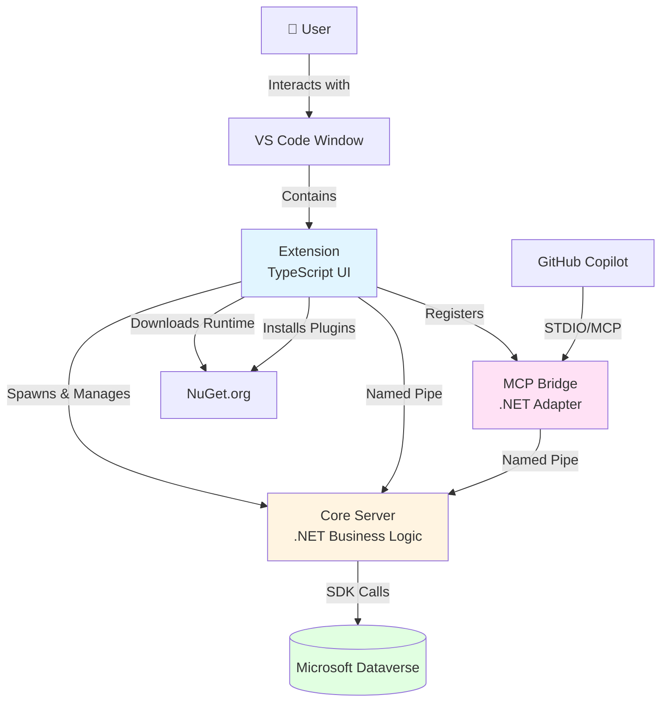

# Overview

## What is Dataverse MCP Toolbox?

The **Dataverse MCP Toolbox** is a sophisticated integration solution that bridges Microsoft Dataverse operations with AI assistants like GitHub Copilot. It enables AI-powered interactions with Dataverse environments through natural language, providing a powerful toolbox for developers and power users.

## Key Capabilities

### 🤖 AI-Powered Dataverse Operations
- Execute Dataverse operations through natural language with GitHub Copilot
- Query, create, update, and delete records using conversational commands
- Retrieve metadata, entity definitions, and schema information
- Perform complex operations without writing code manually

### 🔌 Extensible Plugin System
- Install plugins from NuGet.org to extend functionality
- Create custom plugins using the Extensibility SDK
- Share plugins with the community through NuGet packages
- Dynamic tool discovery and registration

### 🔐 Secure Authentication
- OAuth 2.0 authentication using Microsoft Identity Platform
- Secure token storage in VS Code's encrypted secret storage
- Support for multiple concurrent connections
- Per-environment authentication with automatic token refresh

### 🏗️ Sidecar Architecture
- Clean separation of concerns between UI, business logic, and protocol adaptation
- Isolated instances per VS Code window
- No conflicts between multiple VS Code sessions
- Efficient inter-process communication

## Use Cases

### Development & Testing
- Quickly inspect Dataverse environments during development
- Test data queries and operations without opening browser
- Debug issues by examining entity metadata and relationships
- Prototype solutions with AI assistance

### Data Operations
- Bulk operations through conversational commands
- Complex queries across multiple entities
- Data validation and quality checks
- Environment comparison and synchronization

### Learning & Exploration
- Learn Dataverse SDK capabilities through experimentation
- Explore entity relationships and metadata
- Understand environment configuration
- Discover best practices with AI guidance

### Custom Tooling
- Build specialized plugins for your organization's needs
- Automate repetitive tasks with custom tools
- Integrate with existing CI/CD pipelines
- Create domain-specific abstractions

## High-Level Architecture

## Technology Stack

### Core Server
- **.NET 8.0**: Modern, cross-platform runtime
- **Microsoft.PowerPlatform.Dataverse.Client**: Official Dataverse SDK
- **Microsoft.Identity.Client**: OAuth authentication (MSAL)
- **StreamJsonRpc**: JSON-RPC 2.0 implementation
- **Named Pipes**: Inter-process communication

### MCP Bridge
- **.NET 8.0**: Self-contained executable
- **StreamJsonRpc**: Protocol forwarding
- **STDIO**: Communication with GitHub Copilot
- **Named Pipes**: Communication with Core Server

### VS Code Extension
- **TypeScript**: Extension implementation
- **VS Code Extension API**: UI and commands
- **vscode-jsonrpc**: JSON-RPC client
- **Node.js Streams**: Named Pipe client

### Extensibility SDK
- **.NET Standard 2.0**: Wide compatibility
- **Reflection**: Dynamic tool discovery
- **JSON Schema**: Automatic schema generation
- **Dataverse SDK**: Full access to IOrganizationService

## Platform Support

The toolbox runs on all major platforms:

- **macOS**: Intel (x64) and Apple Silicon (arm64)
- **Windows**: 64-bit (x64)
- **Linux**: 64-bit (x64)

All components are distributed as self-contained executables requiring no separate .NET installation.

## Distribution Model

### For Users
- **VS Code Extension**: Install from VS Code Marketplace
- **Runtime Binaries**: Automatically downloaded from NuGet on first run
- **Plugins**: Install from NuGet.org via Extension UI

### For Developers
- **Extensibility SDK**: NuGet package for plugin development
- **Sample Plugins**: Reference implementations available
- **Source Code**: Open source on GitHub

## Quick Feature Overview

| Feature | Description |
|---------|-------------|
| **Connection Management** | Create and manage multiple Dataverse connections |
| **Plugin Management** | Install, update, and remove plugins from NuGet |
| **Tool Discovery** | Automatic registration of plugin tools |
| **AI Integration** | Native GitHub Copilot integration via MCP |
| **Secure Storage** | Encrypted token storage in VS Code |
| **Multi-Instance** | Isolated state per VS Code window |
| **Auto-Updates** | Configurable update channels (stable/prerelease) |
| **Cross-Platform** | Works on Windows, macOS, and Linux |

## What's Next?

- **[Quick Start Guide](02-Quick-Start.md)**: Get up and running in minutes
- **[Core Concepts](03-Core-Concepts.md)**: Understand the fundamental concepts
- **[Architecture](04-Architecture.md)**: Deep dive into the system architecture
