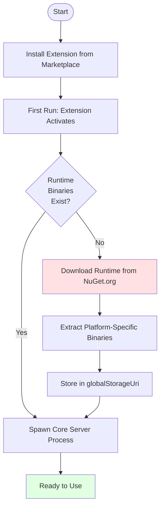
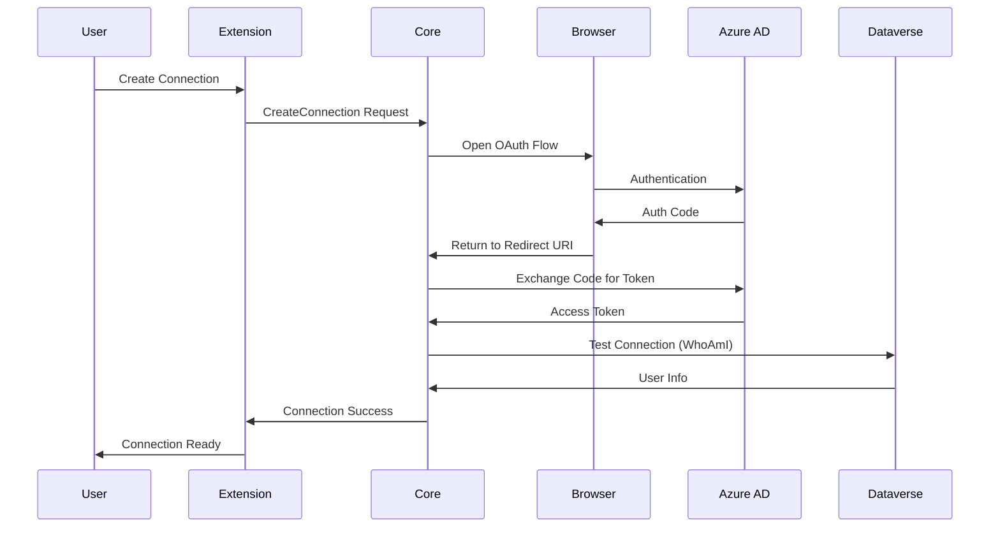
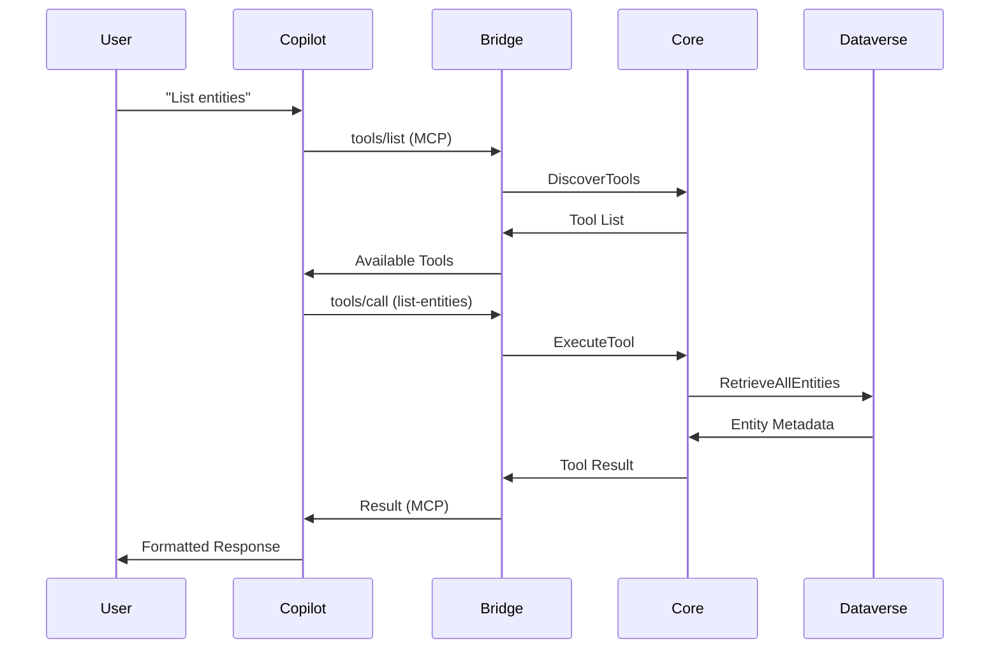
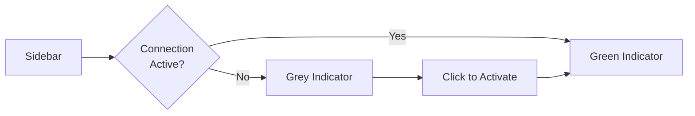

# Quick Start Guide

Get up and running with Dataverse MCP Toolbox in minutes.

## Prerequisites

- **VS Code**: Version 1.85.0 or later
- **GitHub Copilot**: Active subscription (for AI features)
- **Dataverse Environment**: Access to a Dataverse environment
- **Azure AD App**: Or use the default public client application

## Installation Flow



## Step 1: Install the Extension

1. Open VS Code
2. Go to Extensions (⌘+Shift+X / Ctrl+Shift+X)
3. Search for "Dataverse MCP Toolbox"
4. Click **Install**

On first activation, the extension will:
- Download the Core Server and MCP Bridge binaries from NuGet
- Extract the appropriate binaries for your platform
- Store them in VS Code's global storage
- Register the MCP server with GitHub Copilot

## Step 2: Create Your First Connection

### Using the UI

1. Open the **Dataverse MCP** sidebar (click the Dataverse icon)
2. In the **Connections** section, click **+** (Add Connection)
3. Enter your connection details:
   - **Name**: A friendly name (e.g., "Dev Environment")
   - **Environment URL**: Your Dataverse URL (e.g., `https://yourorg.crm.dynamics.com`)
4. Click **Create**

### Authentication Flow



### What Happens

- A browser window opens for OAuth authentication
- You sign in with your Microsoft account
- The token is securely stored in VS Code's secret storage
- The connection is tested automatically
- The connection appears in the sidebar

## Step 3: Use Your First Tool

### With GitHub Copilot Chat

1. Open GitHub Copilot Chat (Ctrl+Alt+I / ⌘+Alt+I)
2. Make sure you have a connection selected (check sidebar)
3. Try a command:

```
@workspace List all the entities in my Dataverse environment
```

or

```
@workspace What is my user information in Dataverse?
```

### Behind the Scenes



## Step 4: Install a Plugin (Optional)

Extend functionality by installing plugins:

1. In the **Plugins** section of the sidebar, click **+** (Install Plugin)
2. Enter the NuGet package ID (e.g., `DataverseMCPToolBox.Plugins.WhoAmI`)
3. Click **Install**
4. The plugin tools are immediately available

## Common First-Time Tasks

### Check Connection Status



- Active connection: Green indicator
- Inactive: Click to activate
- Multiple connections: Only one active at a time

### View Available Tools

Use Copilot to discover tools:
```
@workspace What tools are available for Dataverse?
```

### View Server Information

In the sidebar:
- **Server Info** section shows runtime version
- **Plugins** section lists installed plugins
- **Connections** section shows all connections

## Troubleshooting First Run

### Extension Won't Activate

**Check:**
- VS Code version (must be 1.85.0+)
- Output panel (View → Output → Dataverse MCP Toolbox)
- Error notifications in VS Code

### Binary Download Fails

**Solutions:**
- Check internet connection
- Verify NuGet.org is accessible
- Check proxy settings
- Manual download: Extension settings → Specify local path

### Connection Fails

**Common Issues:**
- Incorrect environment URL (must include `https://`)
- Account doesn't have access to environment
- Firewall blocking OAuth redirect
- Pop-up blocker preventing browser window

**Check Connection:**
- Test URL in browser first
- Verify you can access environment portal
- Check Azure AD app permissions

### Copilot Not Seeing Tools

**Verify:**
1. Connection is active (green indicator)
2. MCP Bridge is registered (check extension output)
3. Restart VS Code
4. Reload window (⌘+R / Ctrl+R)

## Next Steps

Now that you're up and running:

- **[Core Concepts](03-Core-Concepts.md)**: Understand how everything works
- **[Managing Connections](10-Managing-Connections.md)**: Advanced connection management
- **[Using Tools](12-Using-Tools.md)**: Detailed guide on tool usage
- **[Creating Plugins](14-Creating-Plugins.md)**: Build your own plugins

## Quick Reference

| Action | Command |
|--------|---------|
| Open Sidebar | Click Dataverse icon in Activity Bar |
| Add Connection | Click **+** in Connections section |
| Activate Connection | Click on connection name |
| Install Plugin | Click **+** in Plugins section |
| View Logs | Output panel → Dataverse MCP Toolbox |
| Restart Server | Command Palette → "Dataverse: Restart Server" |

## Update Behavior

After initial installation:

- Extension checks for runtime updates on activation
- Update channel configurable (stable/prerelease)
- Can pin to specific version to prevent auto-updates
- See [Server Lifecycle](09-Server-Lifecycle.md) for details
