# Core Concepts

Understanding the fundamental concepts behind Dataverse MCP Toolbox.

## The Sidecar Architecture Pattern

The toolbox follows a **sidecar pattern** where specialized components run alongside the main application (VS Code) to provide additional functionality without cluttering the main process.

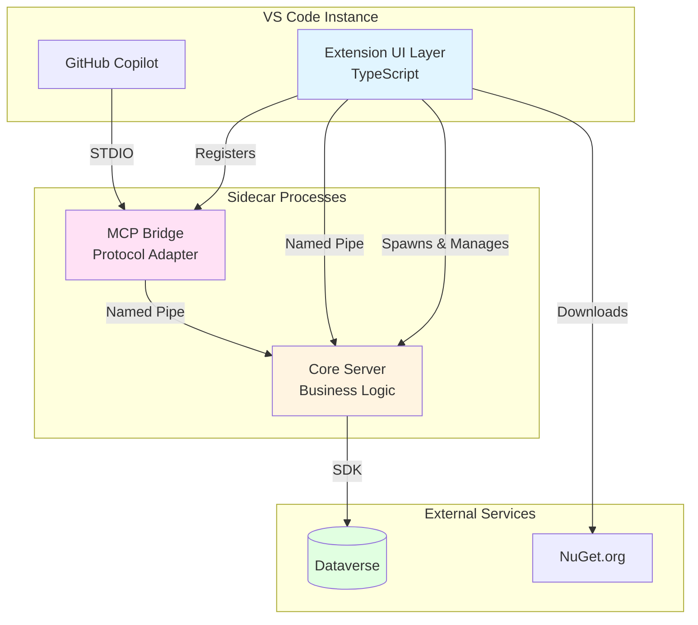

### Why Sidecar?

- **Separation of Concerns**: UI, business logic, and protocol adaptation are independent
- **Language Flexibility**: Use .NET for Dataverse SDK, TypeScript for VS Code
- **Isolation**: Each VS Code window has its own isolated server instance
- **Reliability**: Crashes in one component don't affect others
- **Performance**: Native .NET performance for Dataverse operations

## Model Context Protocol (MCP)

MCP is a protocol that enables AI assistants to access external tools and data sources in a standardized way.

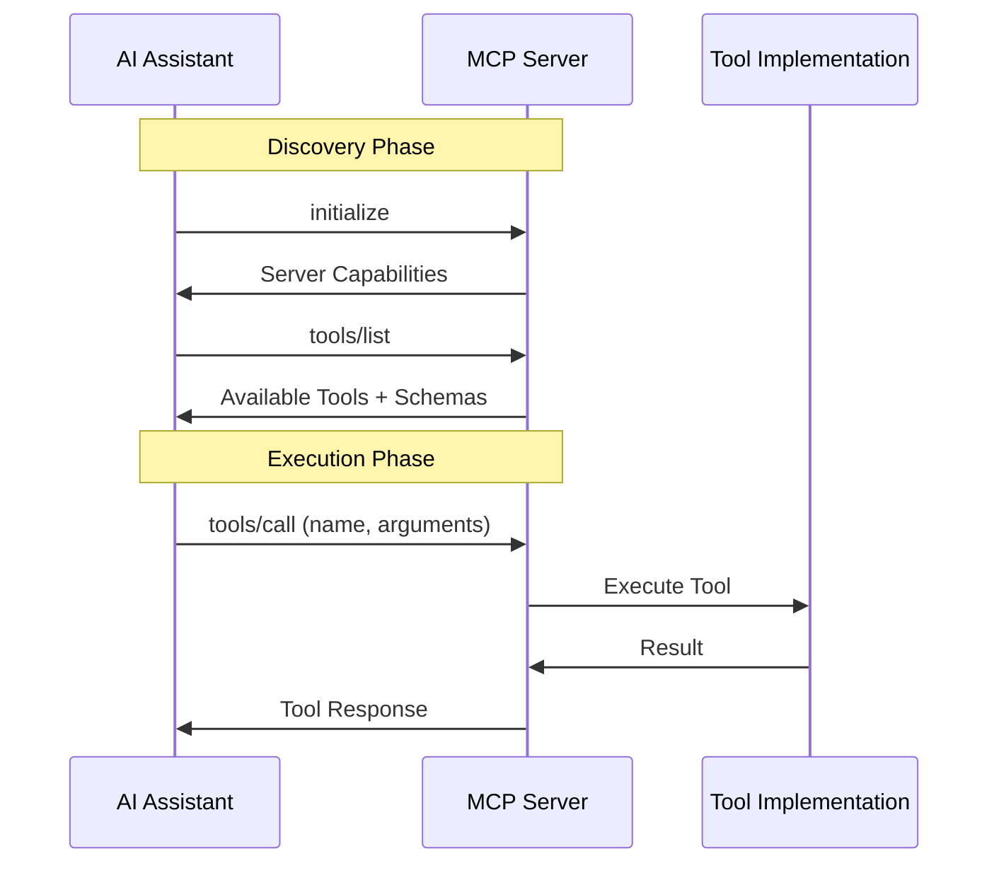

### Key MCP Concepts

#### Tools
- **Definition**: Callable functions with defined inputs and outputs
- **Schema**: JSON Schema describing parameters
- **Execution**: Invoked by AI with validated arguments
- **Example**: `list-entities`, `get-record`, `create-record`

#### Resources
- **Definition**: Data sources that can be read
- **Access**: Retrieved by URI
- **Example**: Connection metadata, plugin information

#### Prompts
- **Definition**: Predefined prompt templates
- **Purpose**: Guide AI interactions
- **Example**: "Query all accounts with revenue > $1M"

## Components Deep Dive

### Core Server

The **brain** of the system - handles all business logic and Dataverse operations.

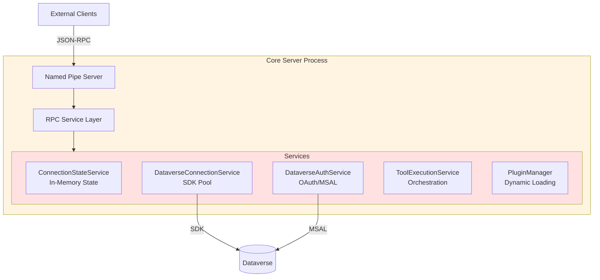

**Responsibilities:**
- Manage Dataverse SDK connections
- Authenticate users via OAuth
- Load and manage plugins
- Execute tools with proper context
- Maintain in-memory state
- Expose RPC interface

**Lifecycle:**
- Started by Extension on activation
- Runs until VS Code window closes
- One instance per VS Code window
- Communicates via unique named pipe

### MCP Bridge

The **translator** - converts between MCP protocol and Core Server's RPC interface.

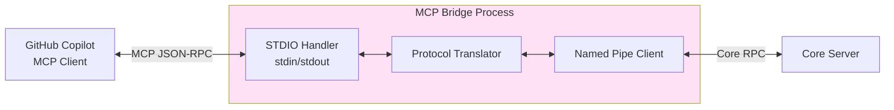

**Responsibilities:**
- Listen to GitHub Copilot on stdin/stdout
- Translate MCP protocol to Core RPC calls
- Forward requests and responses bidirectionally
- No business logic - pure protocol adaptation

**Lifecycle:**
- Started by GitHub Copilot on demand
- Managed by VS Code's MCP system
- Connects to Core Server via named pipe
- Terminates when Copilot session ends

### VS Code Extension

The **face** - provides UI and manages the system lifecycle.

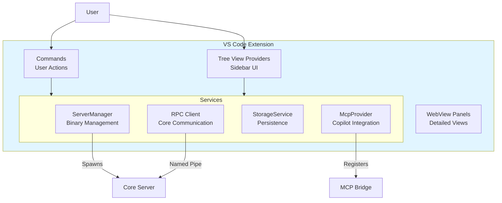

**Responsibilities:**
- Download and manage runtime binaries
- Spawn and monitor Core Server process
- Provide UI for connections and plugins
- Store connection metadata and tokens
- Register MCP Bridge with Copilot
- Handle user commands

**Lifecycle:**
- Activated when VS Code opens workspace
- Downloads binaries if needed
- Starts Core Server
- Registers Bridge configuration
- Deactivates on window close

## Connections

A **connection** represents authenticated access to a Dataverse environment.

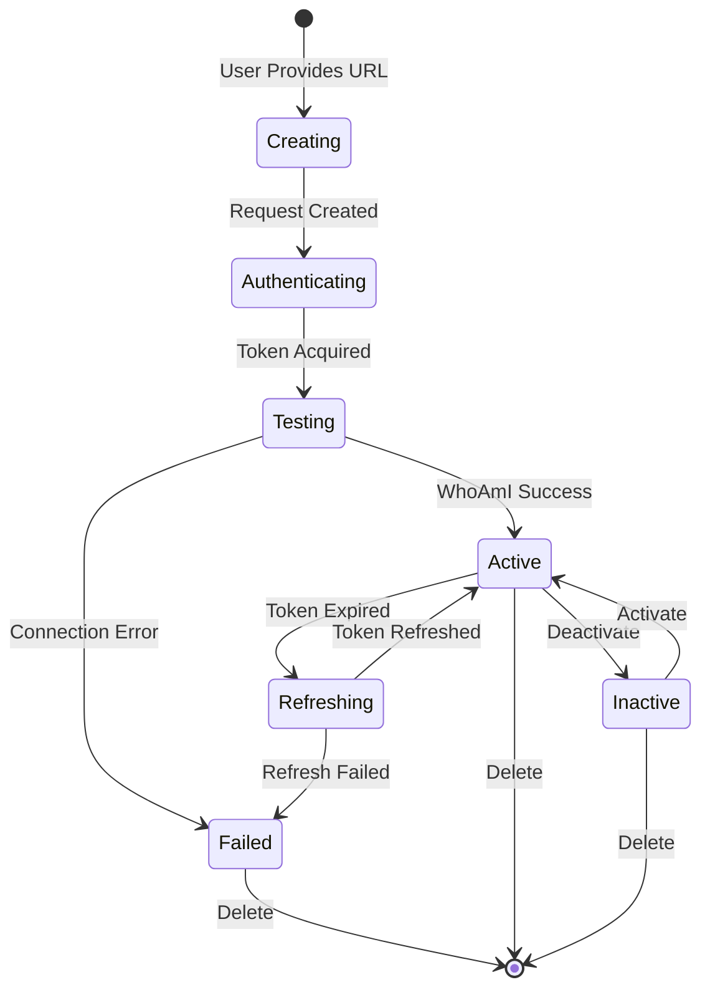

**Connection Properties:**
- **ID**: Unique identifier (GUID)
- **Name**: User-friendly label
- **URL**: Dataverse environment URL
- **Status**: Active, Inactive, or Error
- **Token**: OAuth access token (encrypted)
- **User Info**: Cached WhoAmI result

**Active Connection:**
- Only one connection can be active at a time
- Active connection is used for all tool executions
- Tools receive `IDataverseContext` with active ServiceClient

## Plugins

Plugins extend the toolbox with new capabilities.

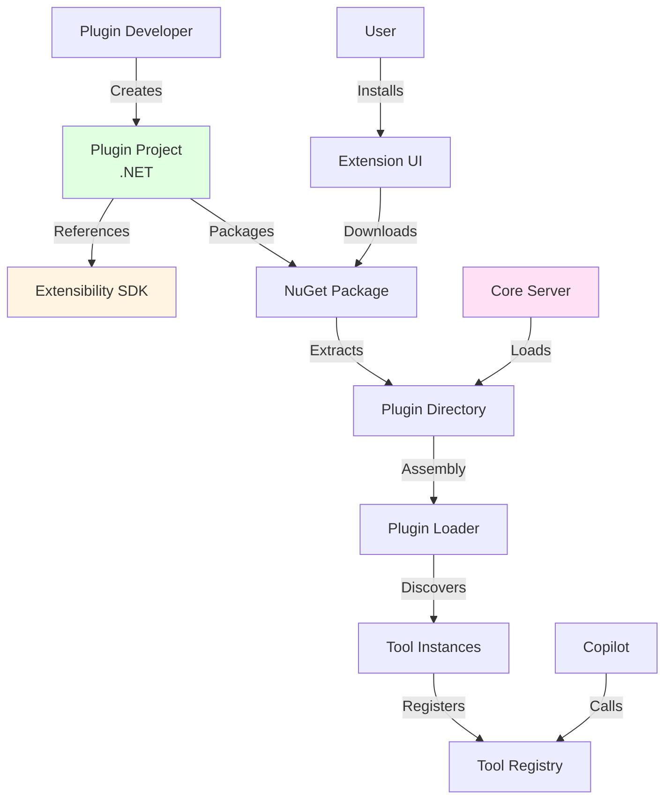

**Plugin Structure:**
- **Manifest**: Metadata (name, version, author)
- **Tools**: One or more tool implementations
- **Dependencies**: Managed by NuGet
- **Lifecycle**: Loaded dynamically by Core Server

**Tool Definition:**
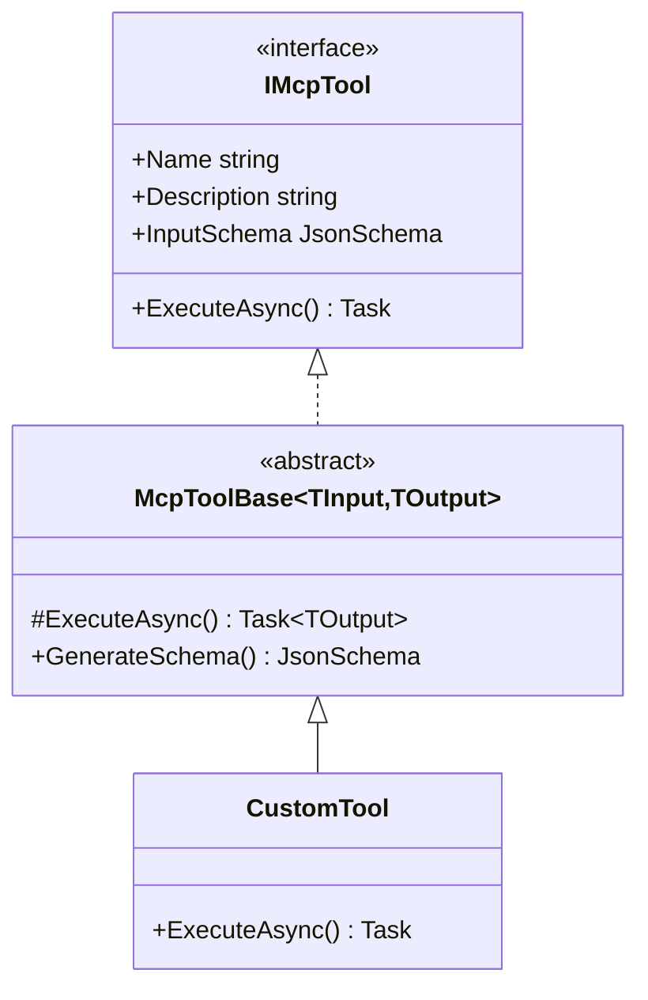

## Tools

A **tool** is a discrete operation that can be invoked by AI.

**Tool Anatomy:**
- **Name**: Unique identifier in kebab-case (`list-entities`)
- **Description**: What the tool does
- **Input Schema**: JSON Schema for parameters
- **Output**: Structured result or error
- **Context**: Access to authenticated Dataverse ServiceClient

**Tool Execution Flow:**

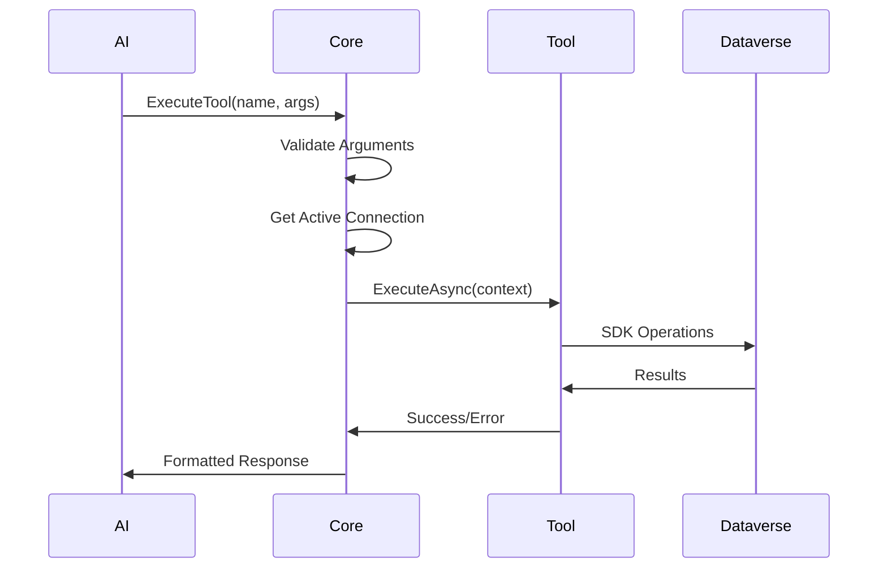

## State Management

Understanding where state lives and its lifecycle.

```mermaid
graph TB
    subgraph "In-Memory (Core Server)"
        Connections[Connection Pool<br/>ServiceClient Instances]
        ToolReg[Tool Registry<br/>Loaded Plugins]
        ActiveConn[Active Connection ID]
    end
    
    subgraph "Persistent (Extension)"
        ConnMeta[Connection Metadata<br/>Workspace State]
        Tokens[OAuth Tokens<br/>Secret Storage]
        Settings[User Settings<br/>Configuration]
    end
    
    subgraph "Filesystem"
        Binaries[Runtime Binaries<br/>Global Storage]
        Plugins[Plugin Assemblies<br/>Global Storage]
    end
    
    CoreServer[Core Server Process] --> Connections
    CoreServer --> ToolReg
    CoreServer --> ActiveConn
    
    ExtensionUI[Extension] --> ConnMeta
    ExtensionUI --> Tokens
    ExtensionUI --> Settings
    ExtensionUI --> Binaries
    ExtensionUI --> Plugins
    
    style "In-Memory (Core Server)" fill:#ffe1e1
    style "Persistent (Extension)" fill:#e1f5ff
    style "Filesystem" fill:#ffe1f5
```

**State Characteristics:**

| State | Location | Lifecycle | Shared |
|-------|----------|-----------|--------|
| Connection Pool | Core RAM | Server uptime | Extension + Bridge |
| Tool Registry | Core RAM | Server uptime | Extension + Bridge |
| Connection Metadata | Extension storage | Persistent | No |
| OAuth Tokens | VS Code secrets | Persistent | No |
| Binaries | Filesystem | Until deleted | No |
| Plugins | Filesystem | Until deleted | No |

## Communication Patterns

All communication uses **JSON-RPC 2.0** over different transports.

### Named Pipes (Extension ↔ Core, Bridge ↔ Core)

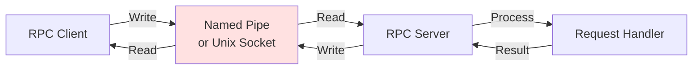

**Characteristics:**
- Platform-specific (named pipes on Windows, Unix sockets on macOS/Linux)
- Newline-delimited JSON messages
- Unique pipe name per VS Code instance
- Bidirectional communication

### STDIO (Copilot ↔ Bridge)

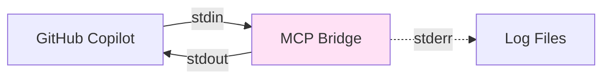

**Characteristics:**
- Standard input/output streams
- JSON-RPC 2.0 over stdio
- stderr for logging only (never stdout)
- Managed by VS Code's MCP system

## Instance Isolation

Each VS Code window has its own isolated system.

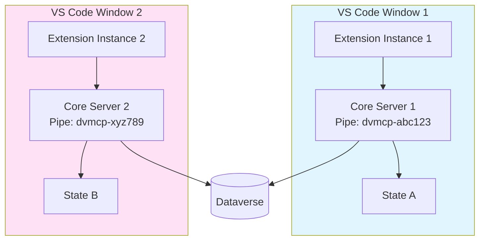

**Isolation Benefits:**
- No state conflicts between windows
- Independent connections and plugins
- Separate crash domains
- Parallel operation without interference

## Next Steps

- **[Architecture](04-Architecture.md)**: Detailed architecture documentation
- **[Core Server](05-Core-Server.md)**: Deep dive into Core Server
- **[Communication](08-Communication.md)**: Communication protocol details
