# Architecture Overview

A comprehensive look at the Dataverse MCP Toolbox architecture, component relationships, and design principles.

## System Architecture

```mermaid
graph TB
    subgraph "User Space"
        User[👤 Developer]
        VSCode[VS Code Application]
    end
    
    subgraph "Extension Layer"
        UI[Extension UI<br/>Commands, TreeViews, Panels]
        ServerMgr[Server Manager<br/>Binary Lifecycle]
        RpcClient[RPC Client<br/>Named Pipe]
        Storage[Storage Services<br/>State & Secrets]
        McpProvider[MCP Provider<br/>Copilot Integration]
    end
    
    subgraph "Sidecar Layer"
        direction LR
        
        subgraph Core["Core Server (.NET)"]
            direction TB
            CoreRpc[RPC Service<br/>Request Handler]
            ConnService[Connection Services]
            AuthService[Auth Services]
            ToolService[Tool Execution]
            PluginService[Plugin Manager]
            CoreState[State Manager]
        end
        
        subgraph Bridge["MCP Bridge (.NET)"]
            direction TB
            StdioHandler[STDIO Handler<br/>MCP Protocol]
            PipeClient[Named Pipe Client]
            Forwarder[Request Forwarder]
        end
    end
    
    subgraph "External Services"
        Copilot[GitHub Copilot]
        Dataverse[(Microsoft Dataverse)]
        NuGet[NuGet.org]
        AAD[Azure AD]
    end
    
    User --> VSCode
    VSCode --> UI
    UI --> ServerMgr
    UI --> RpcClient
    UI --> Storage
    UI --> McpProvider
    
    ServerMgr -->|Spawns| Core
    ServerMgr -->|Downloads| NuGet
    RpcClient -->|Named Pipe| CoreRpc
    McpProvider -->|Registers| Bridge
    
    Copilot -->|STDIO/MCP| StdioHandler
    StdioHandler --> Forwarder
    Forwarder --> PipeClient
    PipeClient -->|Named Pipe| CoreRpc
    
    CoreRpc --> ConnService
    CoreRpc --> ToolService
    CoreRpc --> PluginService
    ConnService --> AuthService
    ToolService --> PluginService
    
    ConnService -->|SDK| Dataverse
    AuthService -->|MSAL| AAD
    PluginService -->|Downloads| NuGet
    
    style "Extension Layer" fill:#e1f5ff
    style Core fill:#fff4e1
    style Bridge fill:#ffe1f5
    style "External Services" fill:#e1ffe1
```

## Design Principles

### 1. Separation of Concerns

Each component has a single, well-defined responsibility:

| Component | Responsibility | Does NOT Handle |
|-----------|----------------|-----------------|
| **Extension** | UI, lifecycle, storage | Dataverse operations, auth |
| **Core Server** | Business logic, Dataverse SDK | UI, MCP protocol |
| **MCP Bridge** | Protocol translation | Business logic, state |

### 2. Transport Agnostic Services

```mermaid
graph TB
    subgraph "Service Layer - Transport Agnostic"
        ConnService[Connection Service]
        AuthService[Auth Service]
        ToolService[Tool Service]
    end
    
    subgraph "Communication Layer - Pluggable"
        NamedPipe[Named Pipe Transport]
        TCP[TCP Transport<br/>Future]
        HTTP[HTTP Transport<br/>Future]
    end
    
    RpcService[RPC Service Layer] --> ConnService
    RpcService --> AuthService
    RpcService --> ToolService
    
    NamedPipe --> RpcService
    TCP -.->|Future| RpcService
    HTTP -.->|Future| RpcService
    
    style "Service Layer - Transport Agnostic" fill:#e1ffe1
    style "Communication Layer - Pluggable" fill:#ffe1e1
```

**Benefits:**
- Services can be tested without transport
- Transport can be swapped without changing business logic
- Services reusable in different contexts

### 3. Instance Isolation

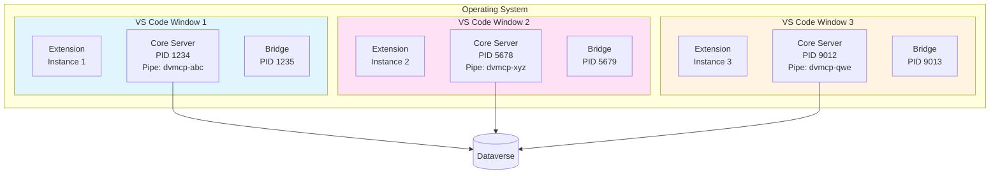

**Isolation Mechanisms:**
- Unique named pipe per instance
- Separate process space
- Independent in-memory state
- No shared file locks

### 4. Defense in Depth

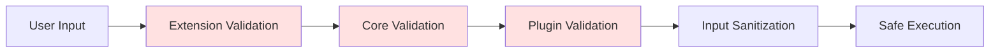

**Security Layers:**
- Input validation at every boundary
- Token encryption in VS Code SecretStorage
- Plugin isolation via AppDomain
- Least privilege principle

## Component Communication Flow

### Extension → Core Server (Direct Operations)

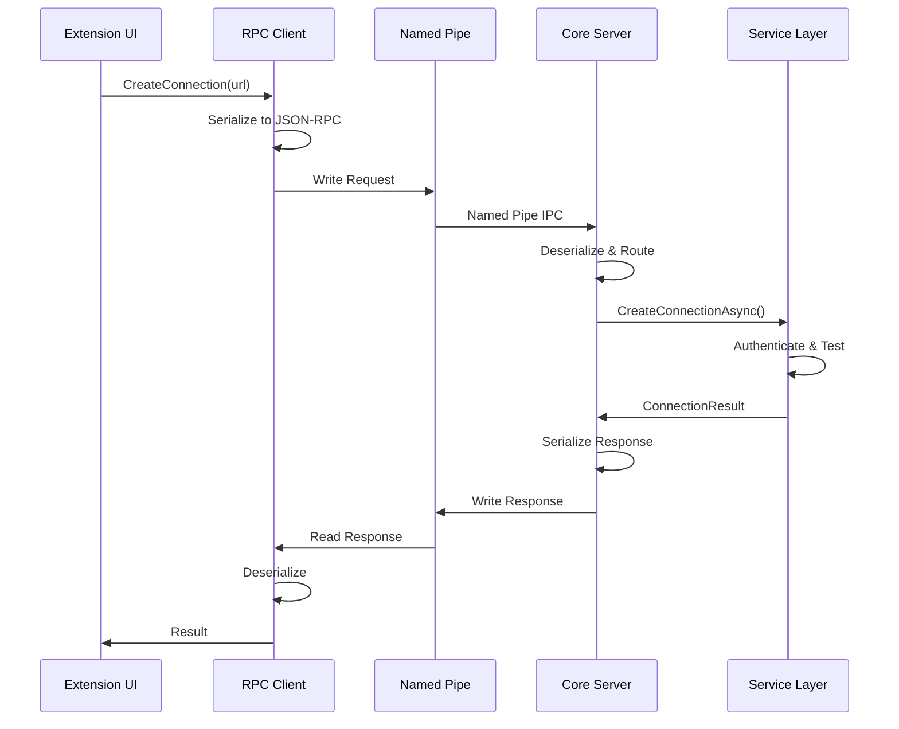

### Copilot → Bridge → Core (Tool Execution)

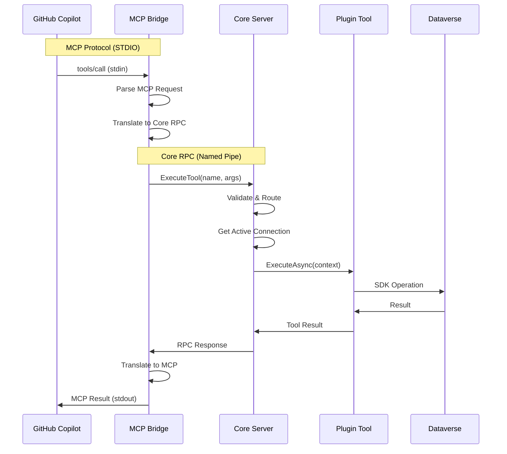

## Data Flow

### Authentication Flow

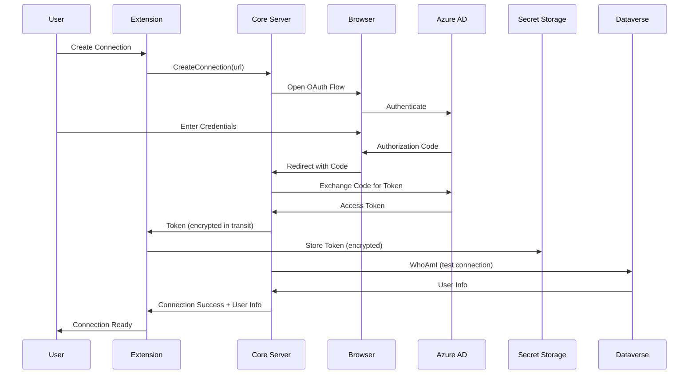

### Plugin Installation Flow

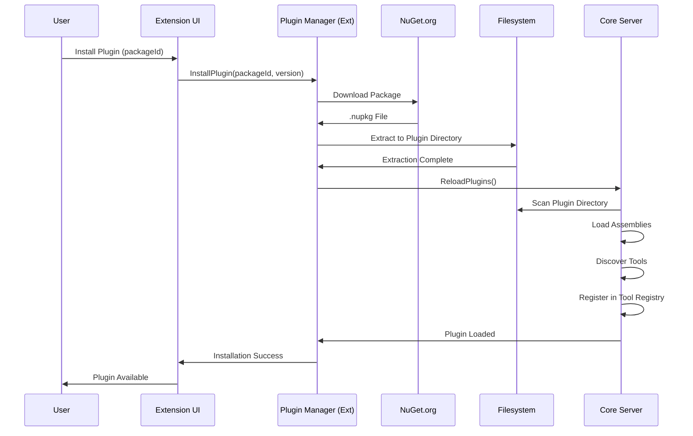

## State Management Architecture

### State Distribution

```mermaid
graph TB
    subgraph "Core Server - In-Memory (Volatile)"
        ConnectionPool[Active ServiceClient Pool<br/>Dictionary&lt;string, IOrganizationService&gt;]
        ToolRegistry[Tool Registry<br/>Dictionary&lt;string, IMcpTool&gt;]
        ActiveConn[Active Connection ID<br/>string?]
        PluginCache[Loaded Plugin Assemblies<br/>List&lt;Assembly&gt;]
    end
    
    subgraph "Extension - Persistent"
        ConnMetadata[Connection Metadata<br/>WorkspaceState<br/>id, name, url]
        Tokens[OAuth Tokens<br/>SecretStorage<br/>Encrypted]
        Settings[User Settings<br/>update channel, version]
    end
    
    subgraph "Filesystem - Persistent"
        Binaries[Runtime Binaries<br/>globalStorageUri/server/]
        Plugins[Plugin Assemblies<br/>globalStorageUri/plugins/]
    end
    
    Restart[Server Restart] -.->|Clears| ConnectionPool
    Restart -.->|Clears| ToolRegistry
    Restart -.->|Clears| ActiveConn
    
    Restart -.->|Reloads from| Plugins
    
    style "Core Server - In-Memory (Volatile)" fill:#ffe1e1
    style "Extension - Persistent" fill:#e1f5ff
    style "Filesystem - Persistent" fill:#fff4e1
```

### State Lifecycle

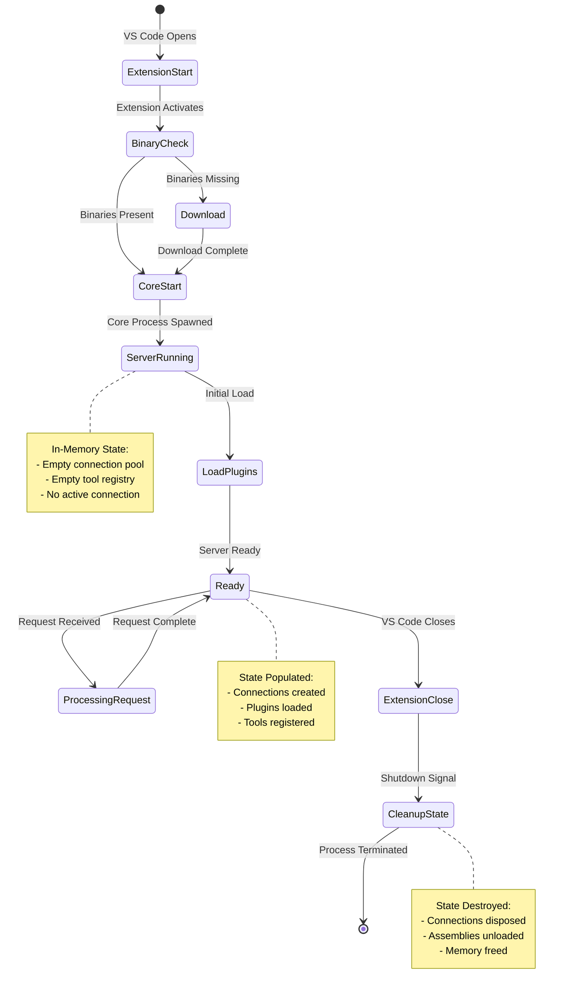

## Error Handling Strategy

### Error Propagation

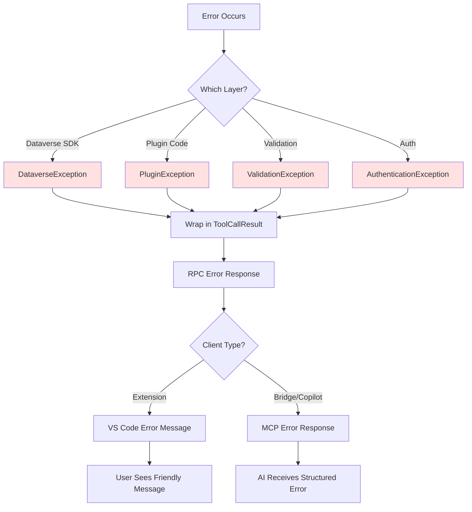

### Error Response Structure

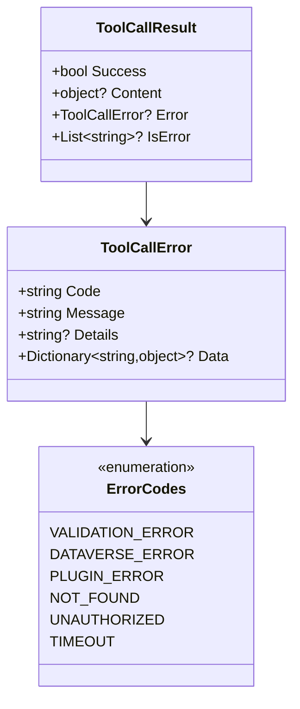

## Platform-Specific Adaptations

### Named Pipe Implementation

```mermaid
graph TB
    Decision{Operating<br/>System?}
    
    Decision -->|Windows| WinPipe[Named Pipe<br/>\\.\pipe\dvmcp-{id}]
    Decision -->|macOS/Linux| UnixSocket[Unix Domain Socket<br/>/tmp/dvmcp-sockets/CoreFxPipe_dvmcp-{id}]
    
    WinPipe --> WinAPI[Windows Named Pipe API<br/>CreateNamedPipe]
    UnixSocket --> PosixAPI[POSIX Socket API<br/>Unix Domain Socket]
    
    WinAPI --> Communicate[JSON-RPC Communication]
    PosixAPI --> Communicate
    
    Communicate --> LengthLimit{Path Length}
    LengthLimit -->|Windows| NoLimit[No practical limit]
    LengthLimit -->|Unix| Limit104[104 chars maximum]
    
    Limit104 --> Shorten[Use short IDs + temp dirs]
    
    style WinPipe fill:#e1f5ff
    style UnixSocket fill:#ffe1f5
```

### Binary Selection

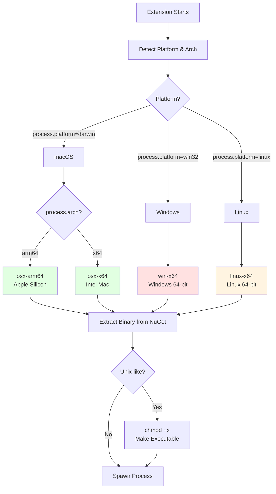

## Scalability Considerations

### Multi-Instance Behavior

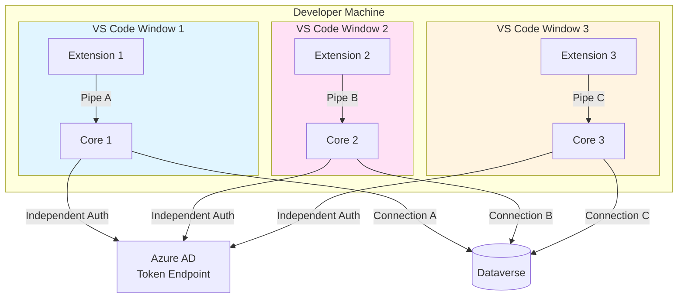

**No Central Coordination:**
- Each instance operates independently
- No shared memory or state
- No inter-instance communication
- No resource contention

## Next Steps

- **[Core Server](05-Core-Server.md)**: Detailed Core Server architecture
- **[MCP Bridge](06-MCP-Bridge.md)**: MCP Bridge implementation
- **[VS Code Extension](07-VS-Code-Extension.md)**: Extension architecture
- **[Communication Protocol](08-Communication.md)**: RPC protocol details
