# Core Server

The Core Server is the central business logic component that handles all Dataverse operations, state management, and plugin execution.

## Overview

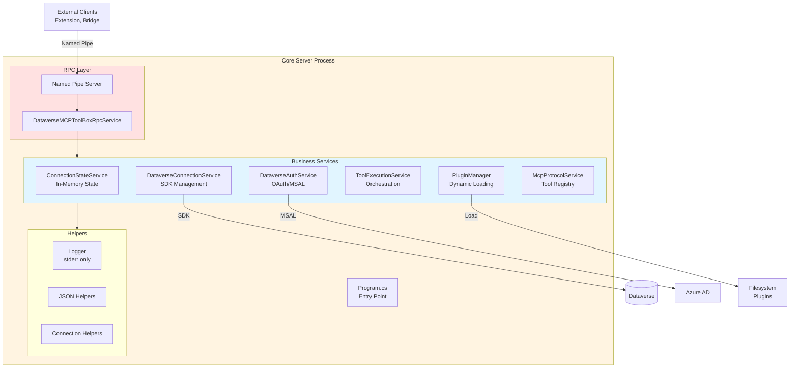
```mermaid
graph TB
    subgraph Core[Core Server Process]
        Entry[Program.cs<br/>Entry Point]
        
        subgraph RPC["RPC Layer"]
            Server[Named Pipe Server]
            RpcService[DataverseMCPToolBoxRpcService]
        end
        
        subgraph Services["Business Services"]
            ConnState[ConnectionStateService<br/>In-Memory State]
            ConnMgr[DataverseConnectionService<br/>SDK Management]
            Auth[DataverseAuthService<br/>OAuth/MSAL]
            ToolExec[ToolExecutionService<br/>Orchestration]
            PluginMgr[PluginManager<br/>Dynamic Loading]
            McpProtocol[McpProtocolService<br/>Tool Registry]
        end
        
        subgraph Helpers
            Logger[Logger<br/>stderr only]
            JsonHelper[JSON Helpers]
            ConnHelper[Connection Helpers]
        end
    end
    
    Clients[External Clients<br/>Extension, Bridge]
    DV[(Dataverse)]
    AAD[Azure AD]
    FS[Filesystem<br/>Plugins]
    
    Clients -->|Named Pipe| Server
    Server --> RpcService
    RpcService --> Services
    Services --> Helpers
    
    ConnMgr -->|SDK| DV
    Auth -->|MSAL| AAD
    PluginMgr -->|Load| FS
    
    style Core fill:#fff4e1
    style RPC fill:#ffe1e1
    style Services fill:#e1f5ff
```

## Startup Sequence

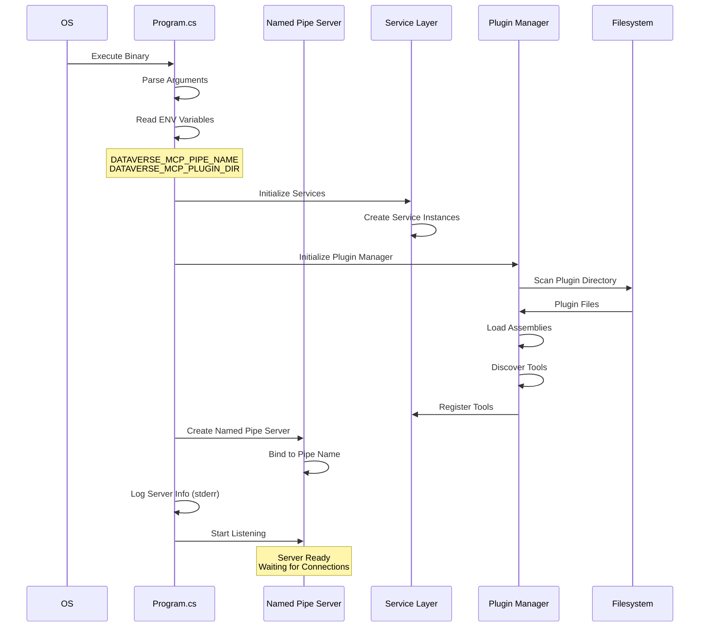
```mermaid
sequenceDiagram
    participant OS
    participant Program as Program.cs
    participant Pipe as Named Pipe Server
    participant Services as Service Layer
    participant PluginMgr as Plugin Manager
    participant FS as Filesystem
    
    OS->>Program: Execute Binary
    Program->>Program: Parse Arguments
    Program->>Program: Read ENV Variables
    
    Note over Program: DATAVERSE_MCP_PIPE_NAME<br/>DATAVERSE_MCP_PLUGIN_DIR
    
    Program->>Services: Initialize Services
    Services->>Services: Create Service Instances
    
    Program->>PluginMgr: Initialize Plugin Manager
    PluginMgr->>FS: Scan Plugin Directory
    FS->>PluginMgr: Plugin Files
    PluginMgr->>PluginMgr: Load Assemblies
    PluginMgr->>PluginMgr: Discover Tools
    PluginMgr->>Services: Register Tools
    
    Program->>Pipe: Create Named Pipe Server
    Pipe->>Pipe: Bind to Pipe Name
    
    Program->>Program: Log Server Info (stderr)
    Program->>Pipe: Start Listening
    
    Note over Pipe: Server Ready<br/>Waiting for Connections
```

## Core Services

### ConnectionStateService

Thread-safe in-memory connection state manager.

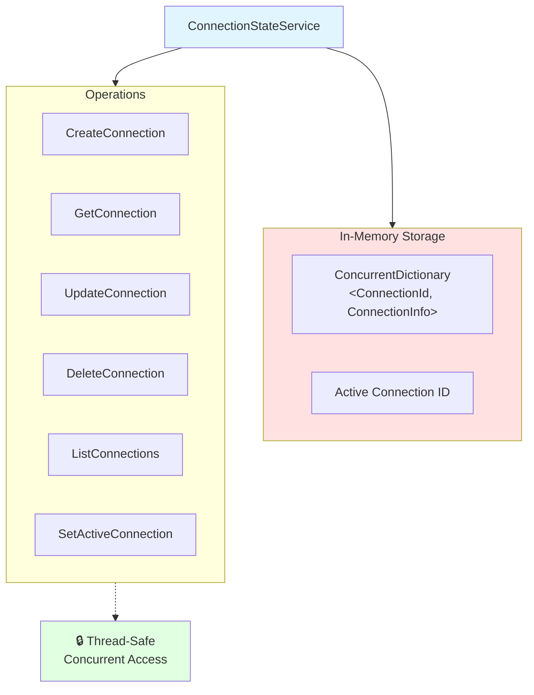
```mermaid
graph TB
    StateService[ConnectionStateService]
    
    subgraph Storage["In-Memory Storage"]
        Dict["ConcurrentDictionary<br/>&lt;ConnectionId, ConnectionInfo&gt;"]
        Active[Active Connection ID]
    end
    
    subgraph Operations
        Create[CreateConnection]
        Get[GetConnection]
        Update[UpdateConnection]
        Delete[DeleteConnection]
        List[ListConnections]
        SetActive[SetActiveConnection]
    end
    
    StateService --> Storage
    StateService --> Operations
    
    ThreadSafe["🔒 Thread-Safe<br/>Concurrent Access"]
    Operations -.-> ThreadSafe
    
    style StateService fill:#e1f5ff
    style Storage fill:#ffe1e1
    style ThreadSafe fill:#e1ffe1
```

**Characteristics:**
- Volatile state (lost on restart)
- No persistence to disk
- Thread-safe for concurrent access
- Simple CRUD operations
- Active connection tracking

### DataverseConnectionService

Manages Dataverse SDK connections and service client pool.

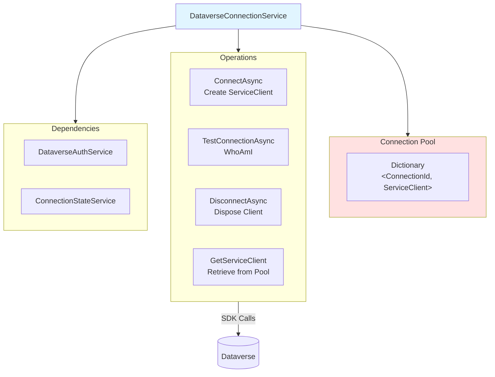
```mermaid
graph TB
    ConnService[DataverseConnectionService]
    
    subgraph Pool["Connection Pool"]
        ServiceClients["Dictionary<br/>&lt;ConnectionId, ServiceClient&gt;"]
    end
    
    subgraph Operations
        Connect[ConnectAsync<br/>Create ServiceClient]
        Test[TestConnectionAsync<br/>WhoAmI]
        Disconnect[DisconnectAsync<br/>Dispose Client]
        GetClient[GetServiceClient<br/>Retrieve from Pool]
    end
    
    subgraph Dependencies
        Auth[DataverseAuthService]
        State[ConnectionStateService]
    end
    
    ConnService --> Pool
    ConnService --> Operations
    ConnService --> Dependencies
    
    DV[(Dataverse)]
    Operations -->|SDK Calls| DV
    
    style ConnService fill:#e1f5ff
    style Pool fill:#ffe1e1
```

**Connection Lifecycle:**

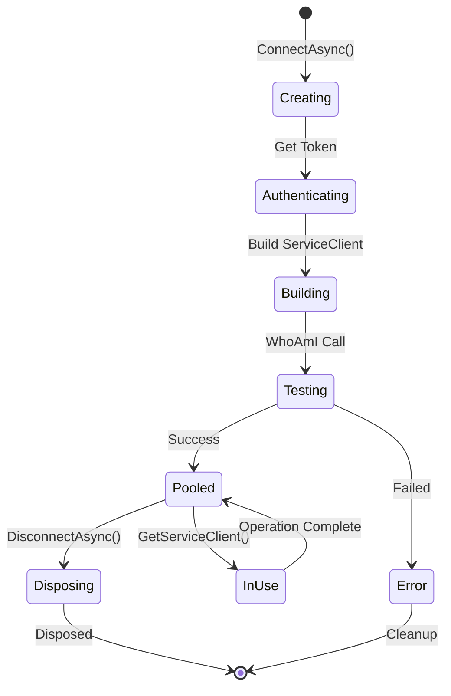
```mermaid
stateDiagram-v2
    [*] --> Creating: ConnectAsync()
    Creating --> Authenticating: Get Token
    Authenticating --> Building: Build ServiceClient
    Building --> Testing: WhoAmI Call
    Testing --> Pooled: Success
    Testing --> Error: Failed
    
    Pooled --> InUse: GetServiceClient()
    InUse --> Pooled: Operation Complete
    
    Pooled --> Disposing: DisconnectAsync()
    Disposing --> [*]: Disposed
    
    Error --> [*]: Cleanup
```

### DataverseAuthService

OAuth authentication using Microsoft Authentication Library (MSAL).

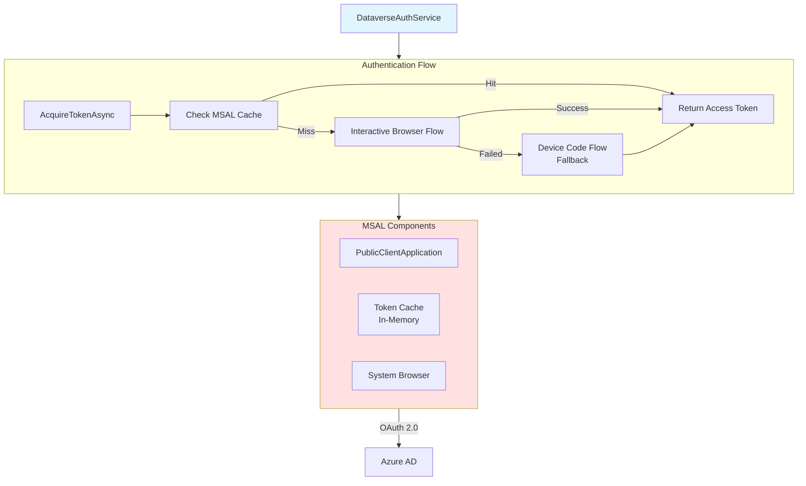
```mermaid
graph TB
    AuthService[DataverseAuthService]
    
    subgraph Flow["Authentication Flow"]
        Start[AcquireTokenAsync]
        Cache[Check MSAL Cache]
        Interactive[Interactive Browser Flow]
        Device[Device Code Flow<br/>Fallback]
        Token[Return Access Token]
    end
    
    subgraph MSAL["MSAL Components"]
        PublicClient[PublicClientApplication]
        TokenCache[Token Cache<br/>In-Memory]
        Browser[System Browser]
    end
    
    AAD[Azure AD]
    
    AuthService --> Flow
    Flow --> MSAL
    MSAL -->|OAuth 2.0| AAD
    
    Start --> Cache
    Cache -->|Hit| Token
    Cache -->|Miss| Interactive
    Interactive -->|Failed| Device
    Interactive -->|Success| Token
    Device --> Token
    
    style AuthService fill:#e1f5ff
    style MSAL fill:#ffe1e1
```

**Authentication Sequence:**

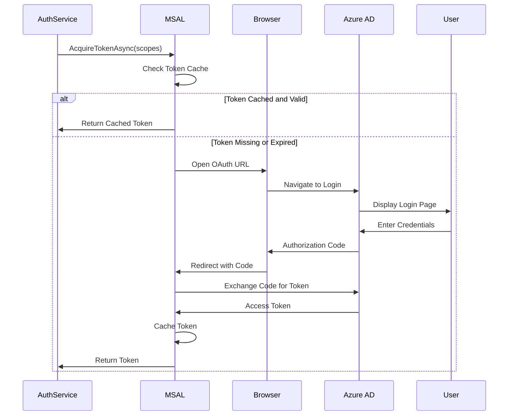
```mermaid
sequenceDiagram
    participant Service as AuthService
    participant MSAL
    participant Browser
    participant AAD as Azure AD
    participant User
    
    Service->>MSAL: AcquireTokenAsync(scopes)
    MSAL->>MSAL: Check Token Cache
    
    alt Token Cached and Valid
        MSAL->>Service: Return Cached Token
    else Token Missing or Expired
        MSAL->>Browser: Open OAuth URL
        Browser->>AAD: Navigate to Login
        AAD->>User: Display Login Page
        User->>AAD: Enter Credentials
        AAD->>Browser: Authorization Code
        Browser->>MSAL: Redirect with Code
        MSAL->>AAD: Exchange Code for Token
        AAD->>MSAL: Access Token
        MSAL->>MSAL: Cache Token
        MSAL->>Service: Return Token
    end
```

### ToolExecutionService

Orchestrates tool execution with proper Dataverse context.

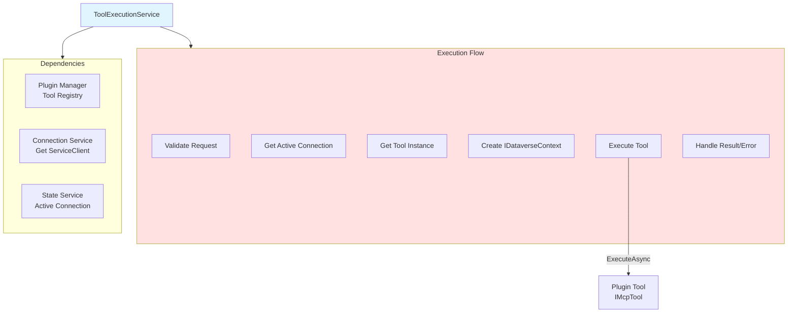
```mermaid
graph TB
    ToolExec[ToolExecutionService]
    
    subgraph Execution["Execution Flow"]
        Validate[Validate Request]
        GetConn[Get Active Connection]
        GetTool[Get Tool Instance]
        CreateContext[Create IDataverseContext]
        Execute[Execute Tool]
        HandleResult[Handle Result/Error]
    end
    
    subgraph Dependencies
        PluginMgr[Plugin Manager<br/>Tool Registry]
        ConnService[Connection Service<br/>Get ServiceClient]
        StateService[State Service<br/>Active Connection]
    end
    
    ToolExec --> Execution
    ToolExec --> Dependencies
    
    Tool[Plugin Tool<br/>IMcpTool]
    Execute -->|ExecuteAsync| Tool
    
    style ToolExec fill:#e1f5ff
    style Execution fill:#ffe1e1
```

**Execution Flow:**

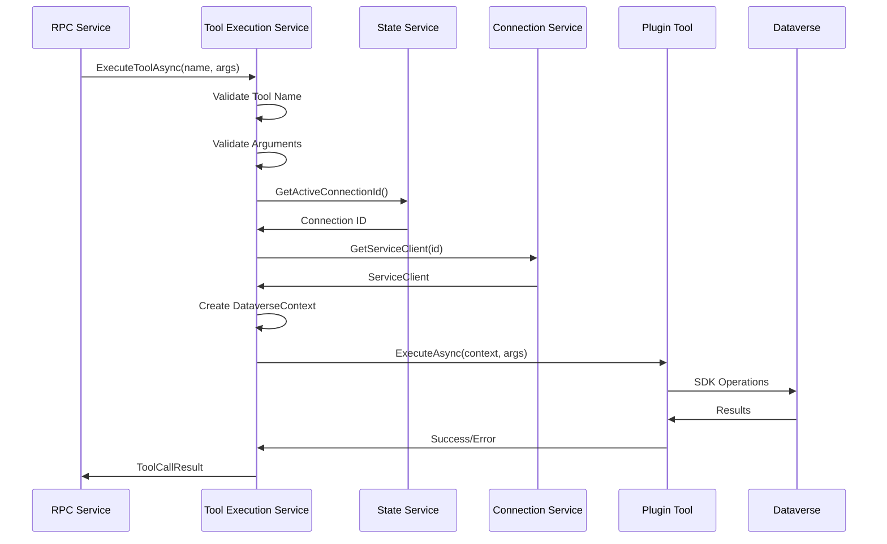
```mermaid
sequenceDiagram
    participant RPC as RPC Service
    participant ToolExec as Tool Execution Service
    participant State as State Service
    participant Conn as Connection Service
    participant Tool as Plugin Tool
    participant DV as Dataverse
    
    RPC->>ToolExec: ExecuteToolAsync(name, args)
    ToolExec->>ToolExec: Validate Tool Name
    ToolExec->>ToolExec: Validate Arguments
    
    ToolExec->>State: GetActiveConnectionId()
    State->>ToolExec: Connection ID
    
    ToolExec->>Conn: GetServiceClient(id)
    Conn->>ToolExec: ServiceClient
    
    ToolExec->>ToolExec: Create DataverseContext
    ToolExec->>Tool: ExecuteAsync(context, args)
    
    Tool->>DV: SDK Operations
    DV->>Tool: Results
    
    Tool->>ToolExec: Success/Error
    ToolExec->>RPC: ToolCallResult
```

### PluginManager

Dynamic plugin loading and tool discovery.

```mermaid
graph TB
    PluginMgr[PluginManager]
    
    subgraph Loading["Plugin Loading"]
        Scan[Scan Plugin Directory]
        Validate[Validate Manifests]
        LoadAsm[Load Assemblies]
        Discover[Discover Tools]
        Register[Register in Registry]
    end
    
    subgraph Discovery["Tool Discovery"]
        Reflect[Reflection Scan]
        Attribute[Find [McpPlugin] Attributes]
        Method[Find [McpTool] Methods]
        Instance[Create Tool Instances]
    end
    
    FS[Filesystem<br/>Plugin Directory]
    Registry[Tool Registry<br/>Dictionary]
    
    PluginMgr --> Loading
    PluginMgr --> Discovery
    Loading --> FS
    Discovery --> Registry
    
    style PluginMgr fill:#e1f5ff
    style Loading fill:#ffe1e1
    style Discovery fill:#fff4e1
```

**Plugin Loading Sequence:**

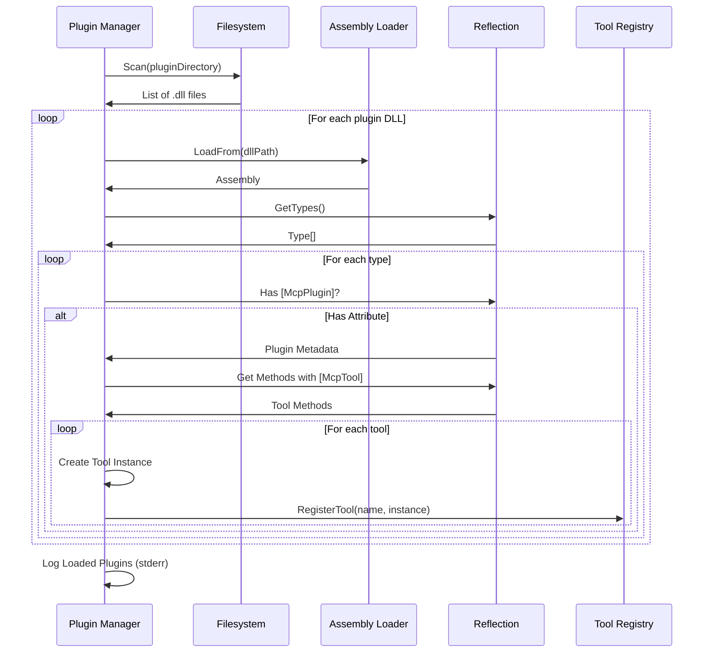
```mermaid
sequenceDiagram
    participant Mgr as Plugin Manager
    participant FS as Filesystem
    participant Loader as Assembly Loader
    participant Reflect as Reflection
    participant Registry as Tool Registry
    
    Mgr->>FS: Scan(pluginDirectory)
    FS->>Mgr: List of .dll files
    
    loop For each plugin DLL
        Mgr->>Loader: LoadFrom(dllPath)
        Loader->>Mgr: Assembly
        
        Mgr->>Reflect: GetTypes()
        Reflect->>Mgr: Type[]
        
        loop For each type
            Mgr->>Reflect: Has [McpPlugin]?
            
            alt Has Attribute
                Reflect->>Mgr: Plugin Metadata
                Mgr->>Reflect: Get Methods with [McpTool]
                Reflect->>Mgr: Tool Methods
                
                loop For each tool
                    Mgr->>Mgr: Create Tool Instance
                    Mgr->>Registry: RegisterTool(name, instance)
                end
            end
        end
    end
    
    Mgr->>Mgr: Log Loaded Plugins (stderr)
```

### McpProtocolService

Tool registry and MCP protocol operations.

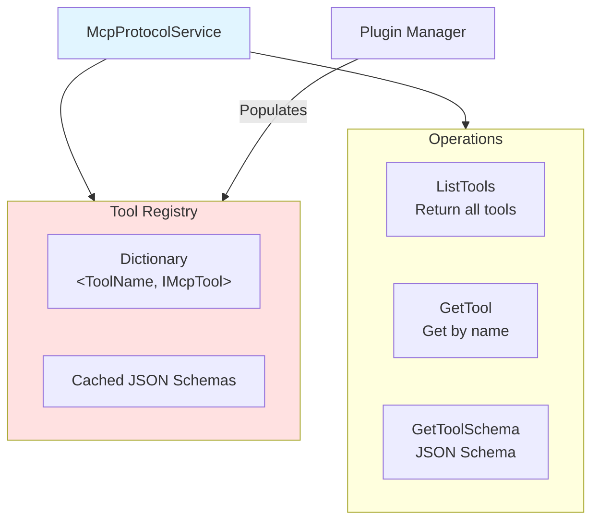
```mermaid
graph TB
    McpService[McpProtocolService]
    
    subgraph Registry["Tool Registry"]
        Tools["Dictionary<br/>&lt;ToolName, IMcpTool&gt;"]
        Schemas["Cached JSON Schemas"]
    end
    
    subgraph Operations
        List[ListTools<br/>Return all tools]
        Get[GetTool<br/>Get by name]
        GetSchema[GetToolSchema<br/>JSON Schema]
    end
    
    McpService --> Registry
    McpService --> Operations
    
    PluginMgr[Plugin Manager]
    PluginMgr -->|Populates| Registry
    
    style McpService fill:#e1f5ff
    style Registry fill:#ffe1e1
```

## RPC Service Layer

### DataverseMCPToolBoxRpcService

Main RPC interface exposed to clients.

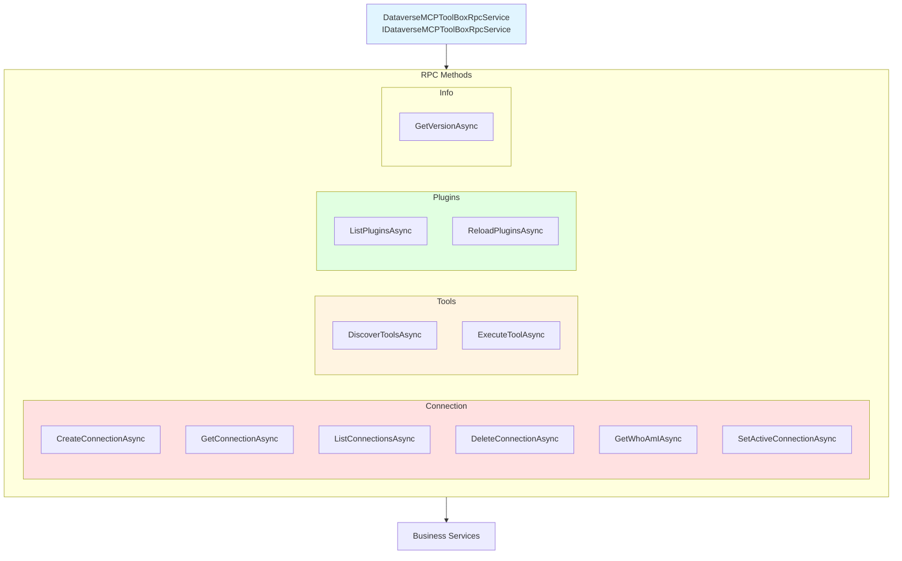
```mermaid
graph TB
    RpcService[DataverseMCPToolBoxRpcService<br/>IDataverseMCPToolBoxRpcService]
    
    subgraph Methods["RPC Methods"]
        subgraph Connection
            CreateConn[CreateConnectionAsync]
            GetConn[GetConnectionAsync]
            ListConn[ListConnectionsAsync]
            DeleteConn[DeleteConnectionAsync]
            WhoAmI[GetWhoAmIAsync]
            SetActive[SetActiveConnectionAsync]
        end
        
        subgraph Tools
            DiscoverTools[DiscoverToolsAsync]
            ExecuteTool[ExecuteToolAsync]
        end
        
        subgraph Plugins
            ListPlugins[ListPluginsAsync]
            ReloadPlugins[ReloadPluginsAsync]
        end
        
        subgraph Info
            GetVersion[GetVersionAsync]
        end
    end
    
    RpcService --> Methods
    
    Services[Business Services]
    Methods --> Services
    
    style RpcService fill:#e1f5ff
    style Connection fill:#ffe1e1
    style Tools fill:#fff4e1
    style Plugins fill:#e1ffe1
```

**Method Categories:**

| Category | Methods | Purpose |
|----------|---------|---------|
| **Connection** | Create, Get, List, Delete, WhoAmI, SetActive | Connection lifecycle |
| **Tools** | Discover, Execute | Tool operations |
| **Plugins** | List, Reload | Plugin management |
| **Info** | GetVersion | Server metadata |

## Request/Response Flow

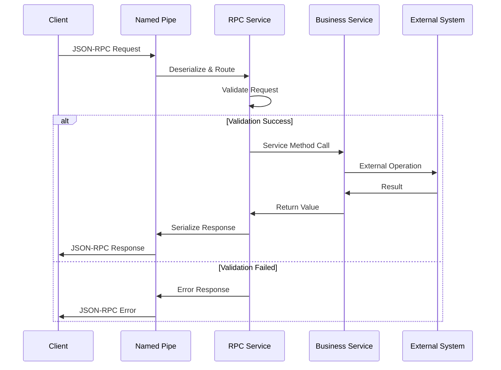
```mermaid
sequenceDiagram
    participant Client
    participant Pipe as Named Pipe
    participant RpcService as RPC Service
    participant Business as Business Service
    participant External as External System
    
    Client->>Pipe: JSON-RPC Request
    Pipe->>RpcService: Deserialize & Route
    RpcService->>RpcService: Validate Request
    
    alt Validation Success
        RpcService->>Business: Service Method Call
        Business->>External: External Operation
        External->>Business: Result
        Business->>RpcService: Return Value
        RpcService->>Pipe: Serialize Response
        Pipe->>Client: JSON-RPC Response
    else Validation Failed
        RpcService->>Pipe: Error Response
        Pipe->>Client: JSON-RPC Error
    end
```

## Logging Strategy

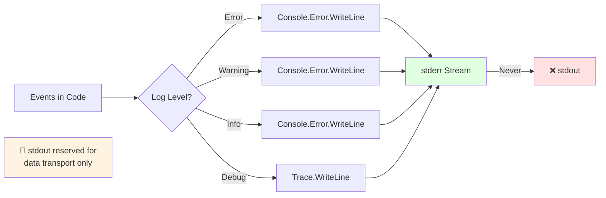
```mermaid
graph LR
    Events[Events in Code] --> Decision{Log Level?}
    
    Decision -->|Error| Error[Console.Error.WriteLine]
    Decision -->|Warning| Warning[Console.Error.WriteLine]
    Decision -->|Info| Info[Console.Error.WriteLine]
    Decision -->|Debug| Debug[Trace.WriteLine]
    
    Error --> Stderr[stderr Stream]
    Warning --> Stderr
    Info --> Stderr
    Debug --> Stderr
    
    Stderr -->|Never| Stdout[❌ stdout]
    
    Note[📝 stdout reserved for<br/>data transport only]
    
    style Stdout fill:#ffe1e1
    style Stderr fill:#e1ffe1
    style Note fill:#fff4e1
```

**Critical Rule:**
- ✅ **ALL logs** go to `stderr` via `Console.Error.WriteLine()`
- ❌ **NEVER** write logs to `stdout`
- ✅ `Trace.Listeners` redirected to `stderr`
- ✅ Exception details logged to `stderr`

## Resource Management

### Disposal Pattern

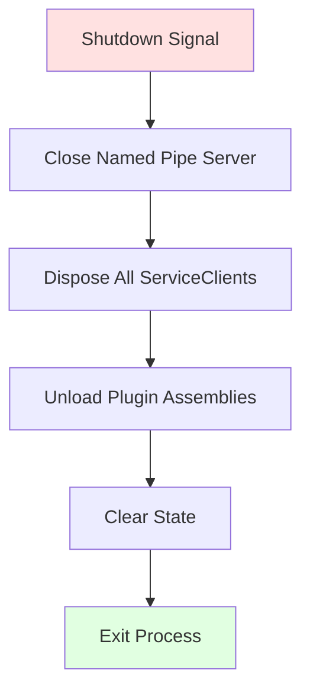
```mermaid
graph TB
    Shutdown[Shutdown Signal]
    
    Shutdown --> Pipe[Close Named Pipe Server]
    Pipe --> Connections[Dispose All ServiceClients]
    Connections --> Assemblies[Unload Plugin Assemblies]
    Assemblies --> Clear[Clear State]
    Clear --> Exit[Exit Process]
    
    style Shutdown fill:#ffe1e1
    style Exit fill:#e1ffe1
```

### Memory Management

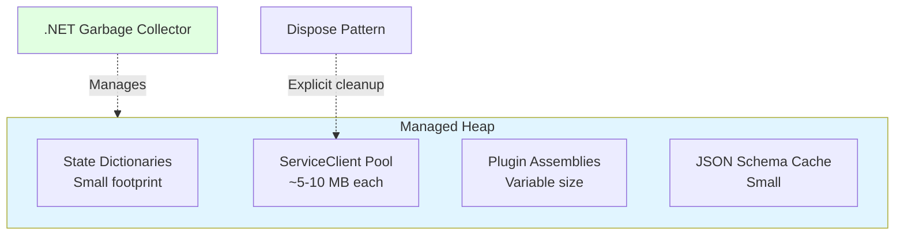
```mermaid
graph TB
    subgraph Heap["Managed Heap"]
        State[State Dictionaries<br/>Small footprint]
        Clients[ServiceClient Pool<br/>~5-10 MB each]
        Plugins[Plugin Assemblies<br/>Variable size]
        Cache[JSON Schema Cache<br/>Small]
    end
    
    GC[.NET Garbage Collector]
    GC -.->|Manages| Heap
    
    Dispose[Dispose Pattern]
    Dispose -.->|Explicit cleanup| Clients
    
    style Heap fill:#e1f5ff
    style GC fill:#e1ffe1
```

**Typical Memory Footprint:**
- Base server: ~20-30 MB
- Per connection: ~5-10 MB
- Per plugin: Variable (usually < 5 MB)
- Total for 3 connections + 2 plugins: ~60-80 MB

## Configuration

### Environment Variables

| Variable | Purpose | Required |
|----------|---------|----------|
| `DATAVERSE_MCP_PIPE_NAME` | Named pipe identifier | Yes |
| `DATAVERSE_MCP_PLUGIN_DIR` | Plugin directory path | Yes |
| `DATAVERSE_MCP_SOCKET_DIR` | Unix socket directory (macOS/Linux) | Platform-specific |

### Command Line Arguments

Currently not used - all configuration via environment variables for consistency.

## Process Lifecycle

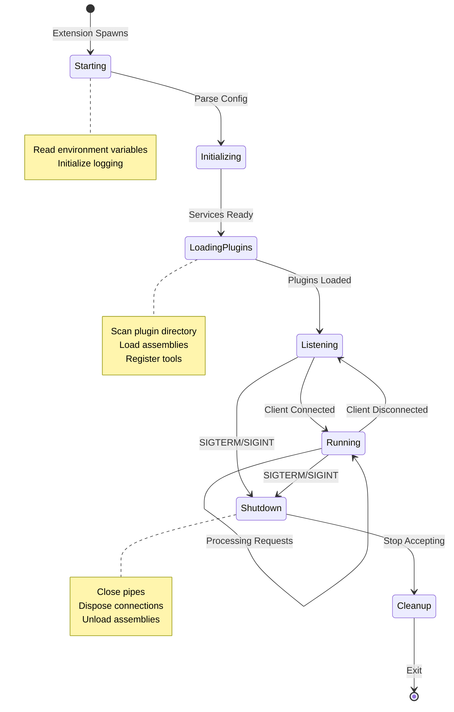
```mermaid
stateDiagram-v2
    [*] --> Starting: Extension Spawns
    Starting --> Initializing: Parse Config
    Initializing --> LoadingPlugins: Services Ready
    LoadingPlugins --> Listening: Plugins Loaded
    Listening --> Running: Client Connected
    
    Running --> Running: Processing Requests
    Running --> Listening: Client Disconnected
    
    Listening --> Shutdown: SIGTERM/SIGINT
    Running --> Shutdown: SIGTERM/SIGINT
    
    Shutdown --> Cleanup: Stop Accepting
    Cleanup --> [*]: Exit
    
    note right of Starting
        Read environment variables
        Initialize logging
    end note
    
    note right of LoadingPlugins
        Scan plugin directory
        Load assemblies
        Register tools
    end note
    
    note right of Shutdown
        Close pipes
        Dispose connections
        Unload assemblies
    end note
```

## Next Steps

- **[MCP Bridge](06-MCP-Bridge.md)**: Protocol adapter architecture
- **[VS Code Extension](07-VS-Code-Extension.md)**: UI and lifecycle management
- **[Communication Protocol](08-Communication.md)**: JSON-RPC details
