# MCP Bridge

The MCP Bridge is a protocol adapter that translates between GitHub Copilot's MCP protocol (over STDIO) and the Core Server's RPC interface (over Named Pipes).

## Purpose

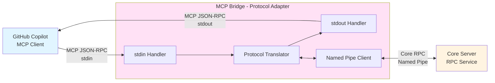

**Key Principle:** The Bridge has **zero business logic** - it is a pure protocol translator and request forwarder.

## Architecture

### Component Overview

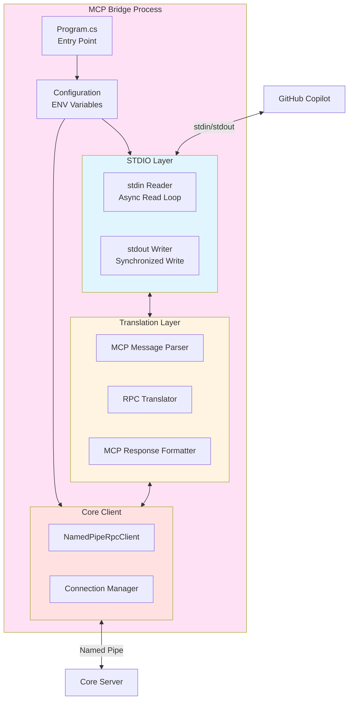

## Startup Sequence

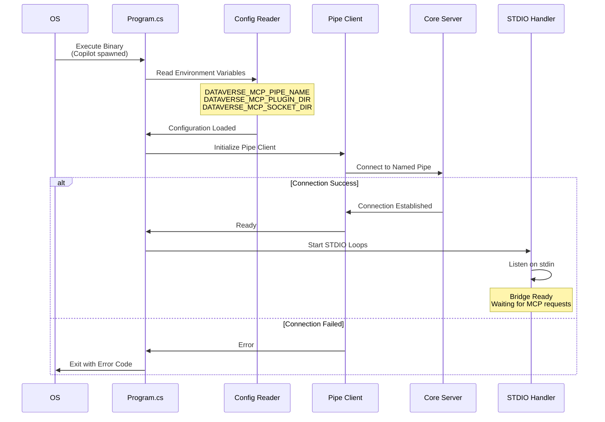

## Request Flow

### MCP → Core Translation

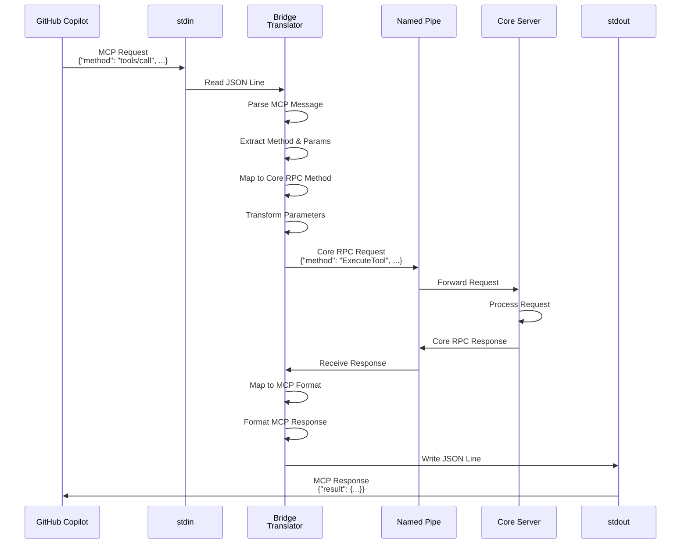

### Core → MCP Translation

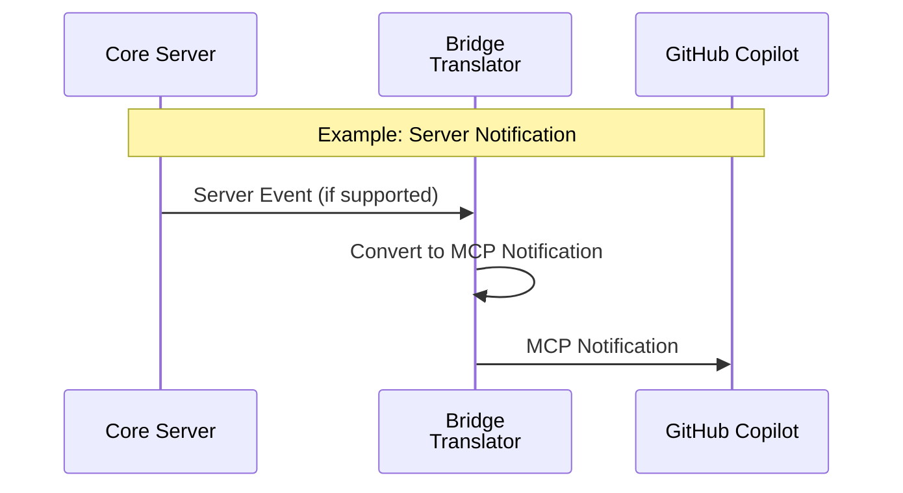

## Protocol Translation

### MCP Methods to Core RPC

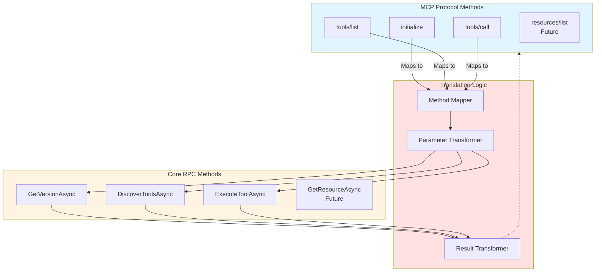

### Method Mapping Table

| MCP Method | Core RPC Method | Transform |
|------------|-----------------|-----------|
| `initialize` | `GetVersionAsync` | Add server capabilities |
| `tools/list` | `DiscoverToolsAsync` | Map tool list to MCP format |
| `tools/call` | `ExecuteToolAsync` | Extract tool name & arguments |
| `resources/list` | N/A (future) | To be implemented |

### Parameter Transformation

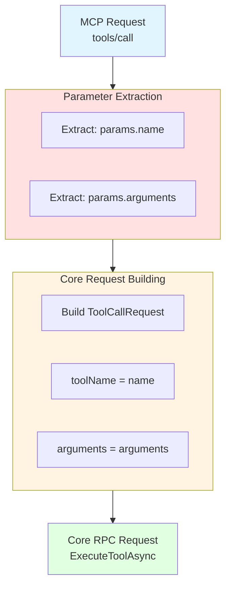

### Response Transformation

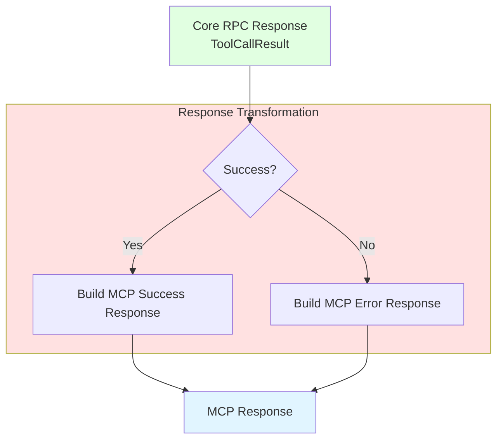

## STDIO Communication

### Input Stream (stdin)

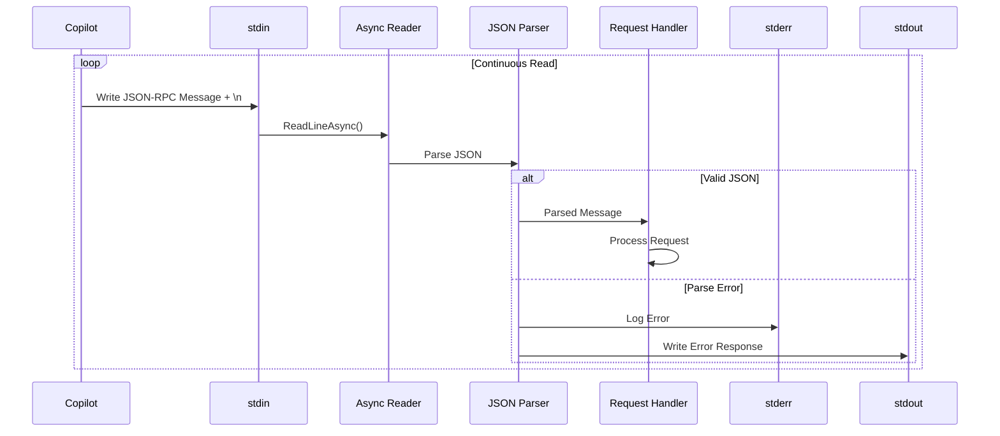

### Output Stream (stdout)

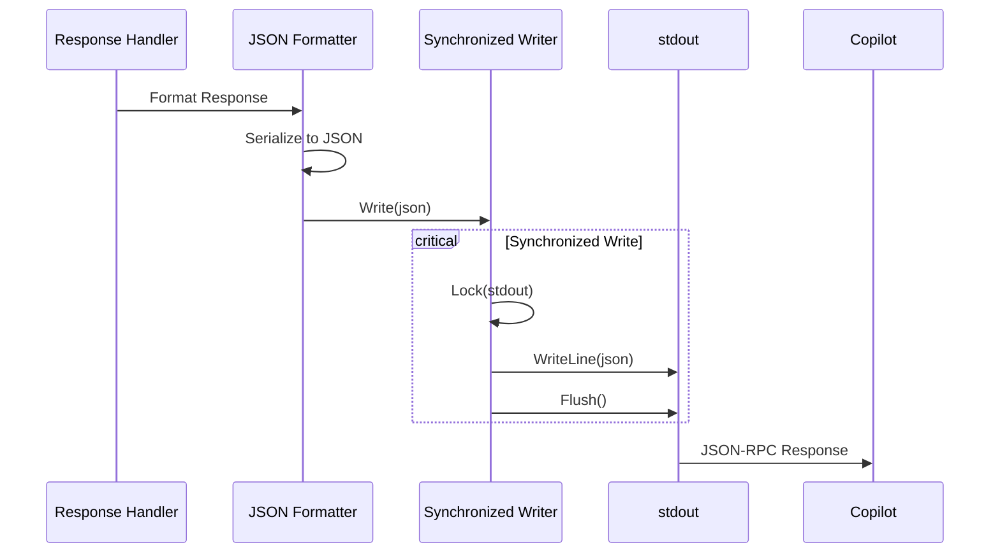

**Critical Rules:**
- ✅ Only JSON-RPC messages on stdout
- ✅ One message per line (newline-delimited)
- ✅ Flush after every write
- ❌ Never write logs to stdout
- ✅ All logs go to stderr

## Connection Management

### Named Pipe Connection

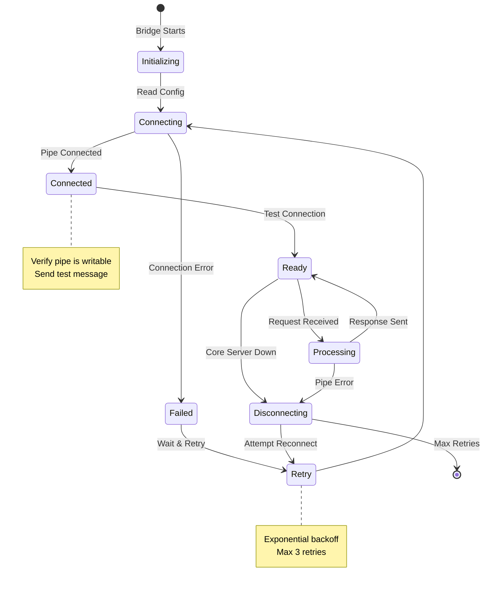

### Connection Configuration

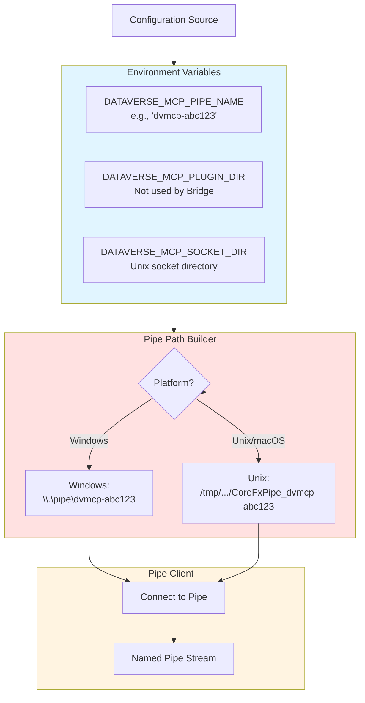

## Error Handling

### Error Categories

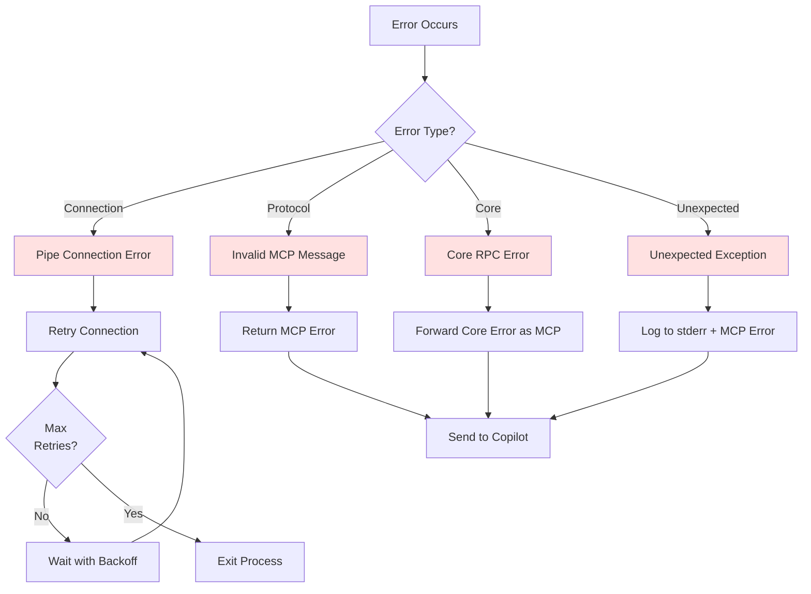

### Error Response Format

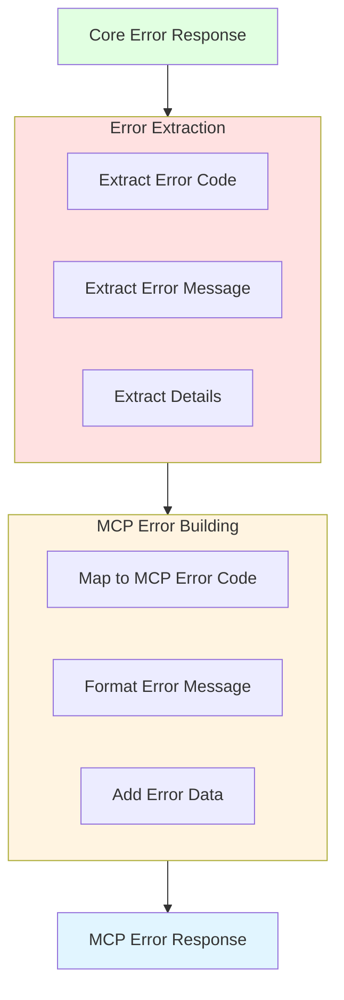

## Process Lifecycle

```mermaid
stateDiagram-v2
    [*] --> Starting: Copilot Spawns
    Starting --> ConfigLoading: Binary Executed
    ConfigLoading --> Connecting: ENV Vars Read
    Connecting --> Ready: Core Connected
    Connecting --> Failed: Connection Failed
    
    Ready --> Listening: STDIO Loops Started
    Listening --> Processing: MCP Request
    Processing --> Listening: Response Sent
    
    Failed --> [*]: Exit with Error
    
    Listening --> Shutdown: stdin Closed
    Processing --> Shutdown: Core Disconnected
    
    Shutdown --> Cleanup: Stop Processing
    Cleanup --> [*]: Exit
    
    note right of ConfigLoading
        DATAVERSE_MCP_PIPE_NAME
        DATAVERSE_MCP_SOCKET_DIR
    end note
    
    note right of Listening
        Read stdin continuously
        Write responses to stdout
        Log errors to stderr
    end note
```

## Logging

### Log Output Strategy

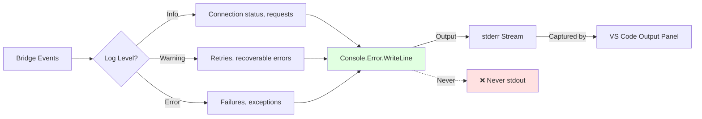

**Log Examples:**
```
[Bridge] Starting MCP Bridge
[Bridge] Connecting to Core Server via pipe: dvmcp-abc123
[Bridge] Connected to Core Server
[Bridge] MCP request received: tools/list
[Bridge] MCP request completed in 45ms
[Bridge] Connection to Core Server lost, retrying...
[Bridge] Shutting down
```

## Performance Considerations

### Minimal Overhead


**Bridge Overhead:** Typically < 5ms per request (excluding Core processing time)

### Memory Footprint

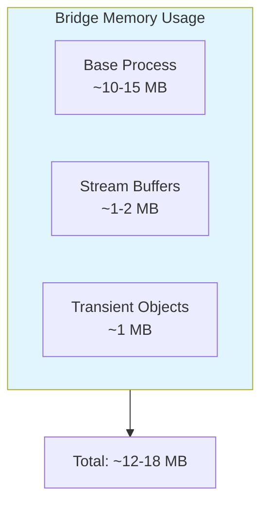

**Characteristics:**
- Minimal memory usage
- No state accumulation
- Transient objects only
- Garbage collected frequently

## Configuration Reference

### Required Environment Variables

| Variable | Type | Example | Purpose |
|----------|------|---------|---------|
| `DATAVERSE_MCP_PIPE_NAME` | string | `dvmcp-abc123` | Named pipe identifier |
| `DATAVERSE_MCP_SOCKET_DIR` | string | `/tmp/dvmcptb-sockets` | Unix socket directory (macOS/Linux only) |

### Optional Environment Variables

| Variable | Type | Default | Purpose |
|----------|------|---------|---------|
| `DATAVERSE_MCP_LOG_LEVEL` | string | `Info` | Logging verbosity |
| `DATAVERSE_MCP_RETRY_COUNT` | int | `3` | Connection retry attempts |

## Next Steps

- **[VS Code Extension](07-VS-Code-Extension.md)**: Extension architecture
- **[Communication Protocol](08-Communication.md)**: Detailed protocol spec
- **[Core Server](05-Core-Server.md)**: Core Server details
