# VS Code Extension

The VS Code Extension provides the user interface and manages the lifecycle of the Core Server and MCP Bridge components.

## Overview

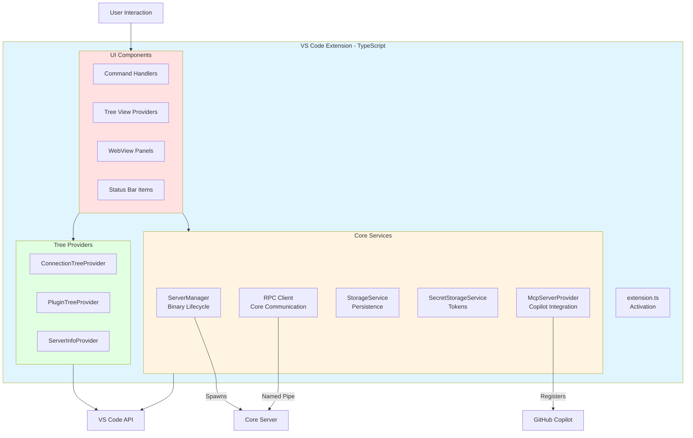
```mermaid
graph TB
    subgraph Extension[VS Code Extension - TypeScript]
        Entry[extension.ts<br/>Activation]
        
        subgraph UI["UI Components"]
            Commands[Command Handlers]
            TreeProviders[Tree View Providers]
            Panels[WebView Panels]
            StatusBar[Status Bar Items]
        end
        
        subgraph Services["Core Services"]
            ServerMgr[ServerManager<br/>Binary Lifecycle]
            RpcClient[RPC Client<br/>Core Communication]
            Storage[StorageService<br/>Persistence]
            Secrets[SecretStorageService<br/>Tokens]
            McpProvider[McpServerProvider<br/>Copilot Integration]
        end
        
        subgraph Providers["Tree Providers"]
            ConnTree[ConnectionTreeProvider]
            PluginTree[PluginTreeProvider]
            ServerTree[ServerInfoProvider]
        end
    end
    
    User[User Interaction]
    VSCode[VS Code API]
    Core[Core Server]
    Copilot[GitHub Copilot]
    
    User --> UI
    UI --> Services
    UI --> Providers
    Services --> VSCode
    Providers --> VSCode
    
    ServerMgr -->|Spawns| Core
    RpcClient -->|Named Pipe| Core
    McpProvider -->|Registers| Copilot
    
    style Extension fill:#e1f5ff
    style UI fill:#ffe1e1
    style Services fill:#fff4e1
    style Providers fill:#e1ffe1
```

## Activation and Lifecycle

### Extension Activation

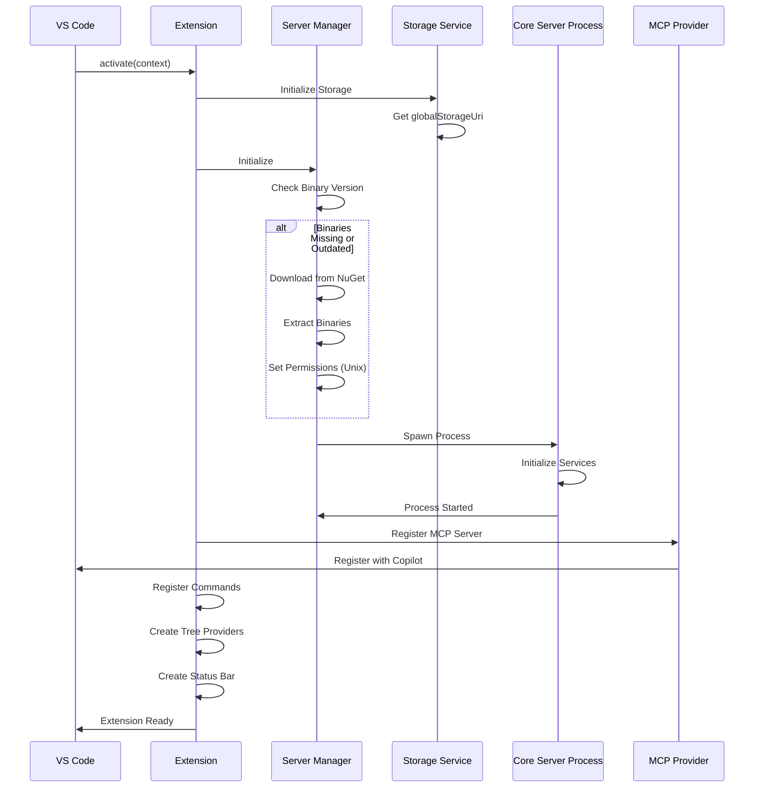
```mermaid
sequenceDiagram
    participant VSCode as VS Code
    participant Ext as Extension
    participant ServerMgr as Server Manager
    participant Storage as Storage Service
    participant Core as Core Server Process
    participant McpProvider as MCP Provider
    
    VSCode->>Ext: activate(context)
    Ext->>Storage: Initialize Storage
    Storage->>Storage: Get globalStorageUri
    
    Ext->>ServerMgr: Initialize
    ServerMgr->>ServerMgr: Check Binary Version
    
    alt Binaries Missing or Outdated
        ServerMgr->>ServerMgr: Download from NuGet
        ServerMgr->>ServerMgr: Extract Binaries
        ServerMgr->>ServerMgr: Set Permissions (Unix)
    end
    
    ServerMgr->>Core: Spawn Process
    Core->>Core: Initialize Services
    Core->>ServerMgr: Process Started
    
    Ext->>McpProvider: Register MCP Server
    McpProvider->>VSCode: Register with Copilot
    
    Ext->>Ext: Register Commands
    Ext->>Ext: Create Tree Providers
    Ext->>Ext: Create Status Bar
    
    Ext->>VSCode: Extension Ready
```

### Deactivation

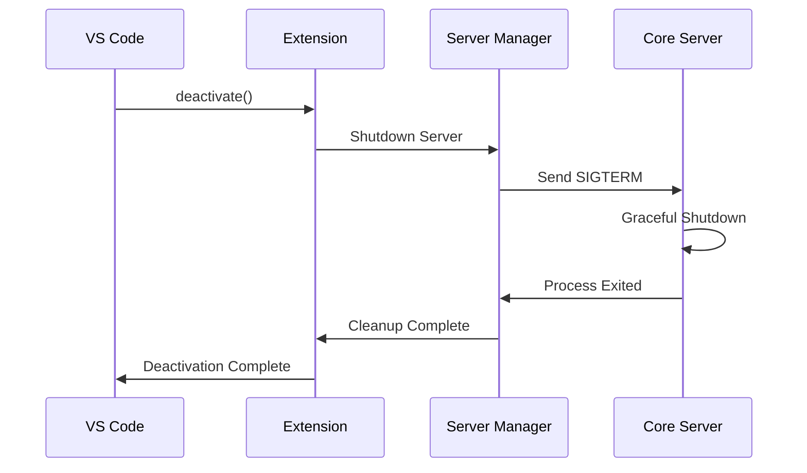
```mermaid
sequenceDiagram
    participant VSCode as VS Code
    participant Ext as Extension
    participant ServerMgr as Server Manager
    participant Core as Core Server
    
    VSCode->>Ext: deactivate()
    Ext->>ServerMgr: Shutdown Server
    ServerMgr->>Core: Send SIGTERM
    Core->>Core: Graceful Shutdown
    Core->>ServerMgr: Process Exited
    ServerMgr->>Ext: Cleanup Complete
    Ext->>VSCode: Deactivation Complete
```

## Core Services

### ServerManager

Manages Core Server binary lifecycle, download, and process management.

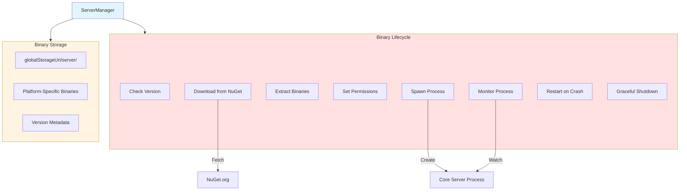
```mermaid
graph TB
    ServerMgr[ServerManager]
    
    subgraph Lifecycle["Binary Lifecycle"]
        Check[Check Version]
        Download[Download from NuGet]
        Extract[Extract Binaries]
        Permissions[Set Permissions]
        Spawn[Spawn Process]
        Monitor[Monitor Process]
        Restart[Restart on Crash]
        Shutdown[Graceful Shutdown]
    end
    
    subgraph Storage["Binary Storage"]
        GlobalStorage[globalStorageUri/server/]
        Platform[Platform-Specific Binaries]
        Version[Version Metadata]
    end
    
    ServerMgr --> Lifecycle
    ServerMgr --> Storage
    
    NuGet[NuGet.org]
    Process[Core Server Process]
    
    Download -->|Fetch| NuGet
    Spawn -->|Create| Process
    Monitor -->|Watch| Process
    
    style ServerMgr fill:#e1f5ff
    style Lifecycle fill:#ffe1e1
    style Storage fill:#fff4e1
```

**Key Responsibilities:**
- Download Runtime NuGet package
- Extract platform-specific binaries
- Version management (stable/prerelease channels)
- Process spawning with environment variables
- Health monitoring and auto-restart
- Graceful shutdown on deactivation

### RPC Client

JSON-RPC client for communicating with Core Server over Named Pipes.

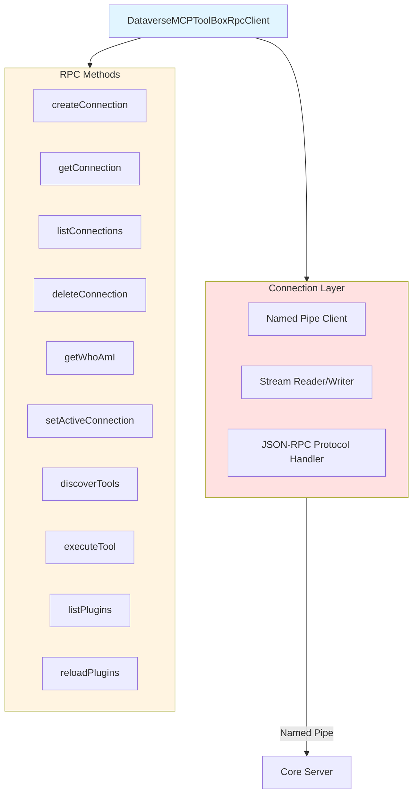
```mermaid
graph TB
    RpcClient[DataverseMCPToolBoxRpcClient]
    
    subgraph Connection["Connection Layer"]
        Pipe[Named Pipe Client]
        Stream[Stream Reader/Writer]
        JsonRpc[JSON-RPC Protocol Handler]
    end
    
    subgraph Methods["RPC Methods"]
        CreateConnection[createConnection]
        GetConnection[getConnection]
        ListConnections[listConnections]
        DeleteConnection[deleteConnection]
        WhoAmI[getWhoAmI]
        SetActive[setActiveConnection]
        DiscoverTools[discoverTools]
        ExecuteTool[executeTool]
        ListPlugins[listPlugins]
        ReloadPlugins[reloadPlugins]
    end
    
    Core[Core Server]
    
    RpcClient --> Connection
    RpcClient --> Methods
    Connection -->|Named Pipe| Core
    
    style RpcClient fill:#e1f5ff
    style Connection fill:#ffe1e1
    style Methods fill:#fff4e1
```

**Communication Pattern:**

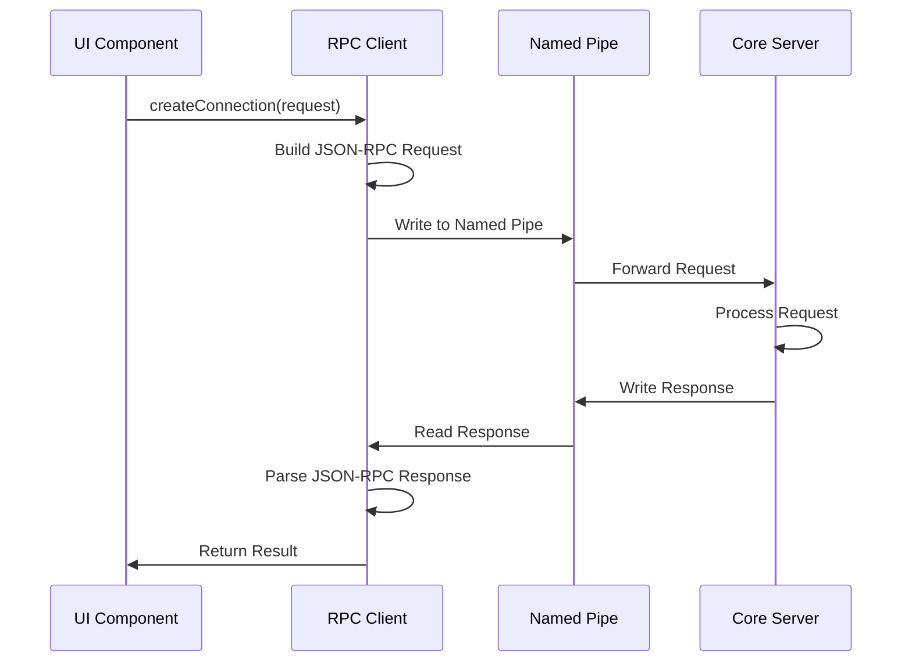
```mermaid
sequenceDiagram
    participant UI as UI Component
    participant Client as RPC Client
    participant Pipe as Named Pipe
    participant Core as Core Server
    
    UI->>Client: createConnection(request)
    Client->>Client: Build JSON-RPC Request
    Client->>Pipe: Write to Named Pipe
    Pipe->>Core: Forward Request
    Core->>Core: Process Request
    Core->>Pipe: Write Response
    Pipe->>Client: Read Response
    Client->>Client: Parse JSON-RPC Response
    Client->>UI: Return Result
```

### StorageService

Manages persistent state in VS Code's workspace and global storage.

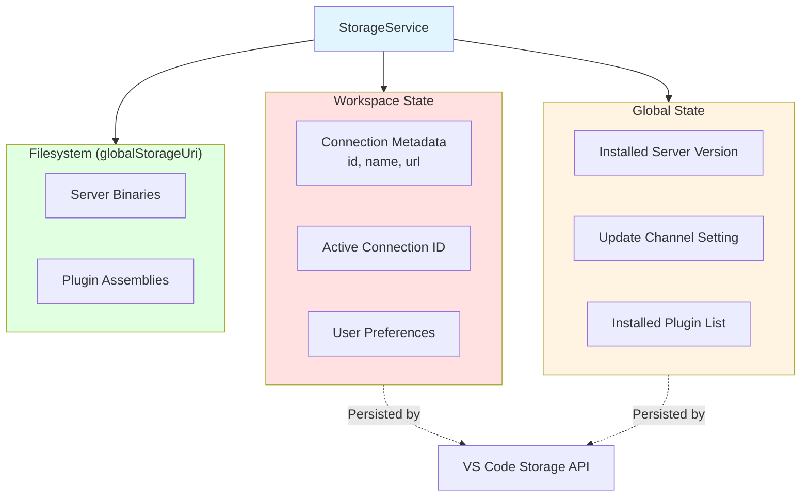
```mermaid
graph TB
    Storage[StorageService]
    
    subgraph WorkspaceState["Workspace State"]
        Connections[Connection Metadata<br/>id, name, url]
        ActiveConn[Active Connection ID]
        Settings[User Preferences]
    end
    
    subgraph GlobalState["Global State"]
        ServerVersion[Installed Server Version]
        UpdateChannel[Update Channel Setting]
        PluginList[Installed Plugin List]
    end
    
    subgraph Filesystem["Filesystem (globalStorageUri)"]
        Binaries[Server Binaries]
        Plugins[Plugin Assemblies]
    end
    
    Storage --> WorkspaceState
    Storage --> GlobalState
    Storage --> Filesystem
    
    VSCodeAPI[VS Code Storage API]
    WorkspaceState -.->|Persisted by| VSCodeAPI
    GlobalState -.->|Persisted by| VSCodeAPI
    
    style Storage fill:#e1f5ff
    style WorkspaceState fill:#ffe1e1
    style GlobalState fill:#fff4e1
    style Filesystem fill:#e1ffe1
```

### SecretStorageService

Secure token storage using VS Code's encrypted secret storage.

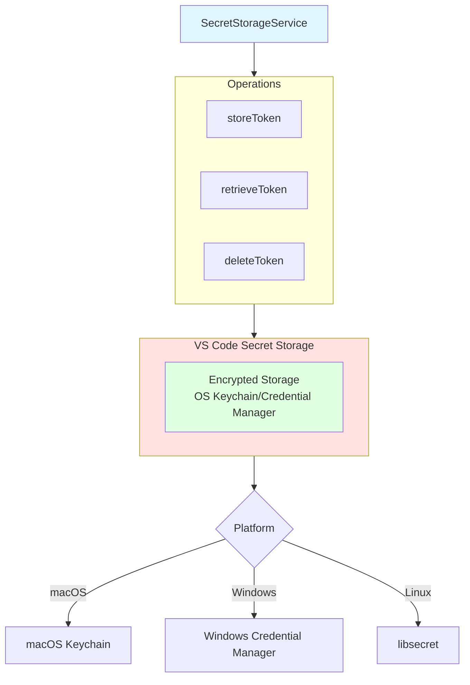
```mermaid
graph TB
    SecretService[SecretStorageService]
    
    subgraph Operations
        Store[storeToken]
        Retrieve[retrieveToken]
        Delete[deleteToken]
    end
    
    subgraph Storage["VS Code Secret Storage"]
        Encrypted[Encrypted Storage<br/>OS Keychain/Credential Manager]
    end
    
    SecretService --> Operations
    Operations --> Storage
    
    Platform{Platform}
    Storage --> Platform
    
    Platform -->|macOS| Keychain[macOS Keychain]
    Platform -->|Windows| CredMgr[Windows Credential Manager]
    Platform -->|Linux| Libsecret[libsecret]
    
    style SecretService fill:#e1f5ff
    style Storage fill:#ffe1e1
    style Encrypted fill:#e1ffe1
```

**Security Features:**
- Tokens never stored in plain text
- Platform-native encryption
- Automatic cleanup on connection delete
- No token exposure in logs

### McpServerProvider

Registers the MCP Bridge with VS Code's MCP system for GitHub Copilot integration.

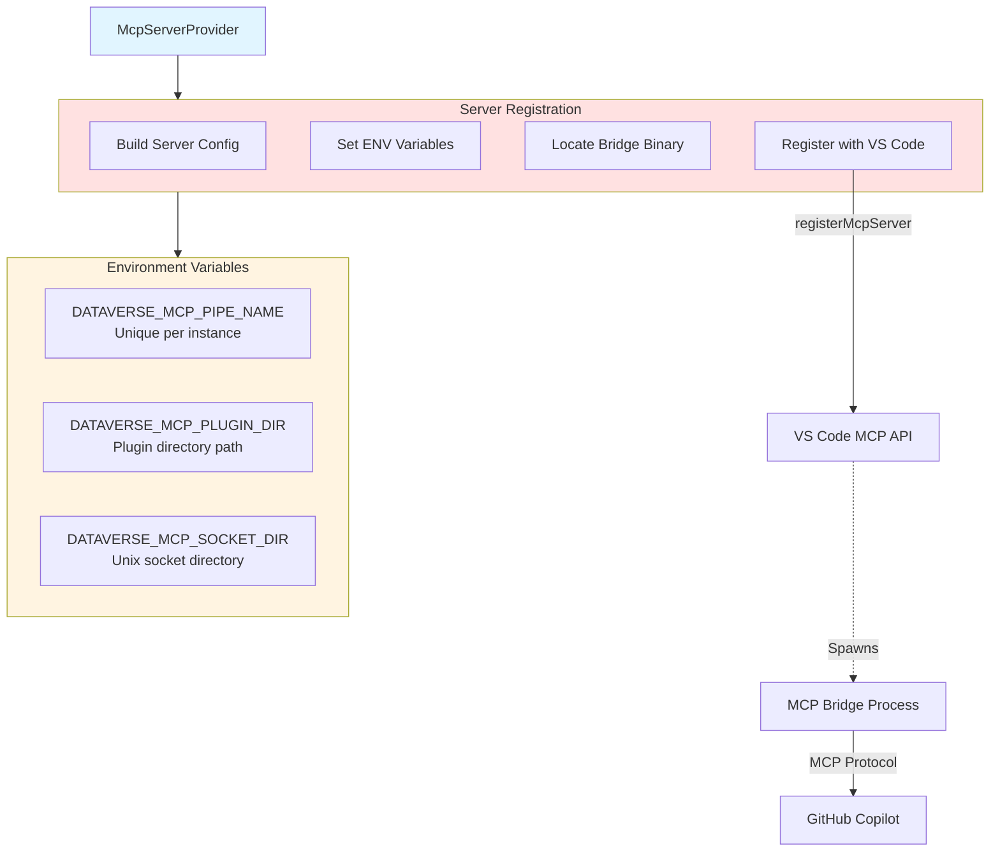
```mermaid
graph TB
    Provider[McpServerProvider]
    
    subgraph Registration["Server Registration"]
        Config[Build Server Config]
        Environment[Set ENV Variables]
        Binary[Locate Bridge Binary]
        Register[Register with VS Code]
    end
    
    subgraph EnvVars["Environment Variables"]
        PipeName[DATAVERSE_MCP_PIPE_NAME<br/>Unique per instance]
        PluginDir[DATAVERSE_MCP_PLUGIN_DIR<br/>Plugin directory path]
        SocketDir[DATAVERSE_MCP_SOCKET_DIR<br/>Unix socket directory]
    end
    
    Provider --> Registration
    Registration --> EnvVars
    
    VSCode[VS Code MCP API]
    Copilot[GitHub Copilot]
    Bridge[MCP Bridge Process]
    
    Register -->|registerMcpServer| VSCode
    VSCode -.->|Spawns| Bridge
    Bridge -->|MCP Protocol| Copilot
    
    style Provider fill:#e1f5ff
    style Registration fill:#ffe1e1
    style EnvVars fill:#fff4e1
```

**Registration Flow:**

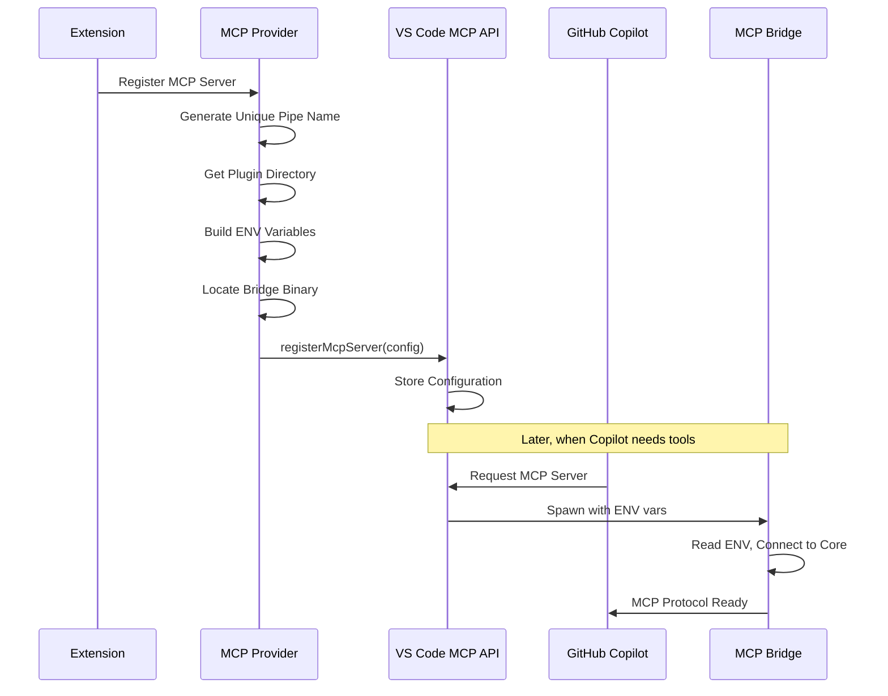
```mermaid
sequenceDiagram
    participant Ext as Extension
    participant Provider as MCP Provider
    participant VSCode as VS Code MCP API
    participant Copilot as GitHub Copilot
    participant Bridge as MCP Bridge
    
    Ext->>Provider: Register MCP Server
    Provider->>Provider: Generate Unique Pipe Name
    Provider->>Provider: Get Plugin Directory
    Provider->>Provider: Build ENV Variables
    Provider->>Provider: Locate Bridge Binary
    Provider->>VSCode: registerMcpServer(config)
    VSCode->>VSCode: Store Configuration
    
    Note over VSCode,Bridge: Later, when Copilot needs tools
    
    Copilot->>VSCode: Request MCP Server
    VSCode->>Bridge: Spawn with ENV vars
    Bridge->>Bridge: Read ENV, Connect to Core
    Bridge->>Copilot: MCP Protocol Ready
```

## UI Components

### Command Handlers

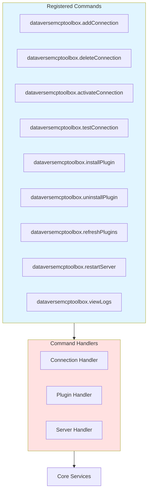
```mermaid
graph TB
    subgraph Commands["Registered Commands"]
        AddConn[dataversemcptoolbox.addConnection]
        DeleteConn[dataversemcptoolbox.deleteConnection]
        ActivateConn[dataversemcptoolbox.activateConnection]
        TestConn[dataversemcptoolbox.testConnection]
        
        InstallPlugin[dataversemcptoolbox.installPlugin]
        UninstallPlugin[dataversemcptoolbox.uninstallPlugin]
        RefreshPlugins[dataversemcptoolbox.refreshPlugins]
        
        RestartServer[dataversemcptoolbox.restartServer]
        ViewLogs[dataversemcptoolbox.viewLogs]
    end
    
    subgraph Handlers["Command Handlers"]
        ConnHandler[Connection Handler]
        PluginHandler[Plugin Handler]
        ServerHandler[Server Handler]
    end
    
    Commands --> Handlers
    
    Services[Core Services]
    Handlers --> Services
    
    style Commands fill:#e1f5ff
    style Handlers fill:#ffe1e1
```

### Tree View Providers

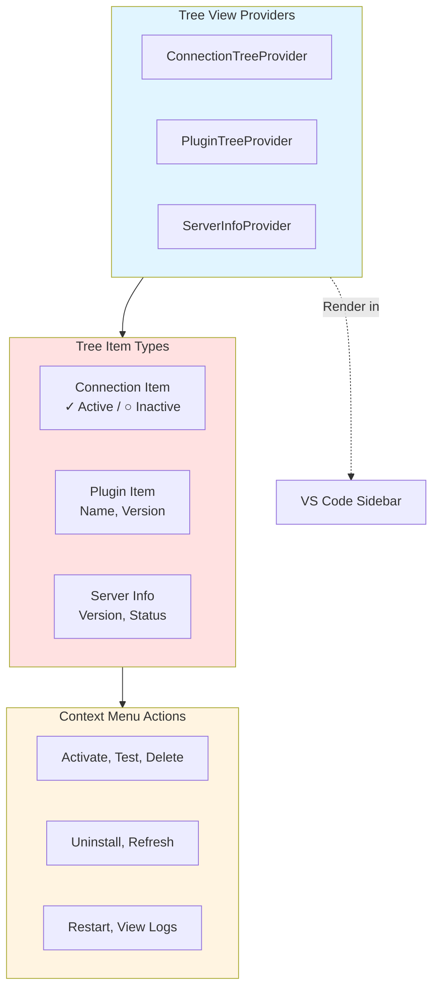
```mermaid
graph TB
    subgraph TreeViews["Tree View Providers"]
        ConnTree[ConnectionTreeProvider]
        PluginTree[PluginTreeProvider]
        ServerTree[ServerInfoProvider]
    end
    
    subgraph TreeItems["Tree Item Types"]
        ConnItem[Connection Item<br/>✓ Active / ○ Inactive]
        PluginItem[Plugin Item<br/>Name, Version]
        ServerItem[Server Info<br/>Version, Status]
    end
    
    subgraph Actions["Context Menu Actions"]
        ConnActions[Activate, Test, Delete]
        PluginActions[Uninstall, Refresh]
        ServerActions[Restart, View Logs]
    end
    
    TreeViews --> TreeItems
    TreeItems --> Actions
    
    Sidebar[VS Code Sidebar]
    TreeViews -.->|Render in| Sidebar
    
    style TreeViews fill:#e1f5ff
    style TreeItems fill:#ffe1e1
    style Actions fill:#fff4e1
```

**Tree View Example:**

```
DATAVERSE MCP
├── Connections
│   ├── ✓ Dev Environment (Active)
│   ├── ○ UAT Environment
│   └── ○ Production
├── Plugins
│   ├── WhoAmI Plugin v1.0.0
│   └── Custom Entity Plugin v2.1.0
└── Server Info
    ├── Version: 1.2.3
    └── Status: Running
```

### WebView Panels

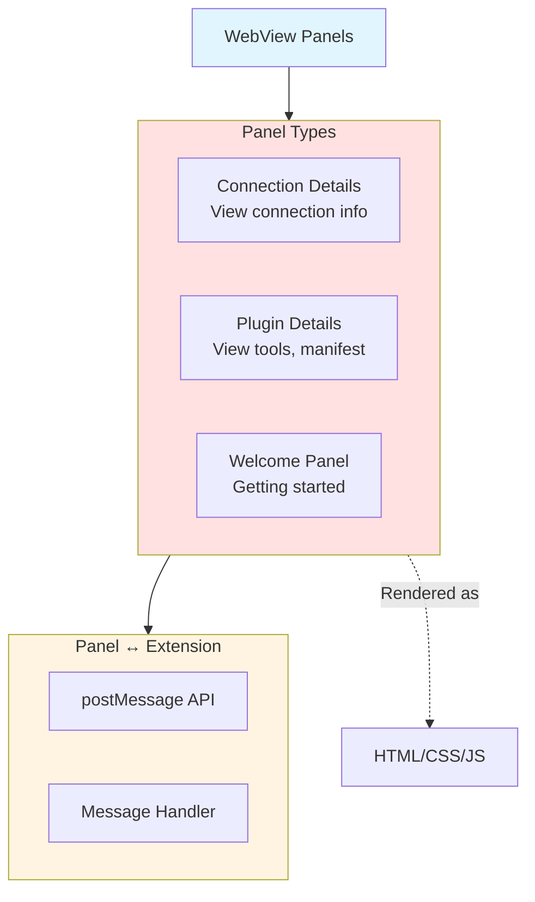
```mermaid
graph TB
    Panels[WebView Panels]
    
    subgraph Types["Panel Types"]
        ConnDetail[Connection Details<br/>View connection info]
        PluginDetail[Plugin Details<br/>View tools, manifest]
        Welcome[Welcome Panel<br/>Getting started]
    end
    
    subgraph Communication["Panel ↔ Extension"]
        PostMessage[postMessage API]
        MessageHandler[Message Handler]
    end
    
    Panels --> Types
    Types --> Communication
    
    HTML[HTML/CSS/JS]
    Types -.->|Rendered as| HTML
    
    style Panels fill:#e1f5ff
    style Types fill:#ffe1e1
    style Communication fill:#fff4e1
```

## Binary Management

### Download and Installation Flow

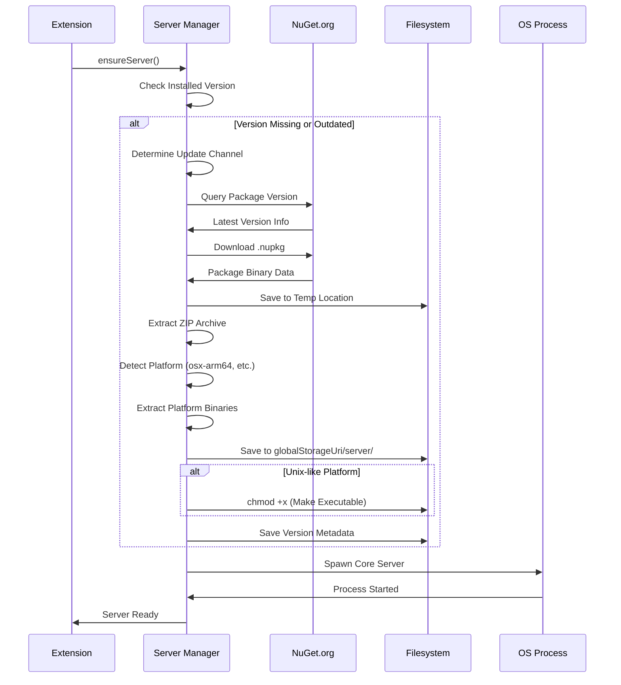
```mermaid
sequenceDiagram
    participant Ext as Extension
    participant Mgr as Server Manager
    participant NuGet as NuGet.org
    participant FS as Filesystem
    participant Process as OS Process
    
    Ext->>Mgr: ensureServer()
    Mgr->>Mgr: Check Installed Version
    
    alt Version Missing or Outdated
        Mgr->>Mgr: Determine Update Channel
        Mgr->>NuGet: Query Package Version
        NuGet->>Mgr: Latest Version Info
        
        Mgr->>NuGet: Download .nupkg
        NuGet->>Mgr: Package Binary Data
        
        Mgr->>FS: Save to Temp Location
        Mgr->>Mgr: Extract ZIP Archive
        Mgr->>Mgr: Detect Platform (osx-arm64, etc.)
        Mgr->>Mgr: Extract Platform Binaries
        Mgr->>FS: Save to globalStorageUri/server/
        
        alt Unix-like Platform
            Mgr->>FS: chmod +x (Make Executable)
        end
        
        Mgr->>FS: Save Version Metadata
    end
    
    Mgr->>Process: Spawn Core Server
    Process->>Mgr: Process Started
    Mgr->>Ext: Server Ready
```

### Version Management

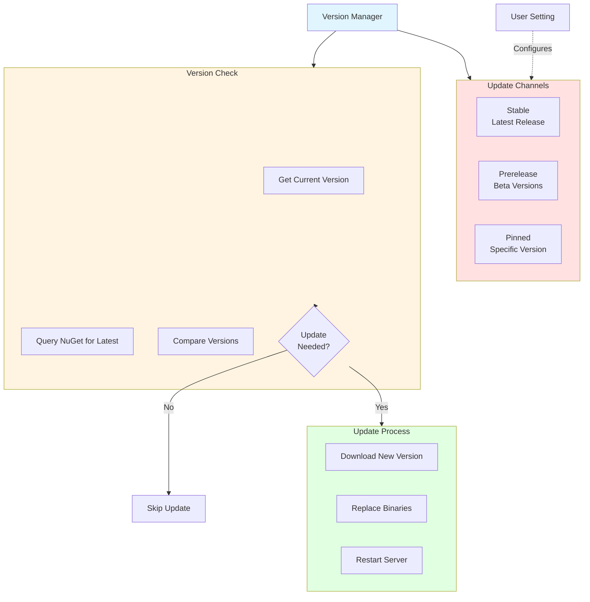
```mermaid
graph TB
    VersionMgr[Version Manager]
    
    subgraph Channels["Update Channels"]
        Stable[Stable<br/>Latest Release]
        Prerelease[Prerelease<br/>Beta Versions]
        Pinned[Pinned<br/>Specific Version]
    end
    
    subgraph Check["Version Check"]
        Current[Get Current Version]
        Query[Query NuGet for Latest]
        Compare[Compare Versions]
        Decision{Update<br/>Needed?}
    end
    
    subgraph Update["Update Process"]
        Download[Download New Version]
        Replace[Replace Binaries]
        Restart[Restart Server]
    end
    
    VersionMgr --> Channels
    VersionMgr --> Check
    Check --> Decision
    Decision -->|Yes| Update
    Decision -->|No| Skip[Skip Update]
    
    User[User Setting]
    User -.->|Configures| Channels
    
    style VersionMgr fill:#e1f5ff
    style Channels fill:#ffe1e1
    style Check fill:#fff4e1
    style Update fill:#e1ffe1
```

**Update Behavior:**

| Channel | Behavior | Use Case |
|---------|----------|----------|
| **Stable** | Auto-update to latest stable release | Production use |
| **Prerelease** | Auto-update to latest prerelease | Testing new features |
| **Pinned** | Never auto-update, use specific version | Stability requirements |

### Platform Binary Selection

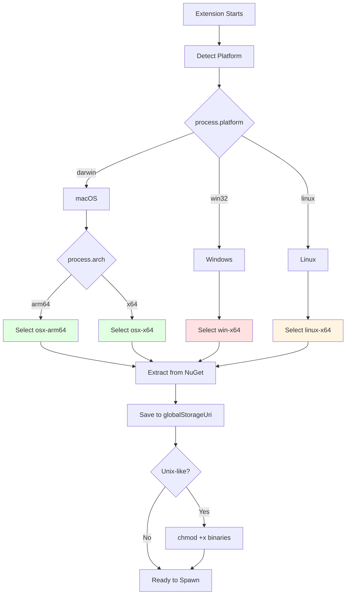
```mermaid
graph TB
    Start[Extension Starts] --> Detect[Detect Platform]
    Detect --> Platform{process.platform}
    
    Platform -->|darwin| Mac[macOS]
    Platform -->|win32| Win[Windows]
    Platform -->|linux| Linux[Linux]
    
    Mac --> Arch{process.arch}
    Arch -->|arm64| ARM[Select osx-arm64]
    Arch -->|x64| IntelMac[Select osx-x64]
    
    Win --> WinBin[Select win-x64]
    Linux --> LinuxBin[Select linux-x64]
    
    ARM --> Extract[Extract from NuGet]
    IntelMac --> Extract
    WinBin --> Extract
    LinuxBin --> Extract
    
    Extract --> Storage[Save to globalStorageUri]
    Storage --> Unix{Unix-like?}
    
    Unix -->|Yes| Chmod[chmod +x binaries]
    Unix -->|No| Ready[Ready to Spawn]
    Chmod --> Ready
    
    style ARM fill:#e1ffe1
    style IntelMac fill:#e1ffe1
    style WinBin fill:#ffe1e1
    style LinuxBin fill:#fff4e1
```

## Process Management

### Core Server Lifecycle

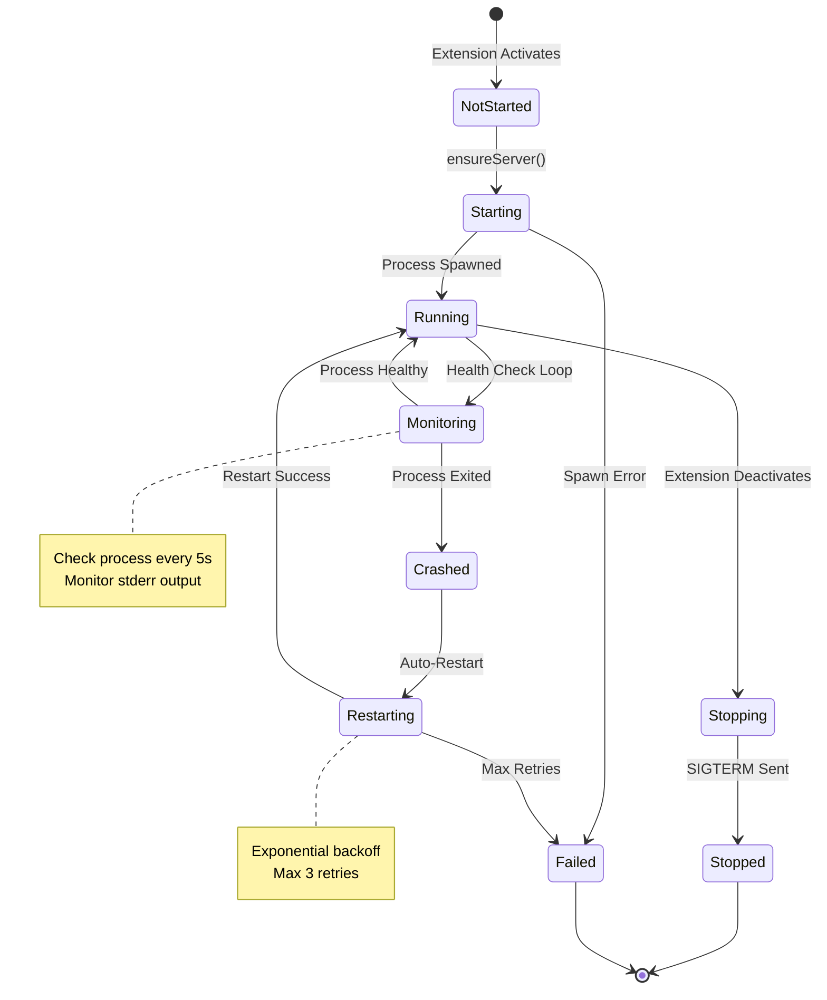
```mermaid
stateDiagram-v2
    [*] --> NotStarted: Extension Activates
    NotStarted --> Starting: ensureServer()
    Starting --> Running: Process Spawned
    Starting --> Failed: Spawn Error
    
    Running --> Monitoring: Health Check Loop
    Monitoring --> Running: Process Healthy
    Monitoring --> Crashed: Process Exited
    
    Crashed --> Restarting: Auto-Restart
    Restarting --> Running: Restart Success
    Restarting --> Failed: Max Retries
    
    Running --> Stopping: Extension Deactivates
    Stopping --> Stopped: SIGTERM Sent
    Stopped --> [*]
    
    Failed --> [*]
    
    note right of Monitoring
        Check process every 5s
        Monitor stderr output
    end note
    
    note right of Restarting
        Exponential backoff
        Max 3 retries
    end note
```

### Environment Variable Injection

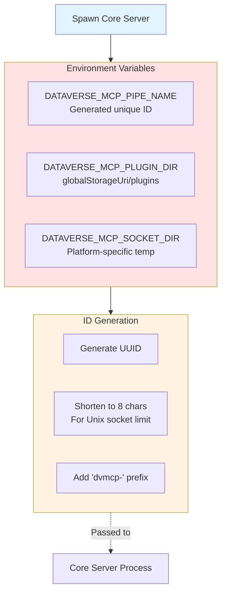
```mermaid
graph TB
    Spawn[Spawn Core Server]
    
    subgraph EnvVars["Environment Variables"]
        PipeName[DATAVERSE_MCP_PIPE_NAME<br/>Generated unique ID]
        PluginDir[DATAVERSE_MCP_PLUGIN_DIR<br/>globalStorageUri/plugins]
        SocketDir[DATAVERSE_MCP_SOCKET_DIR<br/>Platform-specific temp]
    end
    
    subgraph Generation["ID Generation"]
        UUID[Generate UUID]
        Short[Shorten to 8 chars<br/>For Unix socket limit]
        Prefix[Add 'dvmcp-' prefix]
    end
    
    Spawn --> EnvVars
    EnvVars --> Generation
    
    Process[Core Server Process]
    Generation -.->|Passed to| Process
    
    style Spawn fill:#e1f5ff
    style EnvVars fill:#ffe1e1
    style Generation fill:#fff4e1
```

## Configuration

### Extension Settings

```typescript
{
  "dataversemcptoolbox.updateChannel": "stable" | "prerelease",
  "dataversemcptoolbox.pinnedVersion": "1.2.3" | null,
  "dataversemcptoolbox.autoRestart": boolean,
  "dataversemcptoolbox.logLevel": "error" | "warn" | "info" | "debug"
}
```

### Storage Locations

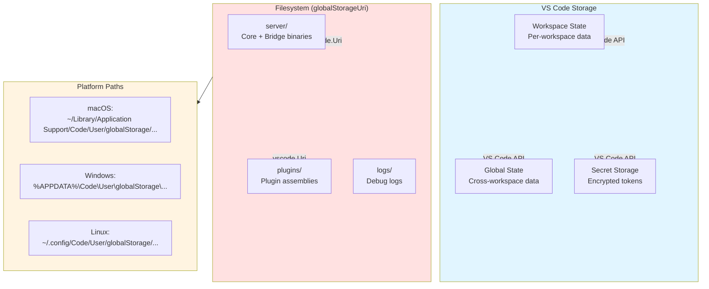
```mermaid
graph TB
    subgraph VSCode["VS Code Storage"]
        Workspace[Workspace State<br/>Per-workspace data]
        Global[Global State<br/>Cross-workspace data]
        Secrets[Secret Storage<br/>Encrypted tokens]
    end
    
    subgraph FS["Filesystem (globalStorageUri)"]
        Server[server/<br/>Core + Bridge binaries]
        Plugins[plugins/<br/>Plugin assemblies]
        Logs[logs/<br/>Debug logs]
    end
    
    subgraph Locations["Platform Paths"]
        MacOS[macOS:<br/>~/Library/Application Support/Code/User/globalStorage/...]
        Windows[Windows:<br/>%APPDATA%\Code\User\globalStorage\...]
        Linux[Linux:<br/>~/.config/Code/User/globalStorage/...]
    end
    
    VSCode -.->|VS Code API| Workspace
    VSCode -.->|VS Code API| Global
    VSCode -.->|VS Code API| Secrets
    
    FS -.->|vscode.Uri| Server
    FS -.->|vscode.Uri| Plugins
    
    FS --> Locations
    
    style VSCode fill:#e1f5ff
    style FS fill:#ffe1e1
    style Locations fill:#fff4e1
```

## Next Steps

- **[Communication Protocol](08-Communication.md)**: JSON-RPC details
- **[Server Lifecycle](09-Server-Lifecycle.md)**: Binary download and updates
- **[Managing Connections](10-Managing-Connections.md)**: Connection workflows
