# Communication Protocol

Detailed specification of the JSON-RPC 2.0 communication protocol used between all components.

## Protocol Overview

All components communicate using **JSON-RPC 2.0** over different transport layers.

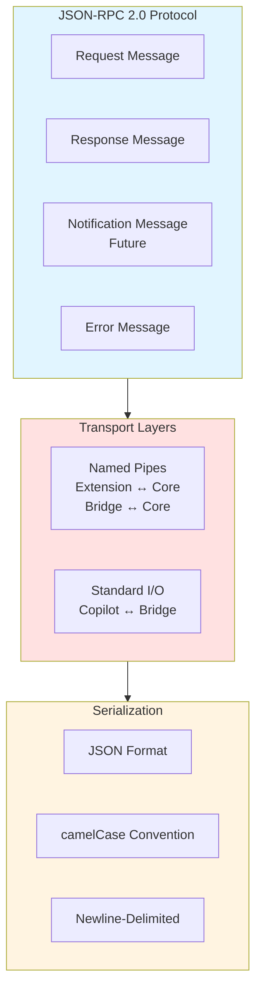

## Message Format

### Request Message

```json
{
  "jsonrpc": "2.0",
  "id": "request-unique-id",
  "method": "methodName",
  "params": {
    "param1": "value1",
    "param2": "value2"
  }
}
```

### Success Response

```json
{
  "jsonrpc": "2.0",
  "id": "request-unique-id",
  "result": {
    "data": "response data"
  }
}
```

### Error Response

```json
{
  "jsonrpc": "2.0",
  "id": "request-unique-id",
  "error": {
    "code": -32600,
    "message": "Error description",
    "data": {
      "details": "Additional error information"
    }
  }
}
```

## Message Flow

### Request-Response Pattern

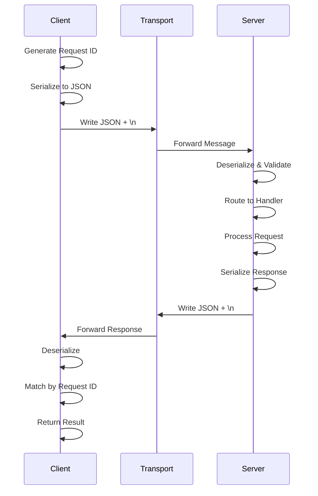

### Concurrent Requests

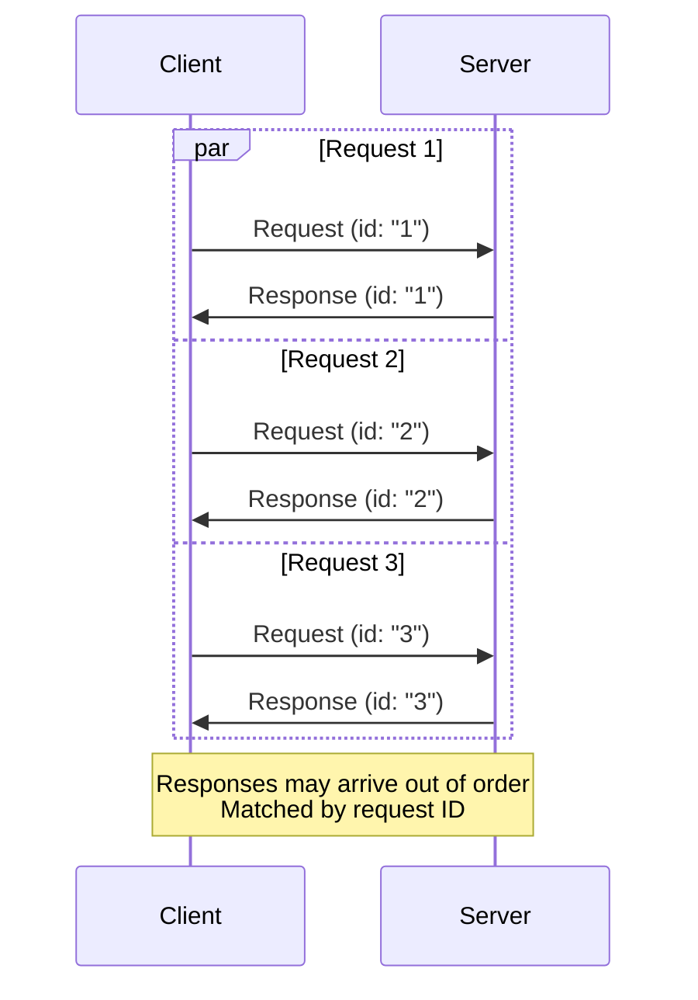

## Transport Layers

### Named Pipes (Extension ↔ Core, Bridge ↔ Core)

```mermaid
graph TB
    subgraph Windows["Windows Named Pipes"]
        WinPath[Path: \\.\pipe\{name}]
        WinAPI[Win32 Named Pipe API]
    end
    
    subgraph Unix["Unix Domain Sockets"]
        UnixPath[Path: /tmp/{dir}/CoreFxPipe_{name}]
        UnixAPI[POSIX Socket API]
        UnixLimit[⚠️ 104 char path limit]
    end
    
    subgraph Common["Common Behavior"]
        Bidirectional[Bidirectional Communication]
        Buffered[Buffered I/O]
        NewlineDelim[Newline-Delimited Messages]
    end
    
    Platform{Platform?}
    Platform -->|Windows| Windows
    Platform -->|Unix/macOS| Unix
    
    Windows --> Common
    Unix --> Common
    
    style Windows fill:#e1f5ff
    style Unix fill:#ffe1e1
    style Common fill:#fff4e1
```

**Pipe Naming Convention:**

| Platform | Pattern | Example |
|----------|---------|---------|
| **Windows** | `\\.\pipe\dvmcp-{id}` | `\\.\pipe\dvmcp-abc12345` |
| **Unix/macOS** | `/tmp/dvmcptb-sockets/CoreFxPipe_dvmcp-{id}` | `/tmp/dvmcptb-sockets/CoreFxPipe_dvmcp-abc12345` |

**Path Length Considerations:**

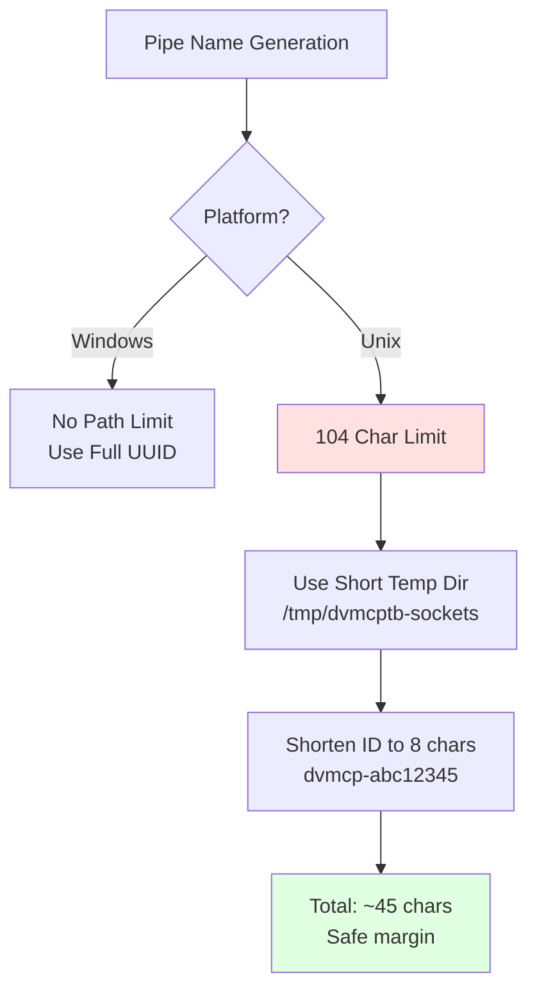

### STDIO (Copilot ↔ Bridge)

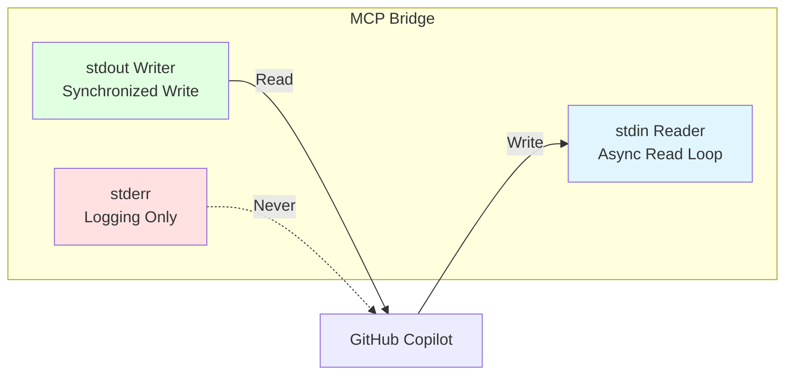

**Critical Rules:**
- ✅ `stdout`: Only JSON-RPC messages
- ✅ `stderr`: All logs and debug output
- ❌ Never mix logs with stdout
- ✅ Flush after every stdout write
- ✅ Newline-delimited messages

## Serialization

### Naming Convention Mapping

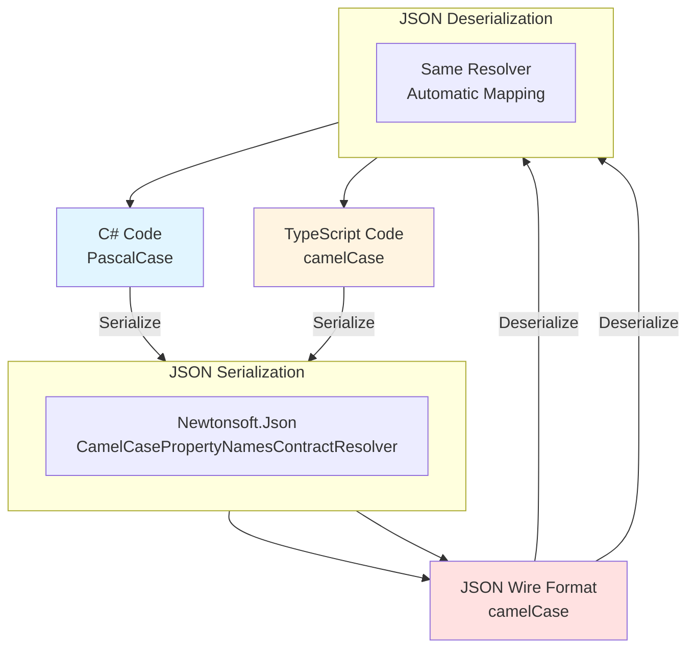

**Example Mapping:**

| C# Property | JSON Property | TypeScript Property |
|-------------|---------------|---------------------|
| `ConnectionId` | `connectionId` | `connectionId` |
| `IsActive` | `isActive` | `isActive` |
| `EnvironmentUrl` | `environmentUrl` | `environmentUrl` |
| `UserInfo` | `userInfo` | `userInfo` |

### Data Types

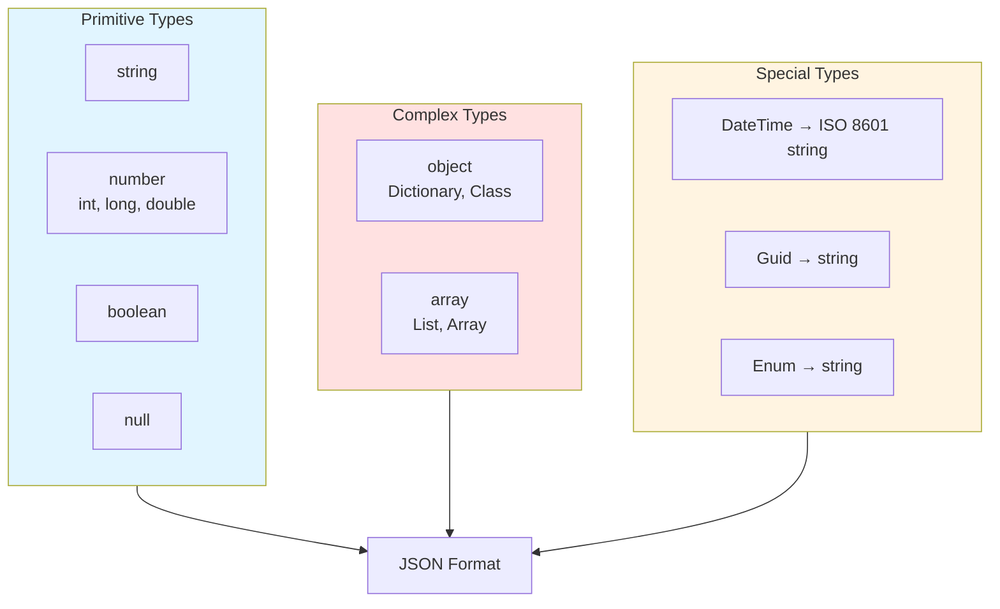

## Core RPC Methods

### Connection Management

```mermaid
graph TB
    subgraph ConnectionMethods["Connection Methods"]
        Create[CreateConnectionAsync<br/>→ ConnectionResult]
        Get[GetConnectionAsync<br/>→ ConnectionInfo]
        List[ListConnectionsAsync<br/>→ ConnectionInfo[]]
        Delete[DeleteConnectionAsync<br/>→ bool]
        SetActive[SetActiveConnectionAsync<br/>→ bool]
        WhoAmI[GetWhoAmIAsync<br/>→ WhoAmIResult]
    end
    
    subgraph Models["Data Models"]
        ConnRequest[ConnectionRequest]
        ConnInfo[ConnectionInfo]
        ConnResult[ConnectionResult]
        WhoAmIRes[WhoAmIResult]
    end
    
    ConnectionMethods --> Models
    
    style ConnectionMethods fill:#e1f5ff
    style Models fill:#ffe1e1
```

#### CreateConnectionAsync

**Request:**
```json
{
  "jsonrpc": "2.0",
  "id": "1",
  "method": "CreateConnectionAsync",
  "params": {
    "name": "Dev Environment",
    "environmentUrl": "https://yourorg.crm.dynamics.com"
  }
}
```

**Success Response:**
```json
{
  "jsonrpc": "2.0",
  "id": "1",
  "result": {
    "success": true,
    "connectionId": "550e8400-e29b-41d4-a716-446655440000",
    "userInfo": {
      "userId": "...",
      "userName": "John Doe",
      "businessUnitId": "...",
      "organizationId": "..."
    }
  }
}
```

#### ListConnectionsAsync

**Request:**
```json
{
  "jsonrpc": "2.0",
  "id": "2",
  "method": "ListConnectionsAsync",
  "params": {}
}
```

**Response:**
```json
{
  "jsonrpc": "2.0",
  "id": "2",
  "result": [
    {
      "id": "550e8400-...",
      "name": "Dev Environment",
      "environmentUrl": "https://dev.crm.dynamics.com",
      "isActive": true,
      "userInfo": {...}
    },
    {
      "id": "660f9511-...",
      "name": "UAT Environment",
      "environmentUrl": "https://uat.crm.dynamics.com",
      "isActive": false,
      "userInfo": {...}
    }
  ]
}
```

### Tool Operations

```mermaid
graph TB
    subgraph ToolMethods["Tool Methods"]
        Discover[DiscoverToolsAsync<br/>→ ToolInfo[]]
        Execute[ExecuteToolAsync<br/>→ ToolCallResult]
    end
    
    subgraph Models["Data Models"]
        ToolInfo[ToolInfo<br/>name, description, schema]
        ToolRequest[ToolCallRequest<br/>toolName, arguments]
        ToolResult[ToolCallResult<br/>success, content, error]
    end
    
    ToolMethods --> Models
    
    style ToolMethods fill:#e1f5ff
    style Models fill:#ffe1e1
```

#### DiscoverToolsAsync

**Request:**
```json
{
  "jsonrpc": "2.0",
  "id": "3",
  "method": "DiscoverToolsAsync",
  "params": {}
}
```

**Response:**
```json
{
  "jsonrpc": "2.0",
  "id": "3",
  "result": [
    {
      "name": "list-entities",
      "description": "List all entities in the Dataverse environment",
      "inputSchema": {
        "type": "object",
        "properties": {},
        "required": []
      }
    },
    {
      "name": "get-record",
      "description": "Retrieve a specific record",
      "inputSchema": {
        "type": "object",
        "properties": {
          "entityName": {"type": "string"},
          "recordId": {"type": "string"}
        },
        "required": ["entityName", "recordId"]
      }
    }
  ]
}
```

#### ExecuteToolAsync

**Request:**
```json
{
  "jsonrpc": "2.0",
  "id": "4",
  "method": "ExecuteToolAsync",
  "params": {
    "toolName": "get-record",
    "arguments": {
      "entityName": "account",
      "recordId": "00000000-0000-0000-0000-000000000001"
    }
  }
}
```

**Success Response:**
```json
{
  "jsonrpc": "2.0",
  "id": "4",
  "result": {
    "success": true,
    "content": {
      "accountid": "00000000-0000-0000-0000-000000000001",
      "name": "Contoso Ltd",
      "revenue": 1000000
    }
  }
}
```

**Error Response:**
```json
{
  "jsonrpc": "2.0",
  "id": "4",
  "result": {
    "success": false,
    "error": {
      "code": "NOT_FOUND",
      "message": "Record not found",
      "details": "No record with ID 00000000-... exists"
    }
  }
}
```

### Plugin Operations

```mermaid
graph TB
    subgraph PluginMethods["Plugin Methods"]
        List[ListPluginsAsync<br/>→ PluginInfo[]]
        Reload[ReloadPluginsAsync<br/>→ bool]
    end
    
    subgraph Models["Data Models"]
        PluginInfo[PluginInfo<br/>name, version, tools[]]
    end
    
    PluginMethods --> Models
    
    style PluginMethods fill:#e1f5ff
    style Models fill:#ffe1e1
```

### Server Information

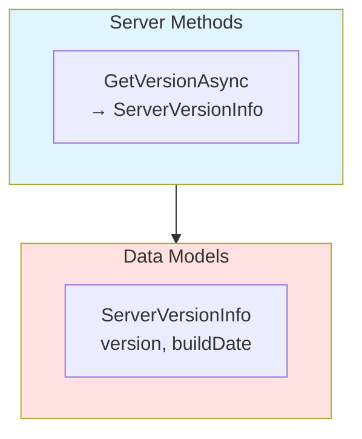

## Error Codes

### JSON-RPC Standard Errors

| Code | Message | Meaning |
|------|---------|---------|
| `-32700` | Parse error | Invalid JSON |
| `-32600` | Invalid Request | Missing required fields |
| `-32601` | Method not found | Unknown method name |
| `-32602` | Invalid params | Parameter validation failed |
| `-32603` | Internal error | Server-side error |

### Application-Specific Errors

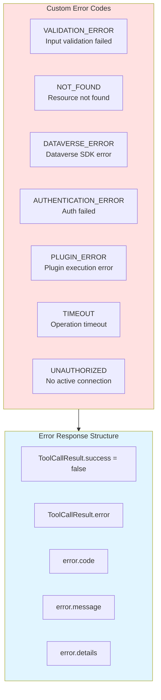

## Protocol Guarantees

### Message Ordering

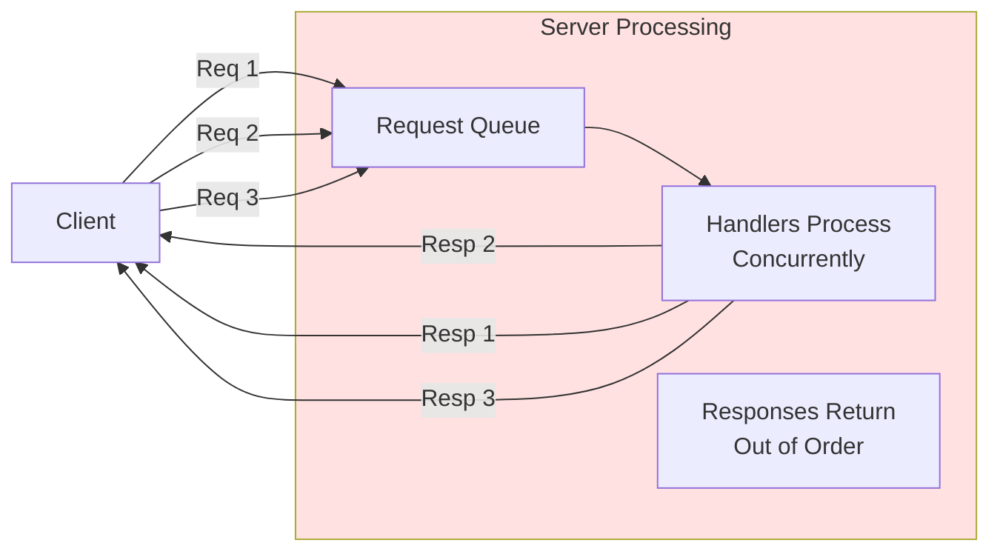

**Guarantees:**
- Requests processed concurrently
- No ordering guarantee on responses
- Client matches responses by request ID
- Requests on same connection are thread-safe

### Error Recovery

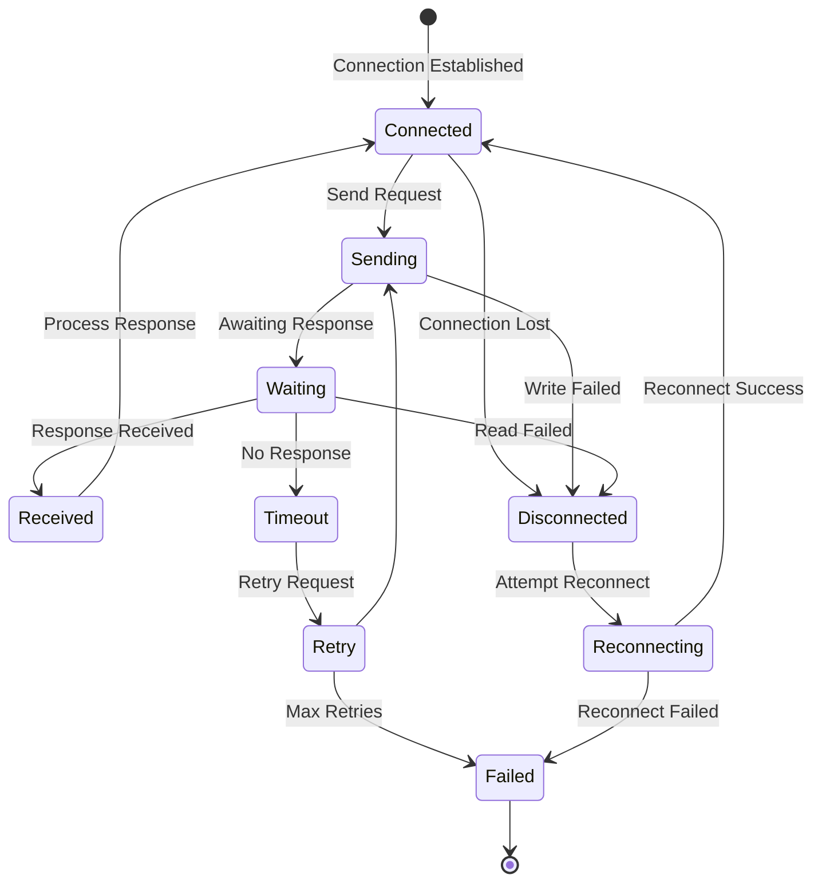

## Performance Characteristics

### Latency Breakdown

```mermaid
graph LR
    Start[Request Start] -->|~1ms| Serialize[Serialization]
    Serialize -->|<1ms| Write[Write to Pipe]
    Write -->|~1-5ms| Transport[Transport]
    Transport -->|<1ms| Read[Read from Pipe]
    Read -->|~1ms| Deserialize[Deserialization]
    Deserialize -->|Variable| Process[Processing]
    Process -->|~1ms| SerializeResp[Serialize Response]
    SerializeResp -->|~1-5ms| TransportResp[Transport]
    TransportResp -->|~1ms| DeserializeResp[Deserialize Response]
    DeserializeResp --> End[Response Ready]
    
    style Serialize fill:#e1ffe1
    style Deserialize fill:#e1ffe1
    style Process fill:#ffe1e1
```

**Typical Latencies:**
- Local RPC overhead: ~5-10ms
- Dataverse SDK call: 100-500ms
- Total request: 110-520ms

### Message Size Limits

| Component | Typical Size | Max Recommended |
|-----------|--------------|-----------------|
| **Request** | < 10 KB | 1 MB |
| **Response** | < 100 KB | 10 MB |
| **Tool Result** | Variable | 5 MB |

**Large Result Handling:**
- Paginate large datasets
- Return references instead of full data
- Stream large responses (future enhancement)

## Next Steps

- **[Server Lifecycle](09-Server-Lifecycle.md)**: Binary download and updates
- **[Managing Connections](10-Managing-Connections.md)**: Connection workflows
- **[Using Tools](12-Using-Tools.md)**: Tool execution details
