# Server Lifecycle

Understanding how the Core Server and MCP Bridge binaries are downloaded, managed, updated, and executed throughout the extension's lifecycle.

## Overview

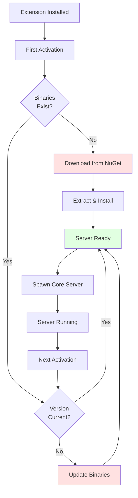
```mermaid
graph TB
    Install[Extension Installed] --> FirstRun[First Activation]
    FirstRun --> Check{Binaries<br/>Exist?}
    
    Check -->|No| Download[Download from NuGet]
    Check -->|Yes| VersionCheck{Version<br/>Current?}
    
    Download --> Extract[Extract & Install]
    Extract --> Ready[Server Ready]
    
    VersionCheck -->|Yes| Ready
    VersionCheck -->|No| Update[Update Binaries]
    Update --> Ready
    
    Ready --> Spawn[Spawn Core Server]
    Spawn --> Running[Server Running]
    
    Running --> NextRun[Next Activation]
    NextRun --> VersionCheck
    
    style Download fill:#ffe1e1
    style Update fill:#ffe1e1
    style Ready fill:#e1ffe1
```

## First Run Experience

### Initial Installation Flow

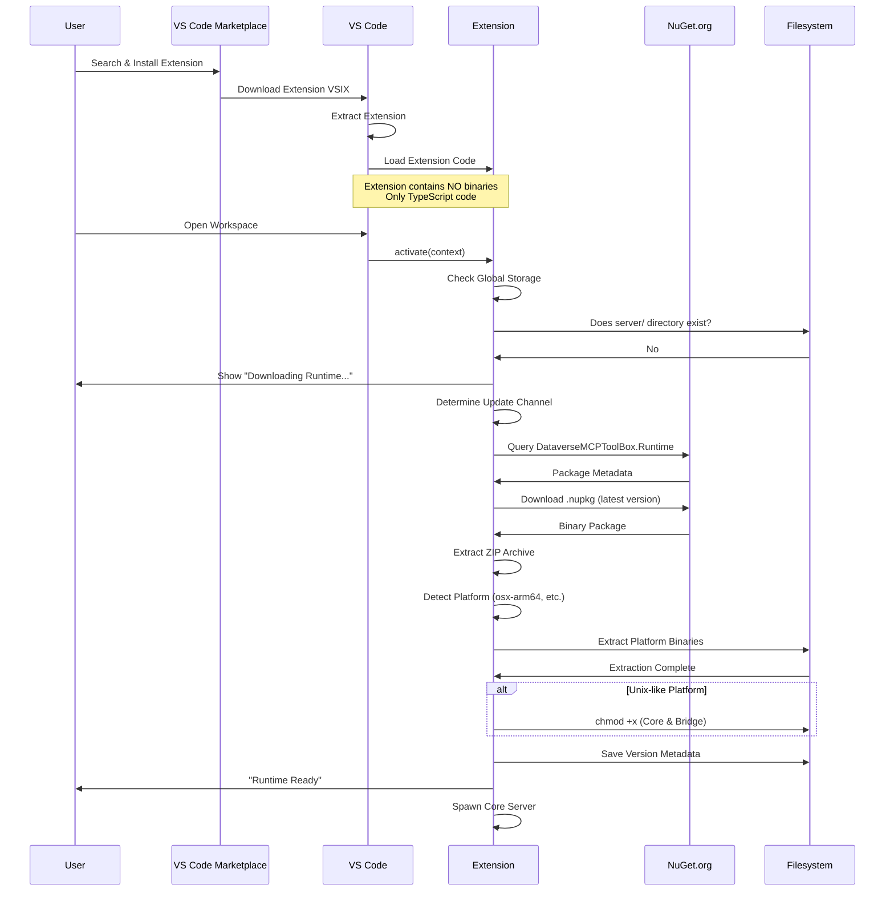
```mermaid
sequenceDiagram
    participant User
    participant Marketplace as VS Code Marketplace
    participant VSCode as VS Code
    participant Ext as Extension
    participant NuGet as NuGet.org
    participant FS as Filesystem
    
    User->>Marketplace: Search & Install Extension
    Marketplace->>VSCode: Download Extension VSIX
    VSCode->>VSCode: Extract Extension
    VSCode->>Ext: Load Extension Code
    
    Note over VSCode,Ext: Extension contains NO binaries<br/>Only TypeScript code
    
    User->>VSCode: Open Workspace
    VSCode->>Ext: activate(context)
    
    Ext->>Ext: Check Global Storage
    Ext->>FS: Does server/ directory exist?
    FS->>Ext: No
    
    Ext->>User: Show "Downloading Runtime..."
    Ext->>Ext: Determine Update Channel
    Ext->>NuGet: Query DataverseMCPToolBox.Runtime
    NuGet->>Ext: Package Metadata
    Ext->>NuGet: Download .nupkg (latest version)
    NuGet->>Ext: Binary Package
    
    Ext->>Ext: Extract ZIP Archive
    Ext->>Ext: Detect Platform (osx-arm64, etc.)
    Ext->>FS: Extract Platform Binaries
    FS->>Ext: Extraction Complete
    
    alt Unix-like Platform
        Ext->>FS: chmod +x (Core & Bridge)
    end
    
    Ext->>FS: Save Version Metadata
    Ext->>User: "Runtime Ready"
    Ext->>Ext: Spawn Core Server
```

### Platform Detection

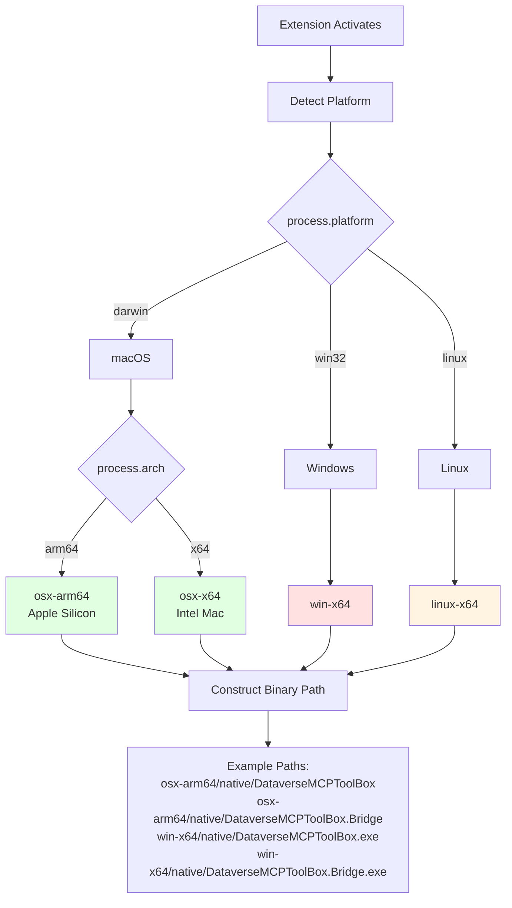
```mermaid
graph TB
    Start[Extension Activates] --> Detect[Detect Platform]
    
    Detect --> Platform{process.platform}
    
    Platform -->|darwin| Mac[macOS]
    Platform -->|win32| Windows[Windows]
    Platform -->|linux| Linux[Linux]
    
    Mac --> Arch{process.arch}
    Arch -->|arm64| ARM[osx-arm64<br/>Apple Silicon]
    Arch -->|x64| Intel[osx-x64<br/>Intel Mac]
    
    Windows --> Win[win-x64]
    Linux --> Lin[linux-x64]
    
    ARM --> BinaryPath[Construct Binary Path]
    Intel --> BinaryPath
    Win --> BinaryPath
    Lin --> BinaryPath
    
    BinaryPath --> Example["Example Paths:<br/>osx-arm64/native/DataverseMCPToolBox<br/>osx-arm64/native/DataverseMCPToolBox.Bridge<br/>win-x64/native/DataverseMCPToolBox.exe<br/>win-x64/native/DataverseMCPToolBox.Bridge.exe"]
    
    style ARM fill:#e1ffe1
    style Intel fill:#e1ffe1
    style Win fill:#ffe1e1
    style Lin fill:#fff4e1
```

### Binary Extraction

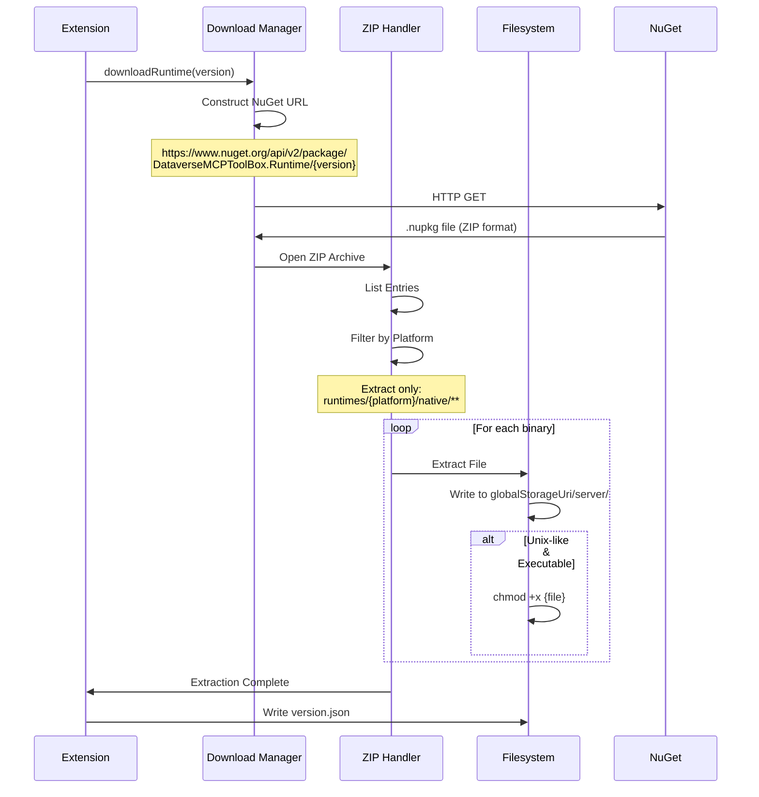
```mermaid
sequenceDiagram
    participant Ext as Extension
    participant Download as Download Manager
    participant Zip as ZIP Handler
    participant FS as Filesystem
    
    Ext->>Download: downloadRuntime(version)
    Download->>Download: Construct NuGet URL
    
    Note over Download: https://www.nuget.org/api/v2/package/<br/>DataverseMCPToolBox.Runtime/{version}
    
    Download->>NuGet: HTTP GET
    NuGet->>Download: .nupkg file (ZIP format)
    
    Download->>Zip: Open ZIP Archive
    Zip->>Zip: List Entries
    
    Zip->>Zip: Filter by Platform
    Note over Zip: Extract only:<br/>runtimes/{platform}/native/**
    
    loop For each binary
        Zip->>FS: Extract File
        FS->>FS: Write to globalStorageUri/server/
        
        alt Unix-like & Executable
            FS->>FS: chmod +x {file}
        end
    end
    
    Zip->>Ext: Extraction Complete
    Ext->>FS: Write version.json
```

### Storage Structure

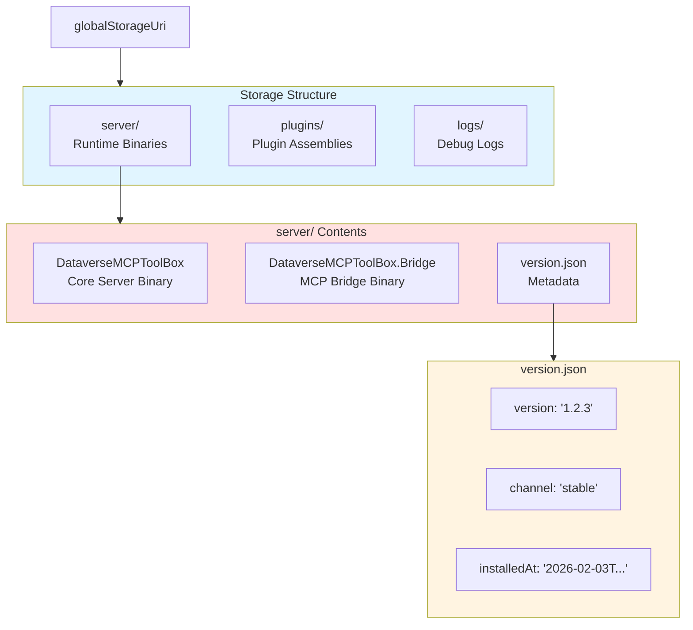
```mermaid
graph TB
    Root[globalStorageUri]
    
    subgraph Storage["Storage Structure"]
        Server[server/<br/>Runtime Binaries]
        Plugins[plugins/<br/>Plugin Assemblies]
        Logs[logs/<br/>Debug Logs]
    end
    
    Root --> Storage
    
    subgraph ServerFiles["server/ Contents"]
        CoreBin[DataverseMCPToolBox<br/>Core Server Binary]
        BridgeBin[DataverseMCPToolBox.Bridge<br/>MCP Bridge Binary]
        Version[version.json<br/>Metadata]
    end
    
    Server --> ServerFiles
    
    subgraph VersionMeta["version.json"]
        Ver["version: '1.2.3'"]
        Channel["channel: 'stable'"]
        Date["installedAt: '2026-02-03T...'"]
    end
    
    Version --> VersionMeta
    
    style Storage fill:#e1f5ff
    style ServerFiles fill:#ffe1e1
    style VersionMeta fill:#fff4e1
```

## Subsequent Runs

### Version Check Flow

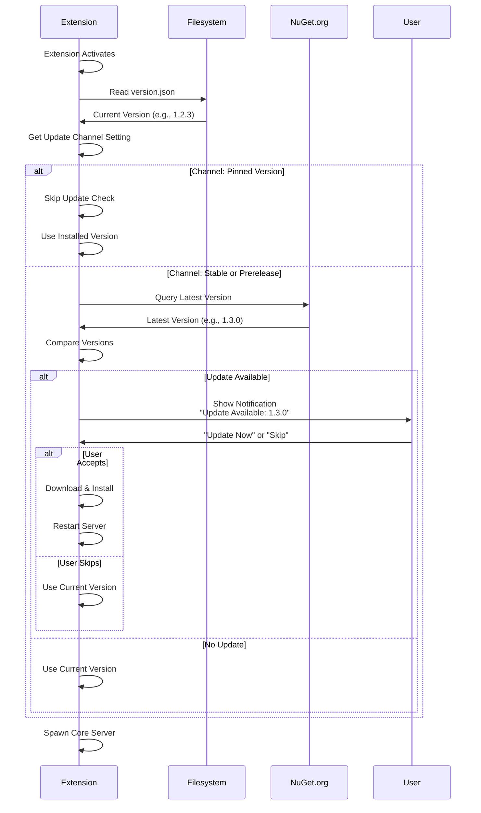
```mermaid
sequenceDiagram
    participant Ext as Extension
    participant FS as Filesystem
    participant NuGet as NuGet.org
    participant User
    
    Ext->>Ext: Extension Activates
    Ext->>FS: Read version.json
    FS->>Ext: Current Version (e.g., 1.2.3)
    
    Ext->>Ext: Get Update Channel Setting
    
    alt Channel: Pinned Version
        Ext->>Ext: Skip Update Check
        Ext->>Ext: Use Installed Version
    else Channel: Stable or Prerelease
        Ext->>NuGet: Query Latest Version
        NuGet->>Ext: Latest Version (e.g., 1.3.0)
        
        Ext->>Ext: Compare Versions
        
        alt Update Available
            Ext->>User: Show Notification<br/>"Update Available: 1.3.0"
            User->>Ext: "Update Now" or "Skip"
            
            alt User Accepts
                Ext->>Ext: Download & Install
                Ext->>Ext: Restart Server
            else User Skips
                Ext->>Ext: Use Current Version
            end
        else No Update
            Ext->>Ext: Use Current Version
        end
    end
    
    Ext->>Ext: Spawn Core Server
```

### Update Channels

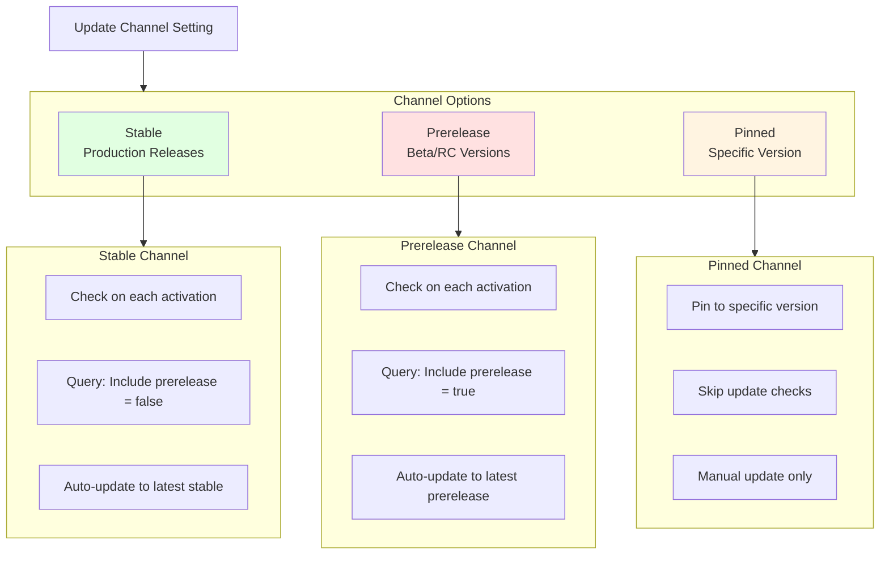
```mermaid
graph TB
    Channel[Update Channel Setting]
    
    subgraph Channels["Channel Options"]
        Stable[Stable<br/>Production Releases]
        Prerelease[Prerelease<br/>Beta/RC Versions]
        Pinned[Pinned<br/>Specific Version]
    end
    
    Channel --> Channels
    
    subgraph StableBehavior["Stable Channel"]
        StableCheck[Check on each activation]
        StableQuery[Query: Include prerelease = false]
        StableUpdate[Auto-update to latest stable]
    end
    
    subgraph PrereleaseBehavior["Prerelease Channel"]
        PreCheck[Check on each activation]
        PreQuery[Query: Include prerelease = true]
        PreUpdate[Auto-update to latest prerelease]
    end
    
    subgraph PinnedBehavior["Pinned Channel"]
        PinVersion[Pin to specific version]
        NoCheck[Skip update checks]
        ManualUpdate[Manual update only]
    end
    
    Stable --> StableBehavior
    Prerelease --> PrereleaseBehavior
    Pinned --> PinnedBehavior
    
    style Stable fill:#e1ffe1
    style Prerelease fill:#ffe1e1
    style Pinned fill:#fff4e1
```

**Channel Configuration:**

```typescript
// In VS Code settings
{
  "dataversemcptoolbox.updateChannel": "stable" | "prerelease",
  "dataversemcptoolbox.pinnedVersion": "1.2.3" | null
}
```

### Version Comparison Logic

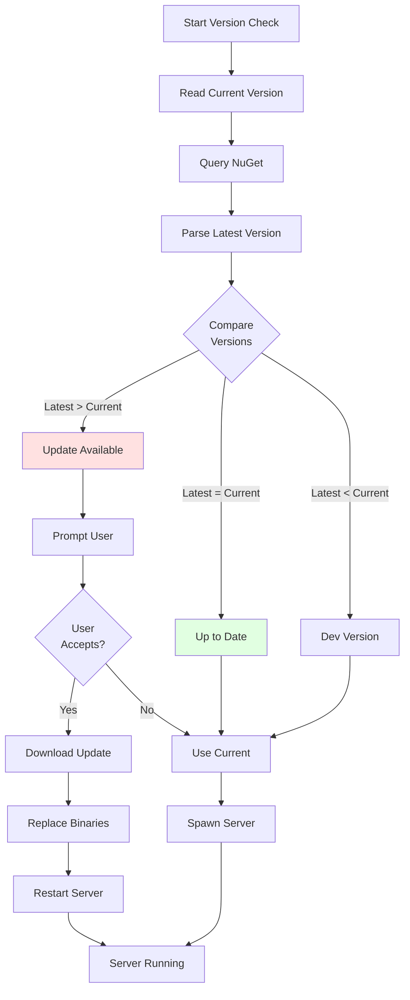
```mermaid
graph TB
    Start[Start Version Check] --> Read[Read Current Version]
    Read --> Query[Query NuGet]
    Query --> Parse[Parse Latest Version]
    
    Parse --> Compare{Compare<br/>Versions}
    
    Compare -->|Latest > Current| UpdateAvail[Update Available]
    Compare -->|Latest = Current| UpToDate[Up to Date]
    Compare -->|Latest < Current| Dev[Dev Version]
    
    UpdateAvail --> Prompt[Prompt User]
    UpToDate --> UseCurrent[Use Current]
    Dev --> UseCurrent
    
    Prompt --> Accept{User<br/>Accepts?}
    Accept -->|Yes| Download[Download Update]
    Accept -->|No| UseCurrent
    
    Download --> Replace[Replace Binaries]
    Replace --> Restart[Restart Server]
    Restart --> Running[Server Running]
    
    UseCurrent --> Spawn[Spawn Server]
    Spawn --> Running
    
    style UpdateAvail fill:#ffe1e1
    style UpToDate fill:#e1ffe1
```

## Binary Management

### Download Process

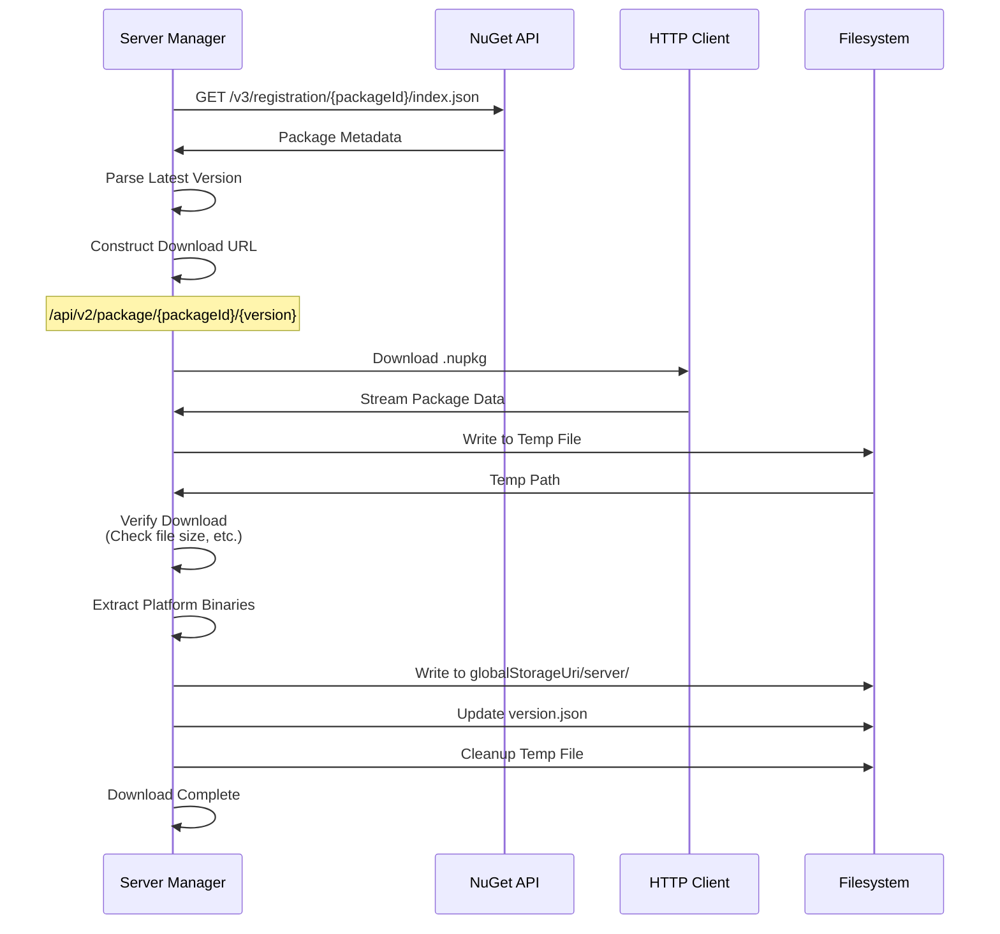
```mermaid
sequenceDiagram
    participant Mgr as Server Manager
    participant NuGet as NuGet API
    participant HTTP as HTTP Client
    participant FS as Filesystem
    
    Mgr->>NuGet: GET /v3/registration/{packageId}/index.json
    NuGet->>Mgr: Package Metadata
    
    Mgr->>Mgr: Parse Latest Version
    Mgr->>Mgr: Construct Download URL
    
    Note over Mgr: /api/v2/package/{packageId}/{version}
    
    Mgr->>HTTP: Download .nupkg
    HTTP->>Mgr: Stream Package Data
    
    Mgr->>FS: Write to Temp File
    FS->>Mgr: Temp Path
    
    Mgr->>Mgr: Verify Download<br/>(Check file size, etc.)
    
    Mgr->>Mgr: Extract Platform Binaries
    Mgr->>FS: Write to globalStorageUri/server/
    
    Mgr->>FS: Update version.json
    Mgr->>FS: Cleanup Temp File
    
    Mgr->>Mgr: Download Complete
```

### Update Process

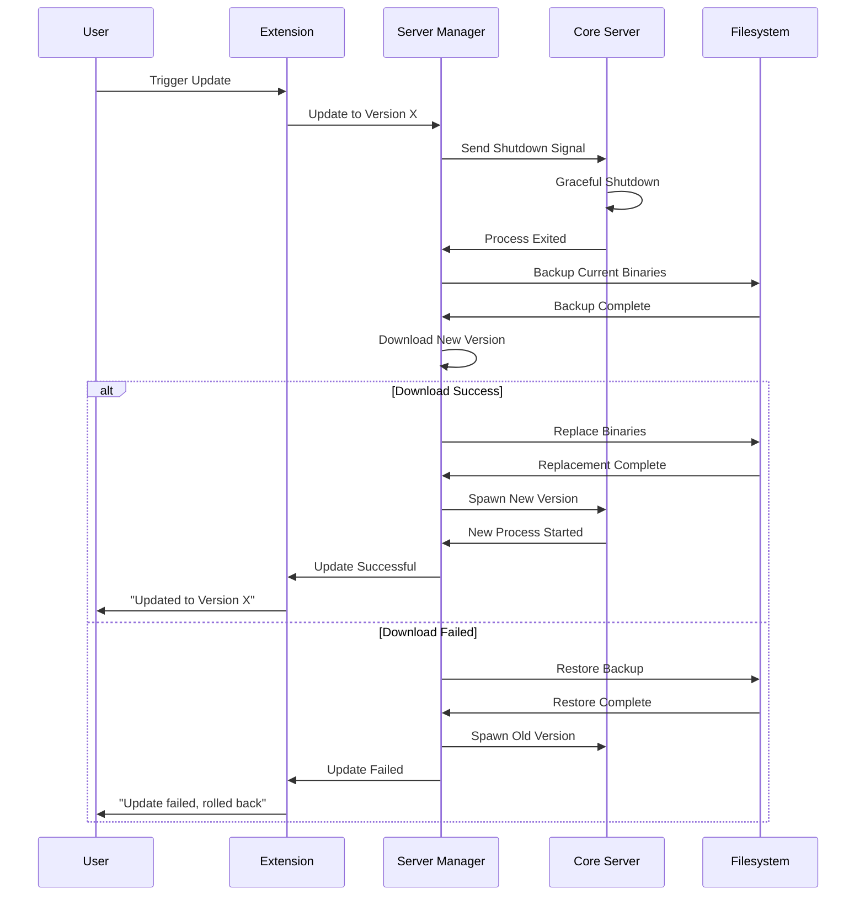
```mermaid
sequenceDiagram
    participant User
    participant Ext as Extension
    participant ServerMgr as Server Manager
    participant Core as Core Server
    participant FS as Filesystem
    
    User->>Ext: Trigger Update
    Ext->>ServerMgr: Update to Version X
    
    ServerMgr->>Core: Send Shutdown Signal
    Core->>Core: Graceful Shutdown
    Core->>ServerMgr: Process Exited
    
    ServerMgr->>FS: Backup Current Binaries
    FS->>ServerMgr: Backup Complete
    
    ServerMgr->>ServerMgr: Download New Version
    
    alt Download Success
        ServerMgr->>FS: Replace Binaries
        FS->>ServerMgr: Replacement Complete
        ServerMgr->>Core: Spawn New Version
        Core->>ServerMgr: New Process Started
        ServerMgr->>Ext: Update Successful
        Ext->>User: "Updated to Version X"
    else Download Failed
        ServerMgr->>FS: Restore Backup
        FS->>ServerMgr: Restore Complete
        ServerMgr->>Core: Spawn Old Version
        ServerMgr->>Ext: Update Failed
        Ext->>User: "Update failed, rolled back"
    end
```

## Process Lifecycle

### Core Server Spawning

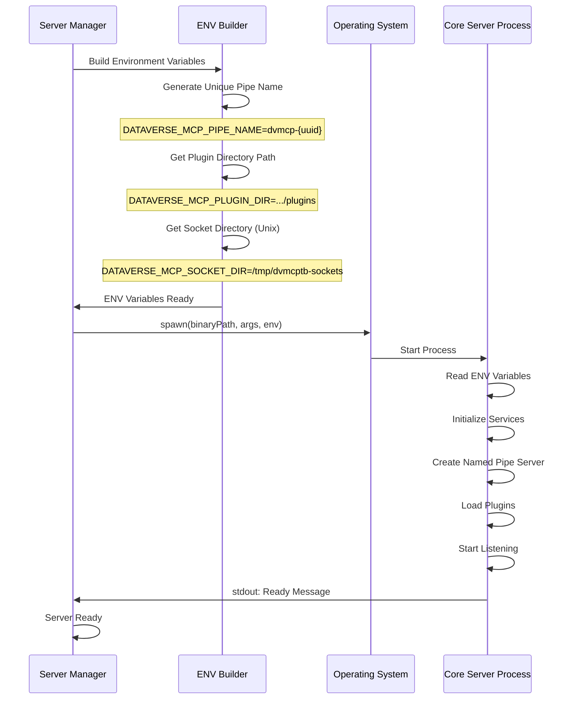
```mermaid
sequenceDiagram
    participant Mgr as Server Manager
    participant Env as ENV Builder
    participant OS as Operating System
    participant Core as Core Server Process
    
    Mgr->>Env: Build Environment Variables
    Env->>Env: Generate Unique Pipe Name
    
    Note over Env: DATAVERSE_MCP_PIPE_NAME=dvmcp-{uuid}
    
    Env->>Env: Get Plugin Directory Path
    
    Note over Env: DATAVERSE_MCP_PLUGIN_DIR=.../plugins
    
    Env->>Env: Get Socket Directory (Unix)
    
    Note over Env: DATAVERSE_MCP_SOCKET_DIR=/tmp/dvmcptb-sockets
    
    Env->>Mgr: ENV Variables Ready
    
    Mgr->>OS: spawn(binaryPath, args, env)
    OS->>Core: Start Process
    
    Core->>Core: Read ENV Variables
    Core->>Core: Initialize Services
    Core->>Core: Create Named Pipe Server
    Core->>Core: Load Plugins
    Core->>Core: Start Listening
    
    Core->>Mgr: stdout: Ready Message
    Mgr->>Mgr: Server Ready
```

### Environment Variable Generation

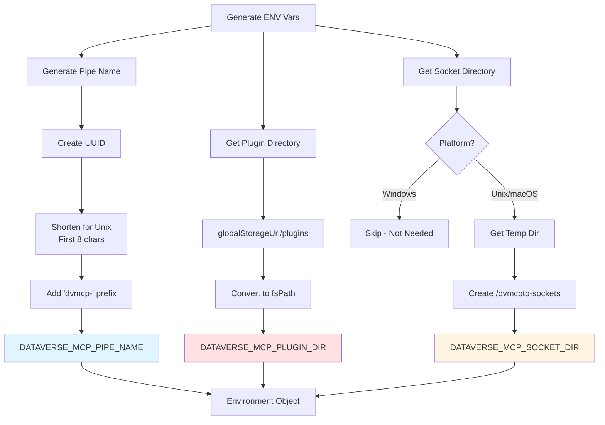
```mermaid
graph TB
    Start[Generate ENV Vars] --> PipeName[Generate Pipe Name]
    
    PipeName --> UUID[Create UUID]
    UUID --> Short[Shorten for Unix<br/>First 8 chars]
    Short --> Prefix[Add 'dvmcp-' prefix]
    Prefix --> PipeVar[DATAVERSE_MCP_PIPE_NAME]
    
    Start --> PluginDir[Get Plugin Directory]
    PluginDir --> GlobalStorage[globalStorageUri/plugins]
    GlobalStorage --> FSPath[Convert to fsPath]
    FSPath --> PluginVar[DATAVERSE_MCP_PLUGIN_DIR]
    
    Start --> SocketDir[Get Socket Directory]
    SocketDir --> Platform{Platform?}
    
    Platform -->|Windows| WinSkip[Skip - Not Needed]
    Platform -->|Unix/macOS| UnixTemp[Get Temp Dir]
    
    UnixTemp --> Create[Create /dvmcptb-sockets]
    Create --> SocketVar[DATAVERSE_MCP_SOCKET_DIR]
    
    PipeVar --> ENV[Environment Object]
    PluginVar --> ENV
    SocketVar --> ENV
    
    style PipeVar fill:#e1f5ff
    style PluginVar fill:#ffe1e1
    style SocketVar fill:#fff4e1
```

### Health Monitoring

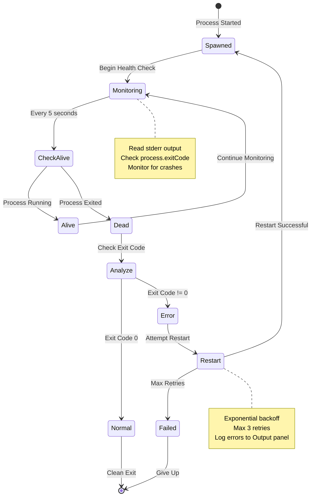
```mermaid
stateDiagram-v2
    [*] --> Spawned: Process Started
    Spawned --> Monitoring: Begin Health Check
    
    Monitoring --> CheckAlive: Every 5 seconds
    CheckAlive --> Alive: Process Running
    CheckAlive --> Dead: Process Exited
    
    Alive --> Monitoring: Continue Monitoring
    
    Dead --> Analyze: Check Exit Code
    
    Analyze --> Normal: Exit Code 0
    Analyze --> Error: Exit Code != 0
    
    Normal --> [*]: Clean Exit
    
    Error --> Restart: Attempt Restart
    Restart --> Spawned: Restart Successful
    Restart --> Failed: Max Retries
    
    Failed --> [*]: Give Up
    
    note right of Monitoring
        Read stderr output
        Check process.exitCode
        Monitor for crashes
    end note
    
    note right of Restart
        Exponential backoff
        Max 3 retries
        Log errors to Output panel
    end note
```

### Graceful Shutdown

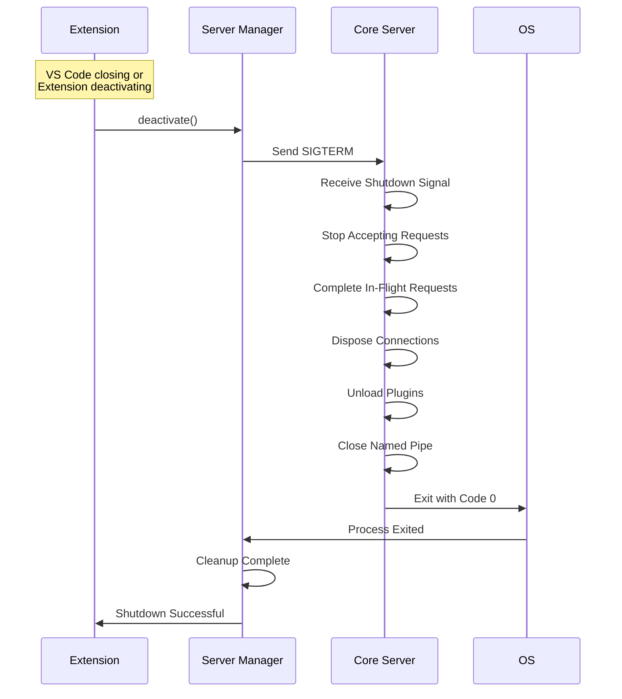
```mermaid
sequenceDiagram
    participant Ext as Extension
    participant ServerMgr as Server Manager
    participant Core as Core Server
    participant OS
    
    Note over Ext: VS Code closing or<br/>Extension deactivating
    
    Ext->>ServerMgr: deactivate()
    ServerMgr->>Core: Send SIGTERM
    
    Core->>Core: Receive Shutdown Signal
    Core->>Core: Stop Accepting Requests
    Core->>Core: Complete In-Flight Requests
    Core->>Core: Dispose Connections
    Core->>Core: Unload Plugins
    Core->>Core: Close Named Pipe
    
    Core->>OS: Exit with Code 0
    OS->>ServerMgr: Process Exited
    
    ServerMgr->>ServerMgr: Cleanup Complete
    ServerMgr->>Ext: Shutdown Successful
```

## Storage Locations

### Platform-Specific Paths

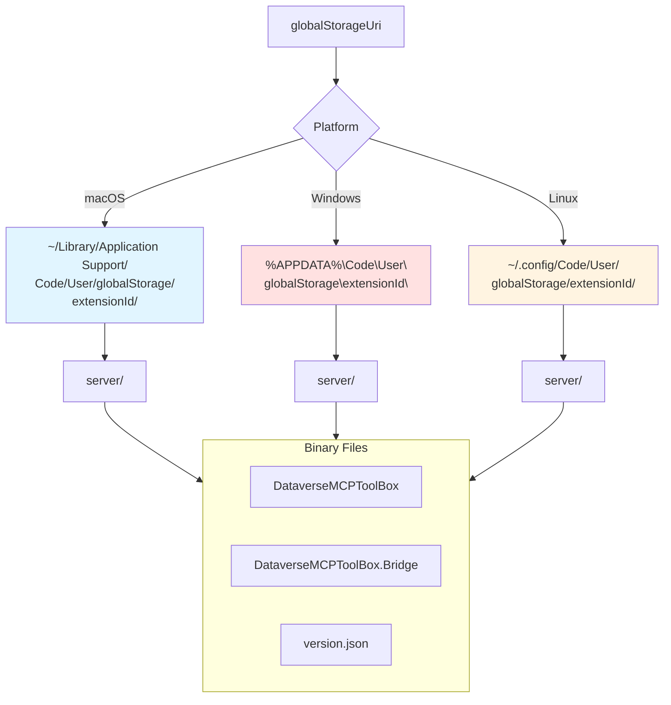
```mermaid
graph TB
    GlobalStorage[globalStorageUri]
    
    GlobalStorage --> Platform{Platform}
    
    Platform -->|macOS| Mac["~/Library/Application Support/<br/>Code/User/globalStorage/<br/>extensionId/"]
    Platform -->|Windows| Win["%APPDATA%\Code\User\<br/>globalStorage\extensionId\"]
    Platform -->|Linux| Lin["~/.config/Code/User/<br/>globalStorage/extensionId/"]
    
    Mac --> Server1[server/]
    Win --> Server2[server/]
    Lin --> Server3[server/]
    
    Server1 --> Binaries
    Server2 --> Binaries
    Server3 --> Binaries
    
    subgraph Binaries["Binary Files"]
        Core[DataverseMCPToolBox]
        Bridge[DataverseMCPToolBox.Bridge]
        Version[version.json]
    end
    
    style Mac fill:#e1f5ff
    style Win fill:#ffe1e1
    style Lin fill:#fff4e1
```

### Disk Space Usage

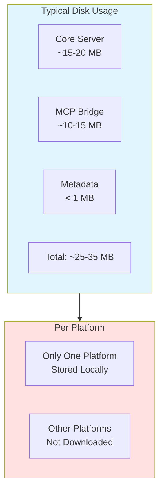
```mermaid
graph TB
    subgraph Usage["Typical Disk Usage"]
        Core[Core Server<br/>~15-20 MB]
        Bridge[MCP Bridge<br/>~10-15 MB]
        Meta[Metadata<br/>< 1 MB]
        Total[Total: ~25-35 MB]
    end
    
    subgraph PerPlatform["Per Platform"]
        OneRID[Only One Platform<br/>Stored Locally]
        OtherRIDs[Other Platforms<br/>Not Downloaded]
    end
    
    Usage --> PerPlatform
    
    style Usage fill:#e1f5ff
    style PerPlatform fill:#ffe1e1
```

## Configuration

### Update Settings

```typescript
// Extension configuration schema
{
  "dataversemcptoolbox.updateChannel": {
    "type": "string",
    "enum": ["stable", "prerelease"],
    "default": "stable",
    "description": "Update channel for runtime binaries"
  },
  "dataversemcptoolbox.pinnedVersion": {
    "type": "string",
    "default": null,
    "description": "Pin to specific version (disables auto-update)"
  },
  "dataversemcptoolbox.checkUpdatesOnStartup": {
    "type": "boolean",
    "default": true,
    "description": "Check for updates when VS Code starts"
  }
}
```

### Manual Version Management

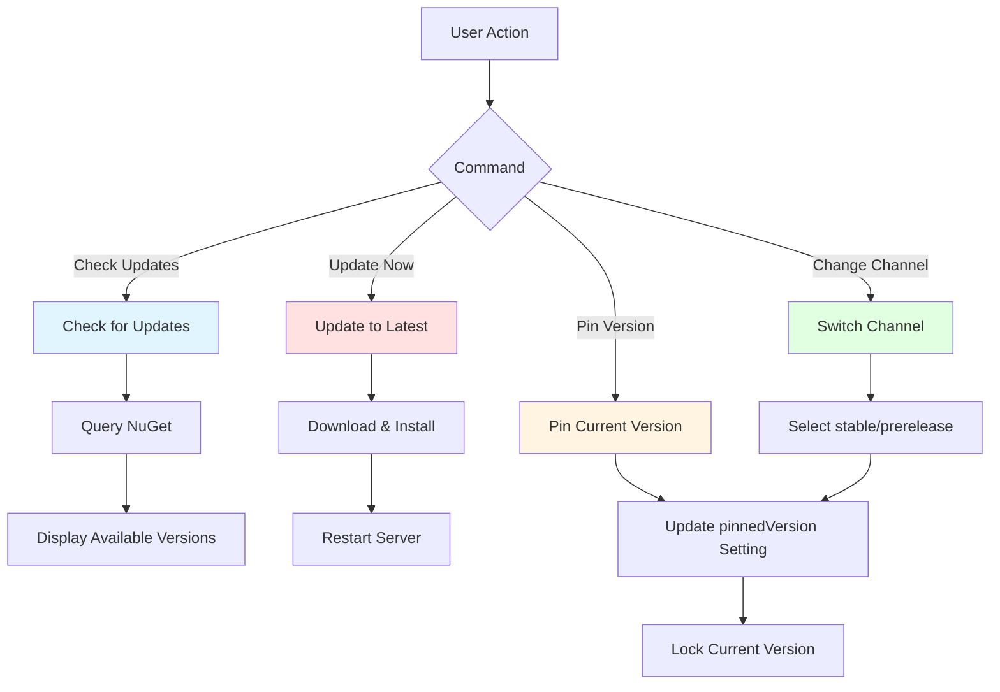
```mermaid
graph TB
    User[User Action] --> Command{Command}
    
    Command -->|Check Updates| Check[Check for Updates]
    Command -->|Update Now| Update[Update to Latest]
    Command -->|Pin Version| Pin[Pin Current Version]
    Command -->|Change Channel| Channel[Switch Channel]
    
    Check --> Query[Query NuGet]
    Query --> Display[Display Available Versions]
    
    Update --> Download[Download & Install]
    Download --> Restart[Restart Server]
    
    Pin --> Settings[Update pinnedVersion Setting]
    Settings --> Lock[Lock Current Version]
    
    Channel --> SelectChannel[Select stable/prerelease]
    SelectChannel --> Settings
    
    style Check fill:#e1f5ff
    style Update fill:#ffe1e1
    style Pin fill:#fff4e1
    style Channel fill:#e1ffe1
```

## Troubleshooting

### Common Issues

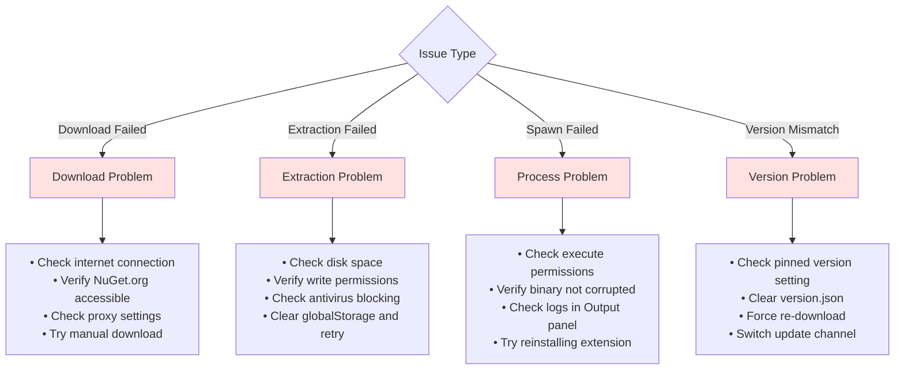
```mermaid
graph TB
    Issue{Issue Type}
    
    Issue -->|Download Failed| DownloadIssue[Download Problem]
    Issue -->|Extraction Failed| ExtractIssue[Extraction Problem]
    Issue -->|Spawn Failed| SpawnIssue[Process Problem]
    Issue -->|Version Mismatch| VersionIssue[Version Problem]
    
    DownloadIssue --> Solutions1["• Check internet connection<br/>• Verify NuGet.org accessible<br/>• Check proxy settings<br/>• Try manual download"]
    
    ExtractIssue --> Solutions2["• Check disk space<br/>• Verify write permissions<br/>• Check antivirus blocking<br/>• Clear globalStorage and retry"]
    
    SpawnIssue --> Solutions3["• Check execute permissions<br/>• Verify binary not corrupted<br/>• Check logs in Output panel<br/>• Try reinstalling extension"]
    
    VersionIssue --> Solutions4["• Check pinned version setting<br/>• Clear version.json<br/>• Force re-download<br/>• Switch update channel"]
    
    style DownloadIssue fill:#ffe1e1
    style ExtractIssue fill:#ffe1e1
    style SpawnIssue fill:#ffe1e1
    style VersionIssue fill:#ffe1e1
```

## Next Steps

- **[Managing Connections](10-Managing-Connections.md)**: Connection workflows
- **[Managing Plugins](11-Managing-Plugins.md)**: Plugin installation
- **[Troubleshooting](13-Troubleshooting.md)**: Detailed troubleshooting guide
