# Managing Connections

Complete guide to creating, managing, and using Dataverse connections.

## Connection Overview

A **connection** represents authenticated access to a specific Dataverse environment. Connections are managed by the Extension UI and stored securely with tokens in VS Code's encrypted storage.

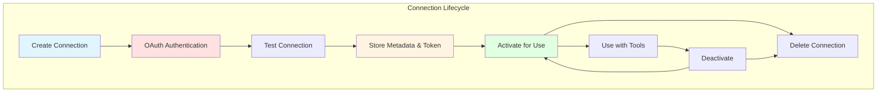
```mermaid
graph TB
    subgraph Lifecycle["Connection Lifecycle"]
        Create[Create Connection]
        Auth[OAuth Authentication]
        Test[Test Connection]
        Store[Store Metadata & Token]
        Activate[Activate for Use]
        Use[Use with Tools]
        Deactivate[Deactivate]
        Delete[Delete Connection]
    end
    
    Create --> Auth
    Auth --> Test
    Test --> Store
    Store --> Activate
    Activate --> Use
    Use --> Deactivate
    Deactivate --> Activate
    Activate --> Delete
    Deactivate --> Delete
    
    style Create fill:#e1f5ff
    style Auth fill:#ffe1e1
    style Store fill:#fff4e1
    style Activate fill:#e1ffe1
```

## Creating a Connection

### UI Workflow

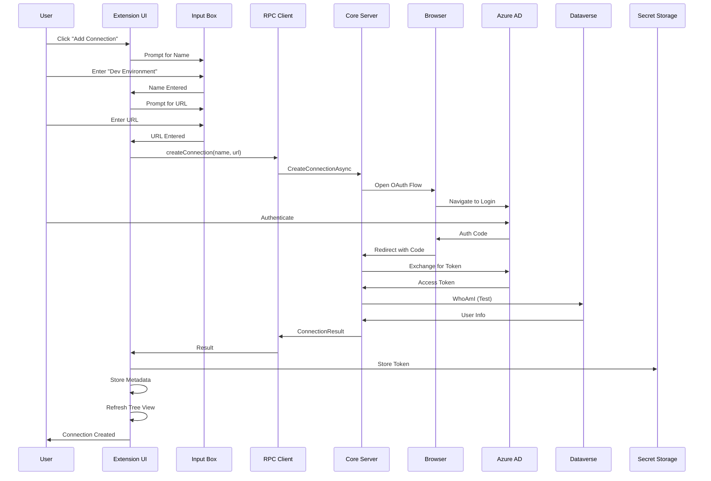
```mermaid
sequenceDiagram
    participant User
    participant UI as Extension UI
    participant Input as Input Box
    participant RPC as RPC Client
    participant Core as Core Server
    participant Browser
    participant AAD as Azure AD
    participant DV as Dataverse
    participant Storage as Secret Storage
    
    User->>UI: Click "Add Connection"
    UI->>Input: Prompt for Name
    User->>Input: Enter "Dev Environment"
    Input->>UI: Name Entered
    
    UI->>Input: Prompt for URL
    User->>Input: Enter URL
    Input->>UI: URL Entered
    
    UI->>RPC: createConnection(name, url)
    RPC->>Core: CreateConnectionAsync
    
    Core->>Browser: Open OAuth Flow
    Browser->>AAD: Navigate to Login
    User->>AAD: Authenticate
    AAD->>Browser: Auth Code
    Browser->>Core: Redirect with Code
    
    Core->>AAD: Exchange for Token
    AAD->>Core: Access Token
    
    Core->>DV: WhoAmI (Test)
    DV->>Core: User Info
    
    Core->>RPC: ConnectionResult
    RPC->>UI: Result
    
    UI->>Storage: Store Token
    UI->>UI: Store Metadata
    UI->>UI: Refresh Tree View
    UI->>User: Connection Created
```

### Connection Form

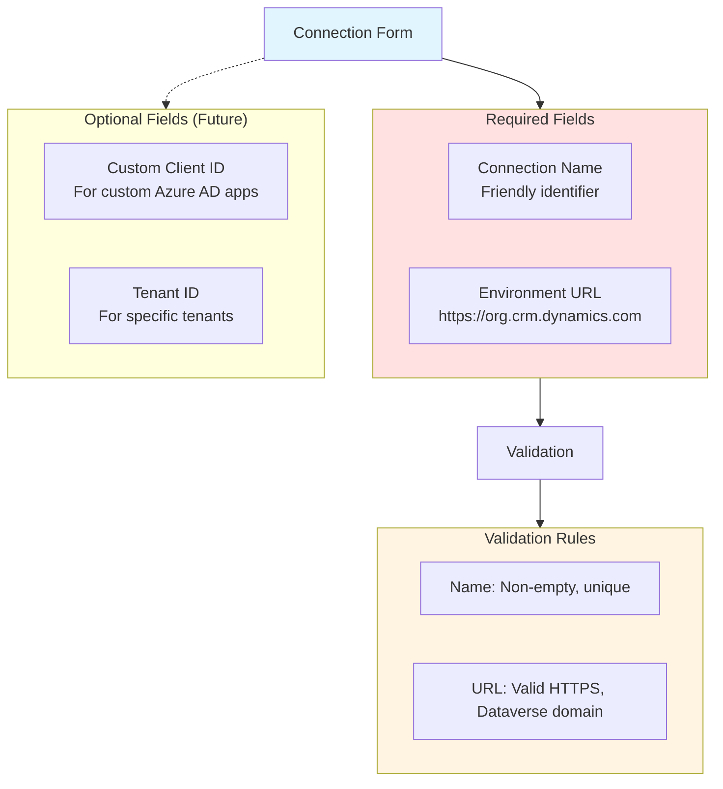
```mermaid
graph TB
    Form[Connection Form]
    
    subgraph Fields["Required Fields"]
        Name[Connection Name<br/>Friendly identifier]
        URL[Environment URL<br/>https://org.crm.dynamics.com]
    end
    
    subgraph Optional["Optional Fields (Future)"]
        ClientId[Custom Client ID<br/>For custom Azure AD apps]
        Tenant[Tenant ID<br/>For specific tenants]
    end
    
    Form --> Fields
    Form -.-> Optional
    
    Validate[Validation]
    Fields --> Validate
    
    subgraph Validation["Validation Rules"]
        NameRule[Name: Non-empty, unique]
        URLRule[URL: Valid HTTPS, Dataverse domain]
    end
    
    Validate --> Validation
    
    style Form fill:#e1f5ff
    style Fields fill:#ffe1e1
    style Validation fill:#fff4e1
```

### URL Validation

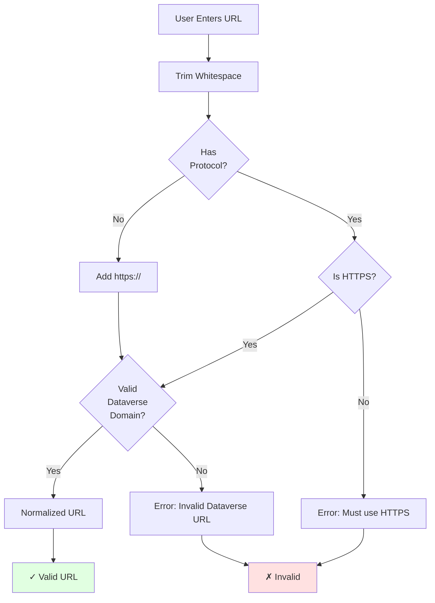
```mermaid
graph TB
    URL[User Enters URL] --> Trim[Trim Whitespace]
    Trim --> Protocol{Has<br/>Protocol?}
    
    Protocol -->|No| AddHTTPS[Add https://]
    Protocol -->|Yes| CheckHTTPS{Is HTTPS?}
    
    AddHTTPS --> ValidDomain
    CheckHTTPS -->|Yes| ValidDomain{Valid<br/>Dataverse<br/>Domain?}
    CheckHTTPS -->|No| Error1[Error: Must use HTTPS]
    
    ValidDomain -->|Yes| Normalized[Normalized URL]
    ValidDomain -->|No| Error2[Error: Invalid Dataverse URL]
    
    Normalized --> Valid[✓ Valid URL]
    Error1 --> Invalid[✗ Invalid]
    Error2 --> Invalid
    
    style Valid fill:#e1ffe1
    style Invalid fill:#ffe1e1
```

**Valid URL Patterns:**
- `https://*.crm.dynamics.com`
- `https://*.crm[N].dynamics.com` (regional)
- `https://*.dynamics.com` (custom domains)

## OAuth Authentication Flow

### Interactive Browser Authentication

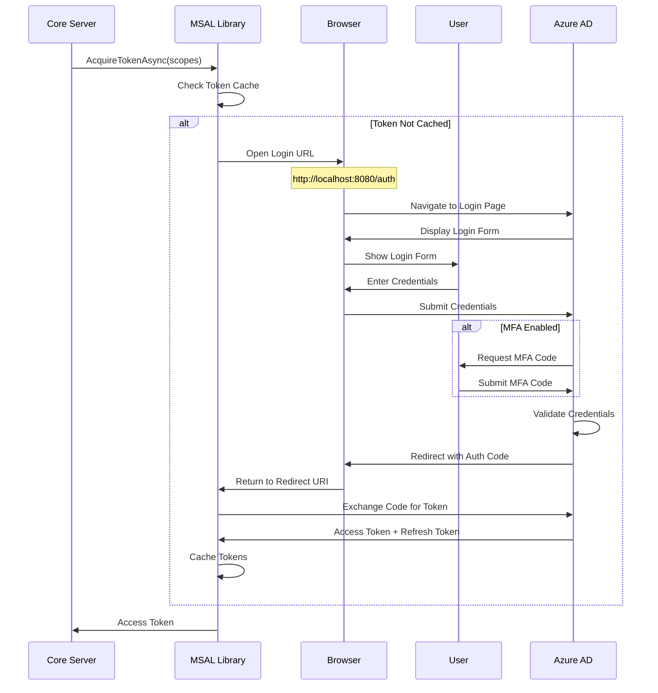
```mermaid
sequenceDiagram
    participant Core as Core Server
    participant MSAL as MSAL Library
    participant Browser
    participant User
    participant AAD as Azure AD
    
    Core->>MSAL: AcquireTokenAsync(scopes)
    MSAL->>MSAL: Check Token Cache
    
    alt Token Not Cached
        MSAL->>Browser: Open Login URL
        Note over Browser: http://localhost:8080/auth
        
        Browser->>AAD: Navigate to Login Page
        AAD->>Browser: Display Login Form
        
        Browser->>User: Show Login Form
        User->>Browser: Enter Credentials
        Browser->>AAD: Submit Credentials
        
        alt MFA Enabled
            AAD->>User: Request MFA Code
            User->>AAD: Submit MFA Code
        end
        
        AAD->>AAD: Validate Credentials
        AAD->>Browser: Redirect with Auth Code
        Browser->>MSAL: Return to Redirect URI
        
        MSAL->>AAD: Exchange Code for Token
        AAD->>MSAL: Access Token + Refresh Token
        MSAL->>MSAL: Cache Tokens
    end
    
    MSAL->>Core: Access Token
```

### Device Code Flow (Fallback)

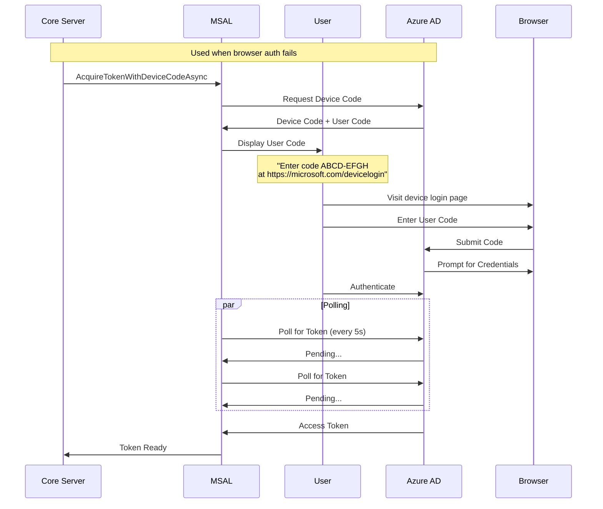
```mermaid
sequenceDiagram
    participant Core as Core Server
    participant MSAL
    participant User
    participant AAD as Azure AD
    
    Note over Core,AAD: Used when browser auth fails
    
    Core->>MSAL: AcquireTokenWithDeviceCodeAsync
    MSAL->>AAD: Request Device Code
    AAD->>MSAL: Device Code + User Code
    
    MSAL->>User: Display User Code
    Note over User: "Enter code ABCD-EFGH<br/>at https://microsoft.com/devicelogin"
    
    User->>Browser: Visit device login page
    User->>Browser: Enter User Code
    Browser->>AAD: Submit Code
    AAD->>Browser: Prompt for Credentials
    User->>AAD: Authenticate
    
    par Polling
        MSAL->>AAD: Poll for Token (every 5s)
        AAD->>MSAL: Pending...
        MSAL->>AAD: Poll for Token
        AAD->>MSAL: Pending...
    end
    
    AAD->>MSAL: Access Token
    MSAL->>Core: Token Ready
```

### Token Storage

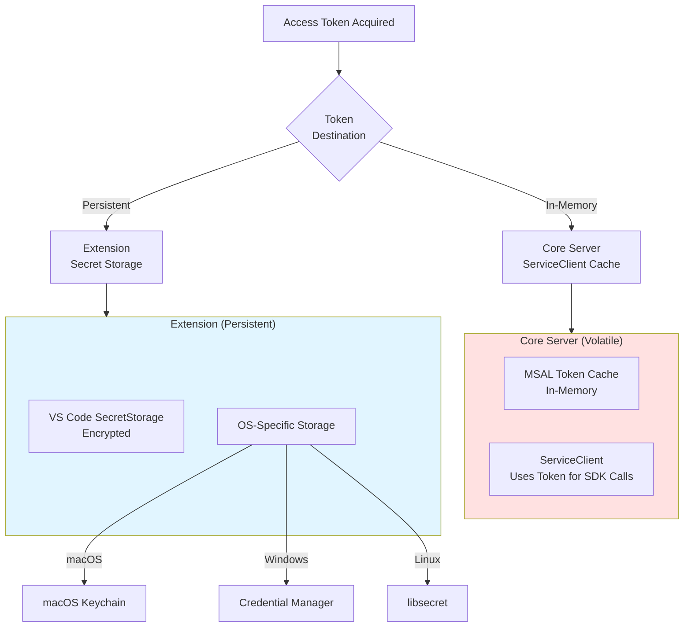
```mermaid
graph TB
    Token[Access Token Acquired]
    
    Token --> Split{Token<br/>Destination}
    
    Split -->|In-Memory| Core[Core Server<br/>ServiceClient Cache]
    Split -->|Persistent| Extension[Extension<br/>Secret Storage]
    
    subgraph CoreStorage["Core Server (Volatile)"]
        MSAL[MSAL Token Cache<br/>In-Memory]
        ServiceClient[ServiceClient<br/>Uses Token for SDK Calls]
    end
    
    subgraph ExtStorage["Extension (Persistent)"]
        VSCodeSecret[VS Code SecretStorage<br/>Encrypted]
        Platform[OS-Specific Storage]
    end
    
    Core --> CoreStorage
    Extension --> ExtStorage
    
    Platform -->|macOS| Keychain[macOS Keychain]
    Platform -->|Windows| CredMgr[Credential Manager]
    Platform -->|Linux| Libsecret[libsecret]
    
    style CoreStorage fill:#ffe1e1
    style ExtStorage fill:#e1f5ff
```

## Connection States

### State Diagram

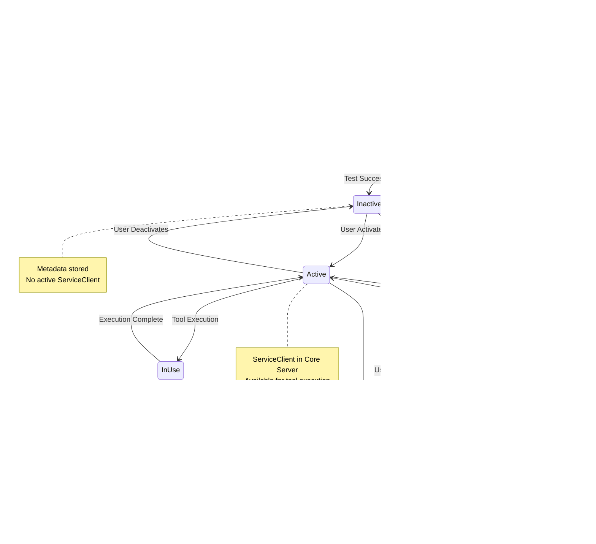
```mermaid
stateDiagram-v2
    [*] --> Creating: User Creates Connection
    Creating --> Authenticating: URL Validated
    Authenticating --> Testing: Token Acquired
    Testing --> Inactive: Test Successful
    Testing --> Failed: Test Failed
    
    Inactive --> Active: User Activates
    Active --> Inactive: User Deactivates
    
    Active --> InUse: Tool Execution
    InUse --> Active: Execution Complete
    
    Active --> Refreshing: Token Expired
    Inactive --> Refreshing: Token Refresh Needed
    Refreshing --> Active: Refresh Success
    Refreshing --> Inactive: Refresh Success
    Refreshing --> Failed: Refresh Failed
    
    Failed --> Deleting: User Deletes
    Inactive --> Deleting: User Deletes
    Active --> Deleting: User Deletes
    
    Deleting --> [*]
    
    note right of Active
        ServiceClient in Core Server
        Available for tool execution
    end note
    
    note right of Inactive
        Metadata stored
        No active ServiceClient
    end note
```

### State Indicators

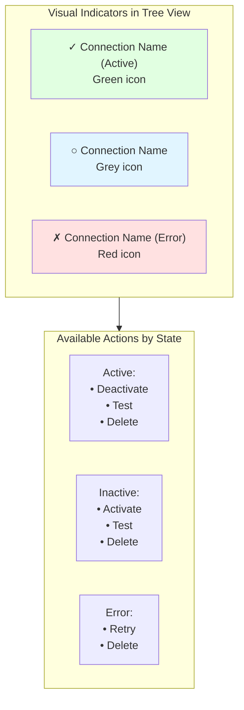
```mermaid
graph TB
    subgraph Visual["Visual Indicators in Tree View"]
        Active["✓ Connection Name (Active)<br/>Green icon"]
        Inactive["○ Connection Name<br/>Grey icon"]
        Error["✗ Connection Name (Error)<br/>Red icon"]
    end
    
    subgraph Actions["Available Actions by State"]
        ActiveActions["Active:<br/>• Deactivate<br/>• Test<br/>• Delete"]
        InactiveActions["Inactive:<br/>• Activate<br/>• Test<br/>• Delete"]
        ErrorActions["Error:<br/>• Retry<br/>• Delete"]
    end
    
    Visual --> Actions
    
    style Active fill:#e1ffe1
    style Inactive fill:#e1f5ff
    style Error fill:#ffe1e1
```

## Managing Connections

### Activating a Connection

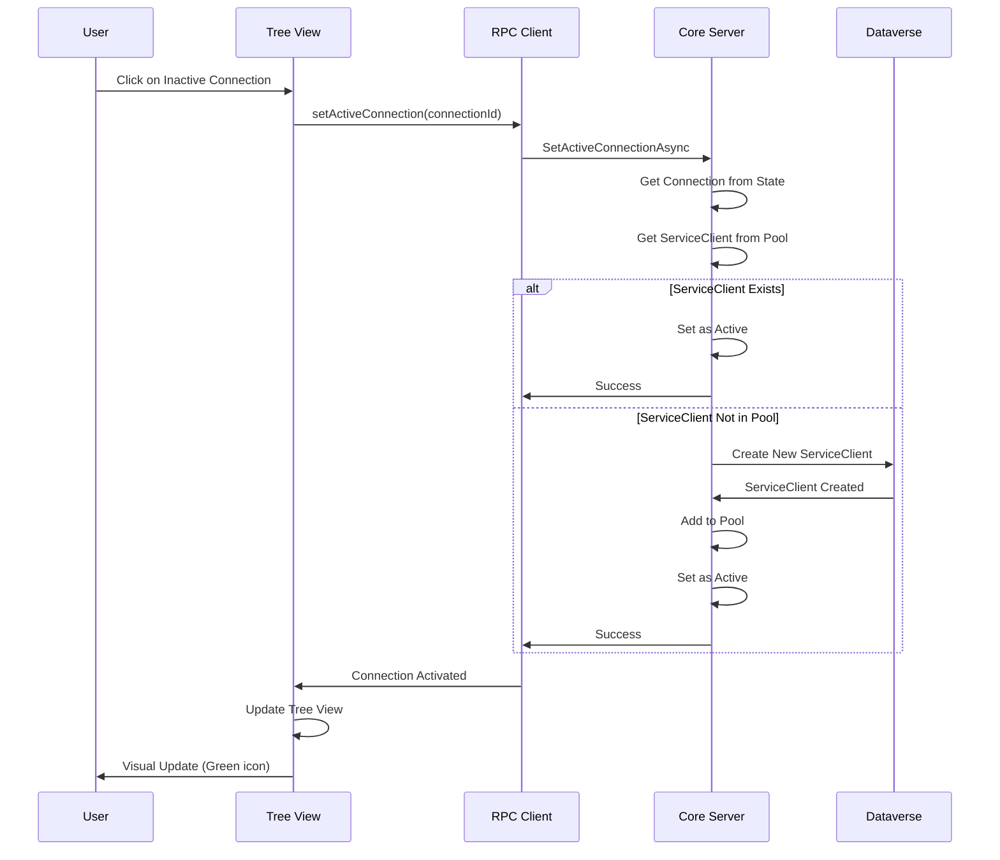
```mermaid
sequenceDiagram
    participant User
    participant UI as Tree View
    participant RPC as RPC Client
    participant Core as Core Server
    participant DV as Dataverse
    
    User->>UI: Click on Inactive Connection
    UI->>RPC: setActiveConnection(connectionId)
    RPC->>Core: SetActiveConnectionAsync
    
    Core->>Core: Get Connection from State
    Core->>Core: Get ServiceClient from Pool
    
    alt ServiceClient Exists
        Core->>Core: Set as Active
        Core->>RPC: Success
    else ServiceClient Not in Pool
        Core->>DV: Create New ServiceClient
        DV->>Core: ServiceClient Created
        Core->>Core: Add to Pool
        Core->>Core: Set as Active
        Core->>RPC: Success
    end
    
    RPC->>UI: Connection Activated
    UI->>UI: Update Tree View
    UI->>User: Visual Update (Green icon)
```

### Testing a Connection

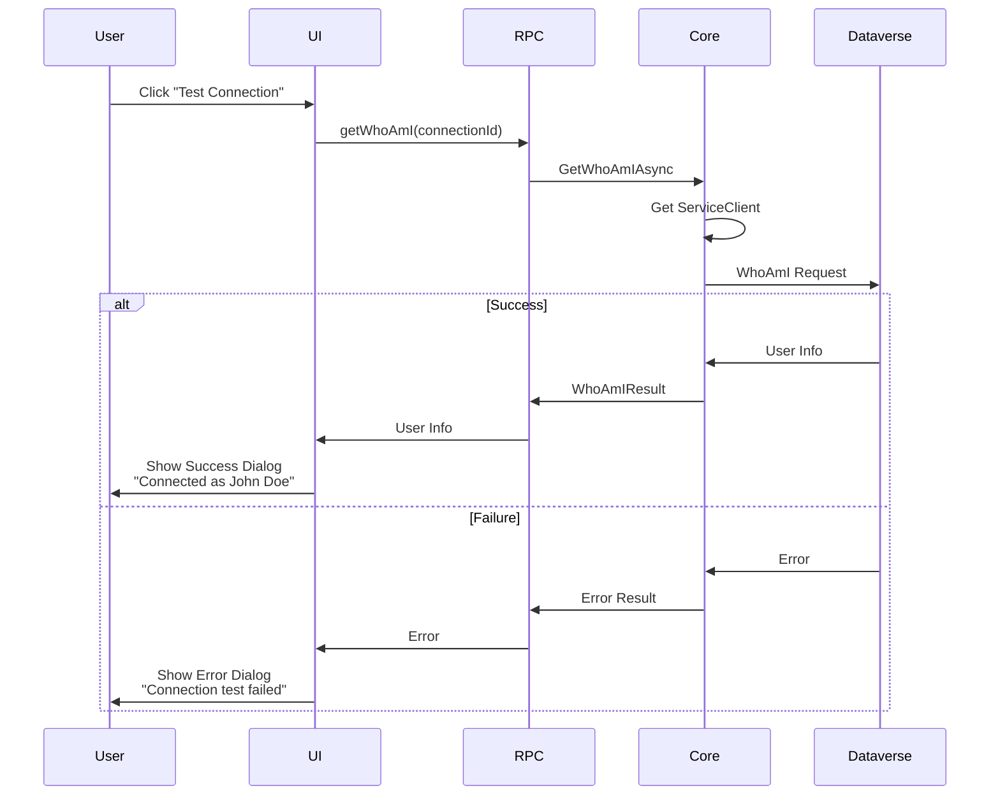
```mermaid
sequenceDiagram
    participant User
    participant UI
    participant RPC
    participant Core
    participant DV as Dataverse
    
    User->>UI: Click "Test Connection"
    UI->>RPC: getWhoAmI(connectionId)
    RPC->>Core: GetWhoAmIAsync
    
    Core->>Core: Get ServiceClient
    Core->>DV: WhoAmI Request
    
    alt Success
        DV->>Core: User Info
        Core->>RPC: WhoAmIResult
        RPC->>UI: User Info
        UI->>User: Show Success Dialog<br/>"Connected as John Doe"
    else Failure
        DV->>Core: Error
        Core->>RPC: Error Result
        RPC->>UI: Error
        UI->>User: Show Error Dialog<br/>"Connection test failed"
    end
```

### Deleting a Connection

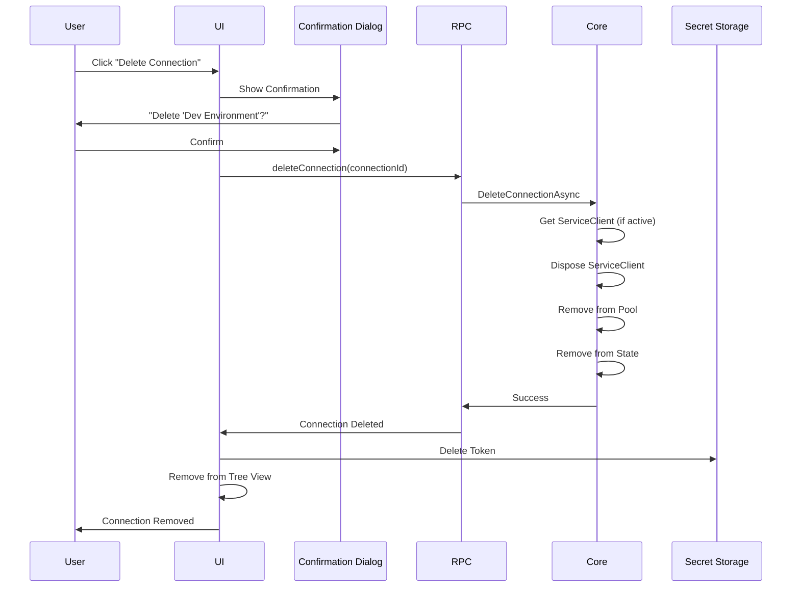
```mermaid
sequenceDiagram
    participant User
    participant UI
    participant Confirm as Confirmation Dialog
    participant RPC
    participant Core
    participant Storage as Secret Storage
    
    User->>UI: Click "Delete Connection"
    UI->>Confirm: Show Confirmation
    Confirm->>User: "Delete 'Dev Environment'?"
    User->>Confirm: Confirm
    
    UI->>RPC: deleteConnection(connectionId)
    RPC->>Core: DeleteConnectionAsync
    
    Core->>Core: Get ServiceClient (if active)
    Core->>Core: Dispose ServiceClient
    Core->>Core: Remove from Pool
    Core->>Core: Remove from State
    Core->>RPC: Success
    
    RPC->>UI: Connection Deleted
    UI->>Storage: Delete Token
    UI->>UI: Remove from Tree View
    UI->>User: Connection Removed
```

## Multiple Connections

### Connection Switching

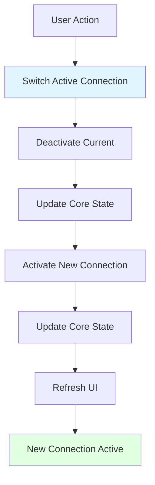
```mermaid
graph TB
    User[User Action] --> Switch[Switch Active Connection]
    
    Switch --> Deactivate[Deactivate Current]
    Deactivate --> Update1[Update Core State]
    Update1 --> Activate[Activate New Connection]
    Activate --> Update2[Update Core State]
    Update2 --> Refresh[Refresh UI]
    
    Refresh --> Result[New Connection Active]
    
    style Switch fill:#e1f5ff
    style Result fill:#e1ffe1
```

### Active Connection Scope

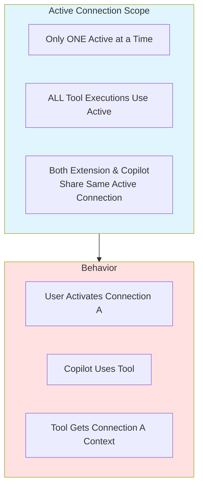
```mermaid
graph TB
    subgraph Scope["Active Connection Scope"]
        OneActive[Only ONE Active at a Time]
        AllTools[ALL Tool Executions Use Active]
        BothClients[Both Extension & Copilot<br/>Share Same Active Connection]
    end
    
    subgraph Behavior["Behavior"]
        Activate[User Activates Connection A]
        UseTool[Copilot Uses Tool]
        Context[Tool Gets Connection A Context]
    end
    
    Scope --> Behavior
    
    style Scope fill:#e1f5ff
    style Behavior fill:#ffe1e1
```

**Important:** The active connection is shared between:
- Extension UI operations
- GitHub Copilot tool executions
- Multiple Copilot chat windows

## Connection Metadata

### Stored Information

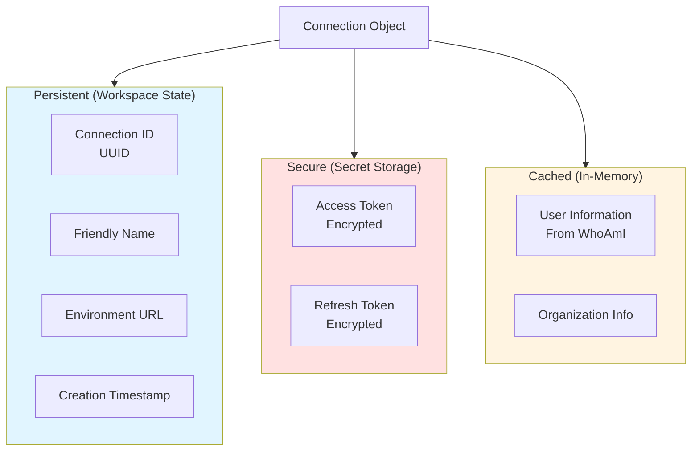
```mermaid
graph TB
    Connection[Connection Object]
    
    subgraph Persistent["Persistent (Workspace State)"]
        ID[Connection ID<br/>UUID]
        Name[Friendly Name]
        URL[Environment URL]
        CreatedAt[Creation Timestamp]
    end
    
    subgraph Secure["Secure (Secret Storage)"]
        Token[Access Token<br/>Encrypted]
        RefreshToken[Refresh Token<br/>Encrypted]
    end
    
    subgraph Cached["Cached (In-Memory)"]
        UserInfo[User Information<br/>From WhoAmI]
        OrgInfo[Organization Info]
    end
    
    Connection --> Persistent
    Connection --> Secure
    Connection --> Cached
    
    style Persistent fill:#e1f5ff
    style Secure fill:#ffe1e1
    style Cached fill:#fff4e1
```

### Connection Info Structure

```typescript
interface ConnectionInfo {
  id: string;                    // UUID
  name: string;                  // User-provided name
  environmentUrl: string;        // Normalized URL
  isActive: boolean;             // Current state
  createdAt: string;             // ISO 8601 timestamp
  userInfo?: {
    userId: string;
    userName: string;
    businessUnitId: string;
    organizationId: string;
  };
}
```

## Token Refresh

### Automatic Refresh Flow

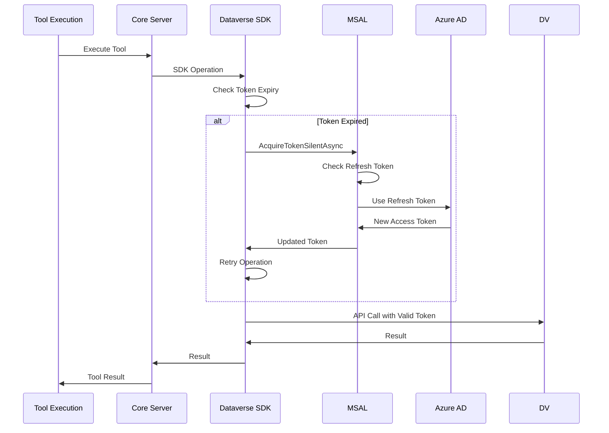
```mermaid
sequenceDiagram
    participant Tool as Tool Execution
    participant Core as Core Server
    participant SDK as Dataverse SDK
    participant MSAL
    participant AAD as Azure AD
    
    Tool->>Core: Execute Tool
    Core->>SDK: SDK Operation
    
    SDK->>SDK: Check Token Expiry
    
    alt Token Expired
        SDK->>MSAL: AcquireTokenSilentAsync
        MSAL->>MSAL: Check Refresh Token
        MSAL->>AAD: Use Refresh Token
        AAD->>MSAL: New Access Token
        MSAL->>SDK: Updated Token
        SDK->>SDK: Retry Operation
    end
    
    SDK->>DV: API Call with Valid Token
    DV->>SDK: Result
    SDK->>Core: Result
    Core->>Tool: Tool Result
```

## Troubleshooting Connections

### Common Issues

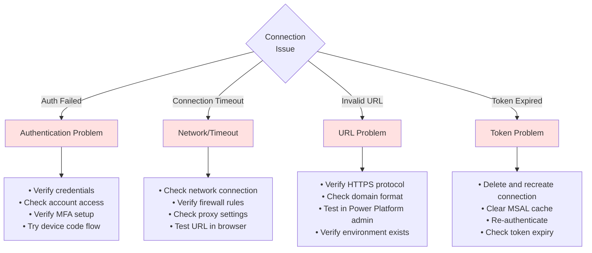
```mermaid
graph TB
    Issue{Connection<br/>Issue}
    
    Issue -->|Auth Failed| AuthIssue[Authentication Problem]
    Issue -->|Connection Timeout| TimeoutIssue[Network/Timeout]
    Issue -->|Invalid URL| URLIssue[URL Problem]
    Issue -->|Token Expired| TokenIssue[Token Problem]
    
    AuthIssue --> AuthSolutions["• Verify credentials<br/>• Check account access<br/>• Verify MFA setup<br/>• Try device code flow"]
    
    TimeoutIssue --> TimeoutSolutions["• Check network connection<br/>• Verify firewall rules<br/>• Check proxy settings<br/>• Test URL in browser"]
    
    URLIssue --> URLSolutions["• Verify HTTPS protocol<br/>• Check domain format<br/>• Test in Power Platform admin<br/>• Verify environment exists"]
    
    TokenIssue --> TokenSolutions["• Delete and recreate connection<br/>• Clear MSAL cache<br/>• Re-authenticate<br/>• Check token expiry"]
    
    style AuthIssue fill:#ffe1e1
    style TimeoutIssue fill:#ffe1e1
    style URLIssue fill:#ffe1e1
    style TokenIssue fill:#ffe1e1
```

### Testing Connectivity

**Manual Testing Steps:**

1. **Test URL Accessibility**
   - Open environment URL in browser
   - Verify you can access Power Platform
   - Confirm authentication works

2. **Test from Extension**
   - Create connection
   - Use "Test Connection" action
   - Review error messages in Output panel

3. **Check Logs**
   - Open Output panel
   - Select "Dataverse MCP Toolbox"
   - Look for authentication errors or SDK errors

4. **Verify Active Connection**
   - Ensure connection has green checkmark
   - Try executing a simple tool via Copilot
   - Check connection switches properly

## Next Steps

- **[Managing Plugins](11-Managing-Plugins.md)**: Install and manage plugins
- **[Using Tools](12-Using-Tools.md)**: Execute tools with connections
- **[Troubleshooting](13-Troubleshooting.md)**: Detailed troubleshooting guide
