# Managing Plugins

Guide to installing, updating, and managing plugins that extend the toolbox functionality.

## Plugin Overview

Plugins are NuGet packages that extend the Dataverse MCP Toolbox with custom tools. They are dynamically loaded by the Core Server and automatically registered for use with GitHub Copilot.

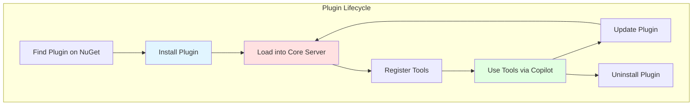

## Finding Plugins

### NuGet Package Search

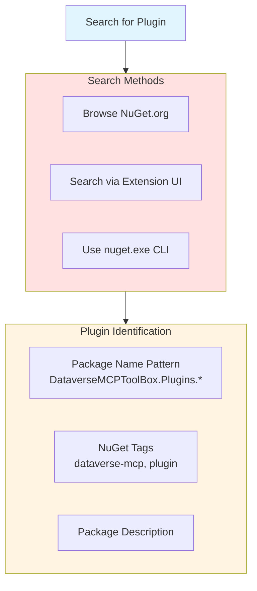

**Common Plugin Package Patterns:**
- `DataverseMCPToolBox.Plugins.{Name}`
- `{Organization}.DataverseMCP.{Feature}`
- Tagged with: `dataverse-mcp`, `mcp-plugin`, `dataverse`

## Installing Plugins

### Installation Flow

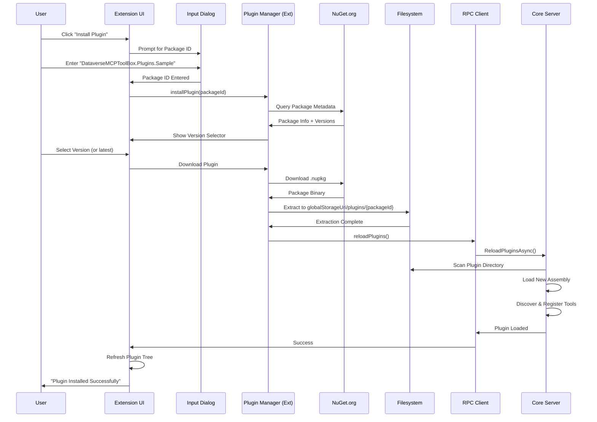

### UI Workflow

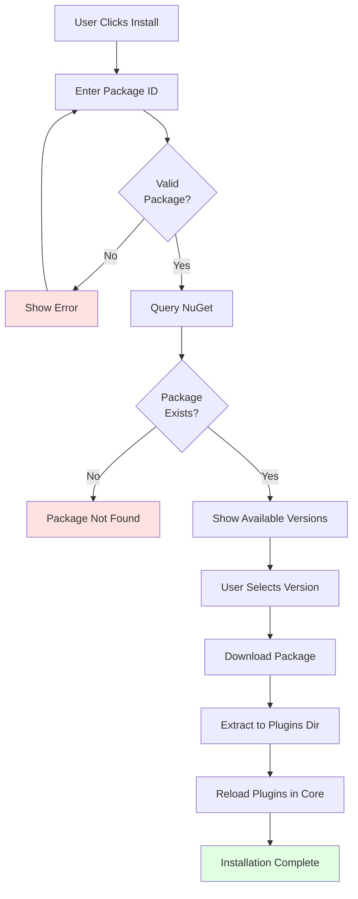

## Plugin Storage

### Directory Structure

```mermaid
graph TB
    Root[globalStorageUri/plugins/]
    
    subgraph Plugins["Installed Plugins"]
        Plugin1[package-id-1/<br/>Version 1.0.0]
        Plugin2[package-id-2/<br/>Version 2.1.0]
        Plugin3[package-id-3/<br/>Version 1.5.0]
    end
    
    Root --> Plugins
    
    subgraph PluginContents["Plugin Directory Contents"]
        DLL[{PluginName}.dll<br/>Main Assembly]
        Deps[Dependencies/<br/>Referenced DLLs]
        Manifest[plugin.json<br/>Metadata]
    end
    
    Plugin1 --> PluginContents
    
    style Root fill:#e1f5ff
    style Plugins fill:#ffe1e1
    style PluginContents fill:#fff4e1
```

**Example Path:**
```
globalStorageUri/
└── plugins/
    ├── DataverseMCPToolBox.Plugins.WhoAmI/
    │   ├── WhoAmI.dll
    │   ├── plugin.json
    │   └── lib/
    │       └── Newtonsoft.Json.dll
    └── CustomOrg.Plugins.EntityTools/
        ├── EntityTools.dll
        ├── plugin.json
        └── lib/
            └── [dependencies]
```

## Plugin Loading

### Dynamic Assembly Loading

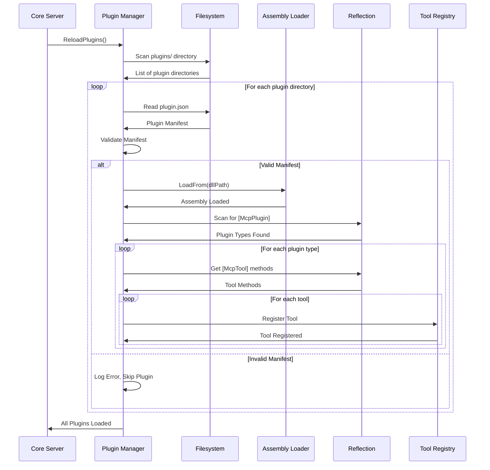

### Plugin Manifest

```json
{
  "name": "sample-plugin",
  "version": "1.0.0",
  "author": "Your Organization",
  "description": "Sample plugin for Dataverse MCP Toolbox",
  "assembly": "SamplePlugin.dll",
  "tools": [
    {
      "name": "sample-tool",
      "description": "Example tool implementation"
    }
  ],
  "dependencies": []
}
```

## Viewing Installed Plugins

### Plugin Tree View

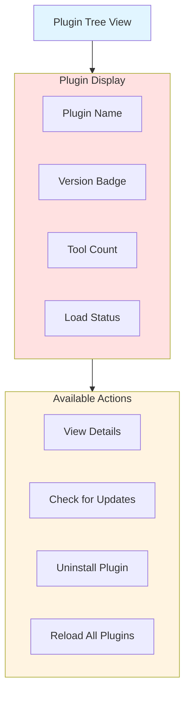

**Example Tree View:**
```
PLUGINS
├── WhoAmI Plugin v1.0.0
│   ├── 📋 get-whoami
│   └── [Uninstall] [Update]
├── Entity Tools v2.1.0
│   ├── 📋 list-entities
│   ├── 📋 get-entity-metadata
│   ├── 📋 create-record
│   └── [Uninstall] [Update]
└── [Install New Plugin]
```

### Plugin Details Panel

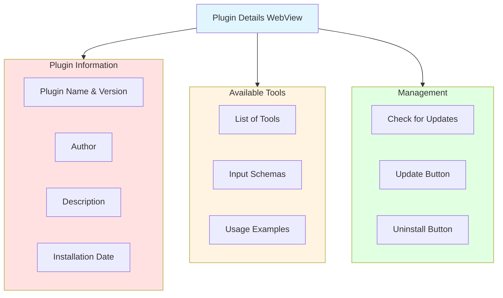

## Updating Plugins

### Update Check Flow

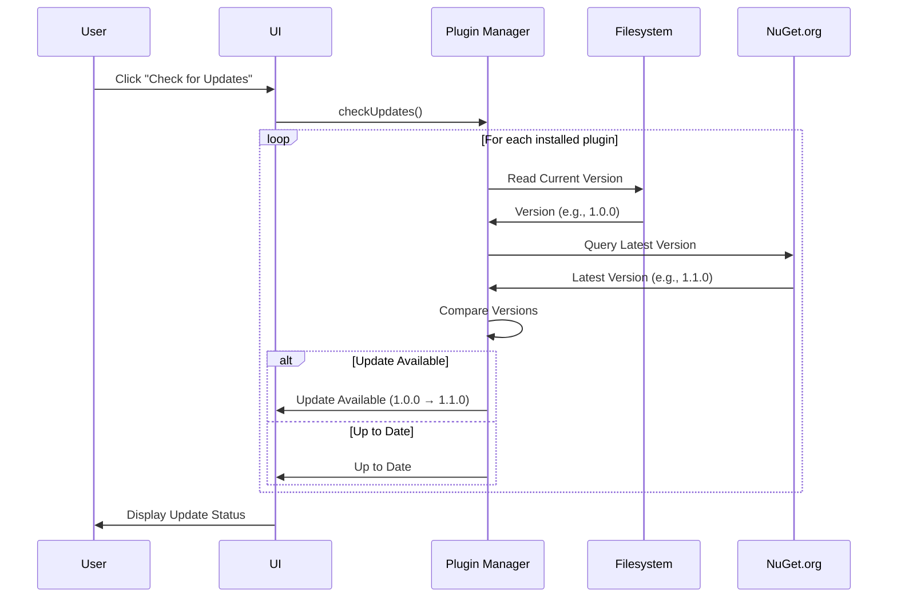

### Update Installation

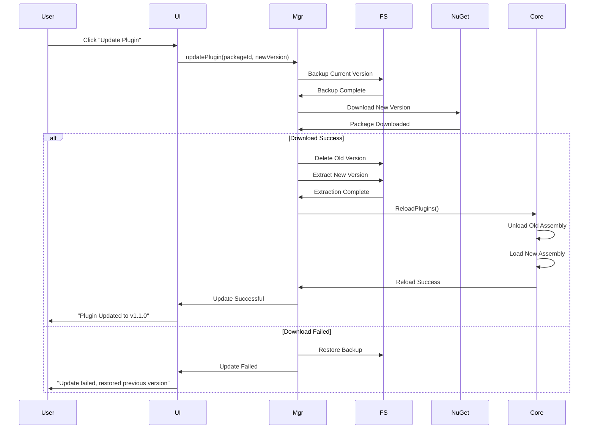

## Uninstalling Plugins

### Uninstall Flow

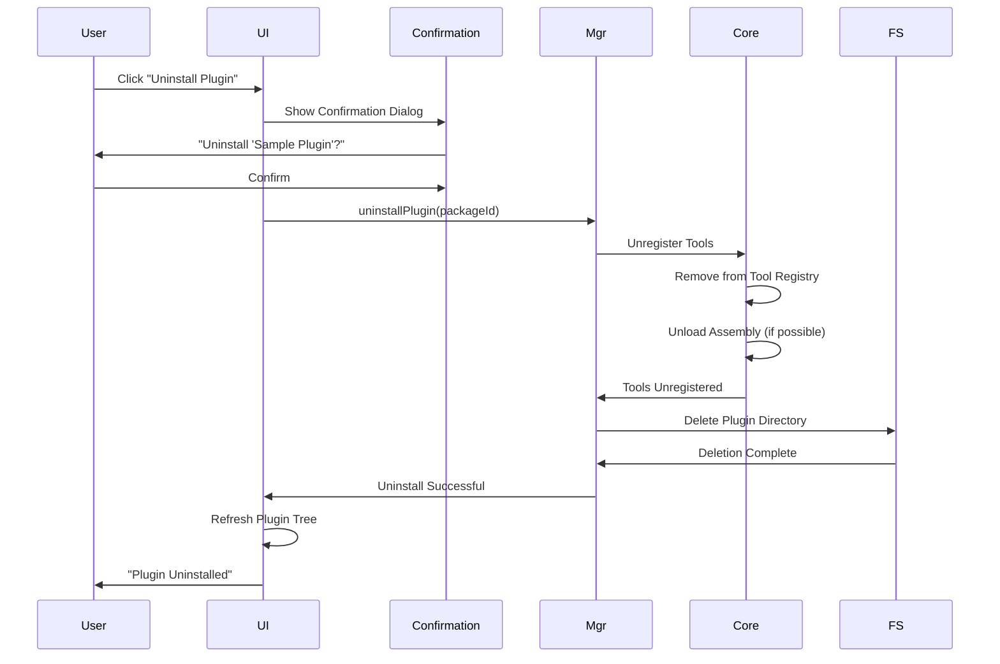

**Note:** Assembly unloading may require Core Server restart on some platforms due to .NET limitations.

## Plugin Compatibility

### Version Compatibility

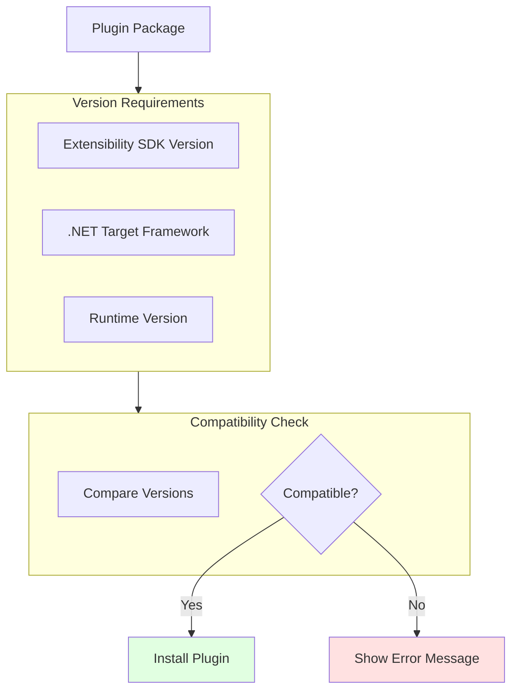

**Compatibility Requirements:**
- Plugin built against compatible SDK version
- .NET Standard 2.0 or .NET 6+ target framework
- No conflicting dependencies

### Dependency Resolution

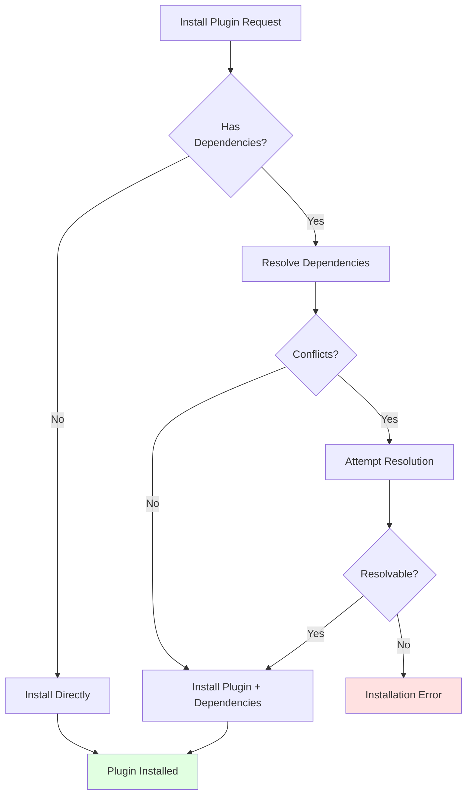

## Troubleshooting Plugins

### Common Issues

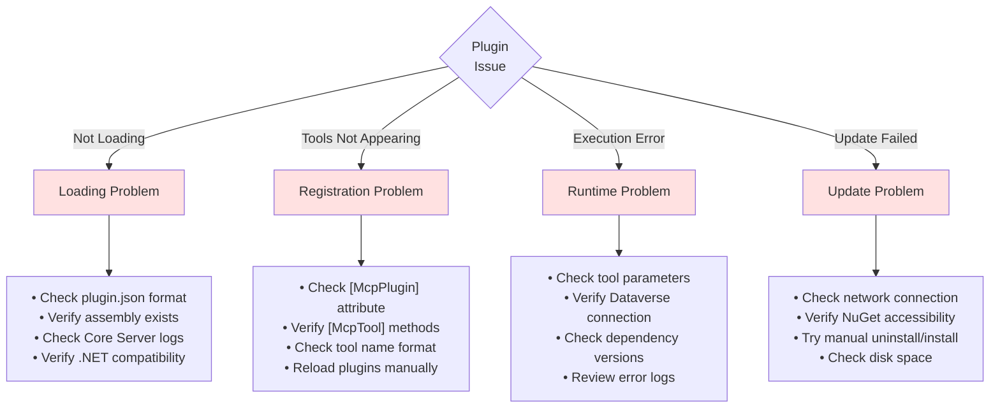

### Diagnostic Commands

**View Loaded Plugins:**
```
Command Palette → Dataverse: List Loaded Plugins
```

**Reload Plugins:**
```
Command Palette → Dataverse: Reload All Plugins
```

**View Plugin Logs:**
```
Output Panel → Dataverse MCP Toolbox
Filter: [Plugin]
```

## Next Steps

- **[Using Tools](12-Using-Tools.md)**: Execute plugin tools
- **[Creating Plugins](14-Creating-Plugins.md)**: Build your own plugins
- **[Troubleshooting](13-Troubleshooting.md)**: Detailed troubleshooting
