# Using Tools

Guide to using tools with GitHub Copilot and understanding tool execution in the Dataverse MCP Toolbox.

## Tool Overview

Tools are discrete operations that can be invoked by AI assistants (like GitHub Copilot) to interact with Dataverse. Each tool has a defined input schema and returns structured output.

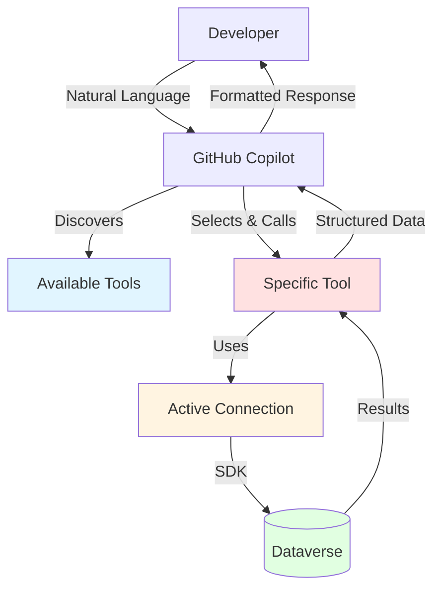

## Tool Discovery

### How Copilot Discovers Tools

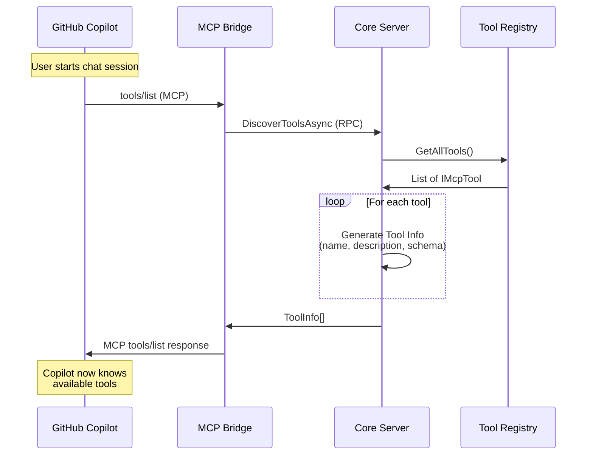

### Tool Information

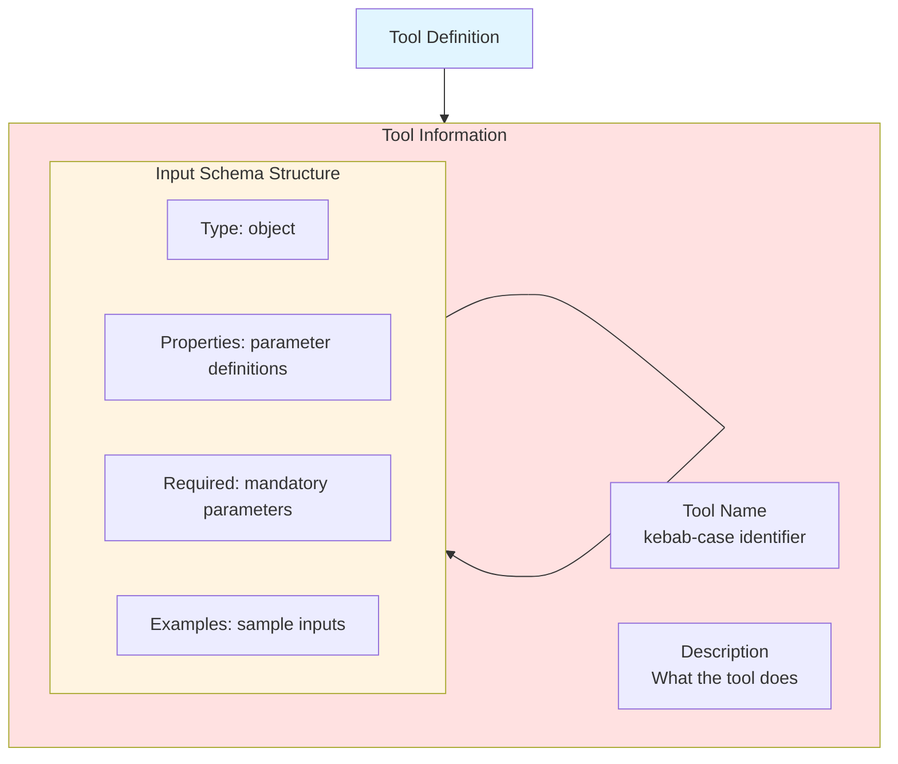

**Example Tool Info:**
```json
{
  "name": "get-record",
  "description": "Retrieve a specific record from Dataverse by entity name and ID",
  "inputSchema": {
    "type": "object",
    "properties": {
      "entityName": {
        "type": "string",
        "description": "Logical name of the entity (e.g., 'account', 'contact')"
      },
      "recordId": {
        "type": "string",
        "description": "GUID of the record to retrieve"
      },
      "columns": {
        "type": "array",
        "items": {"type": "string"},
        "description": "Optional: specific columns to retrieve"
      }
    },
    "required": ["entityName", "recordId"]
  }
}
```

## Tool Execution

### Execution Flow

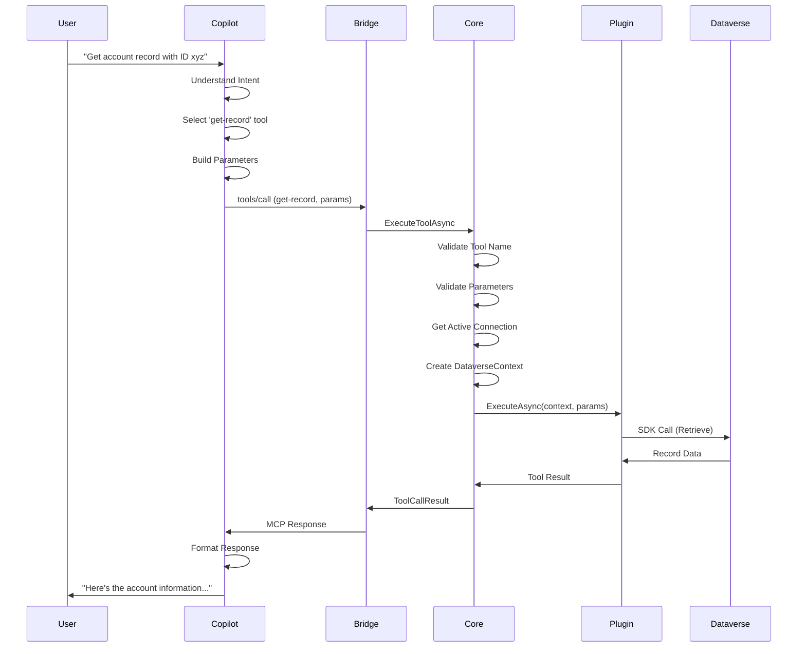

### Parameter Validation

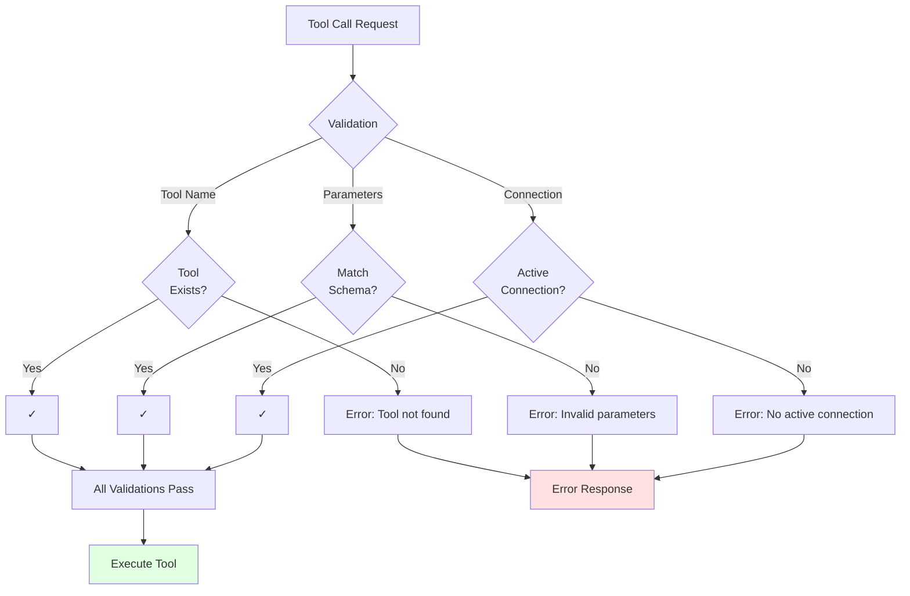

## Using Tools with Copilot

### Natural Language Examples

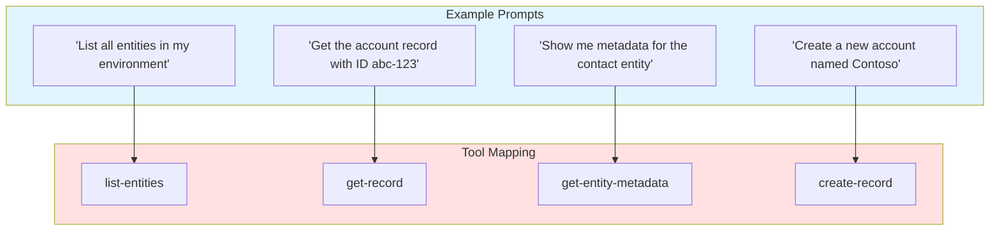

### Copilot Chat Examples

**Example 1: List Entities**
```
User: @workspace What entities are available in my Dataverse environment?

Copilot: Let me retrieve the list of entities for you.
[Calls: list-entities]
I found 250 entities in your environment. Here are some common ones:
- account (Accounts)
- contact (Contacts)
- opportunity (Opportunities)
- lead (Leads)
[...]
```

**Example 2: Get Record**
```
User: @workspace Get me the details of account with ID 12345678-...

Copilot: Let me retrieve that account record.
[Calls: get-record with entityName='account', recordId='12345678-...']
Here's the account information:
- Name: Contoso Corporation
- Revenue: $1,000,000
- Primary Contact: John Doe
[...]
```

**Example 3: Entity Metadata**
```
User: @workspace What fields does the opportunity entity have?

Copilot: Let me get the metadata for the opportunity entity.
[Calls: get-entity-metadata with entityName='opportunity']
The opportunity entity has 87 attributes, including:
- name (string): Topic/Name
- estimatedvalue (money): Est. Revenue
- closeprobability (integer): Probability
[...]
```

## Tool Result Handling

### Success Results

```mermaid
graph TB
    Tool[Tool Execution]
    
    Tool --> Success[Success Result]
    
    subgraph SuccessStructure["Success Structure"]
        SuccessFlag[success: true]
        Content[content: { data }]
        NoError[error: null]
    end
    
    Success --> SuccessStructure
    
    subgraph Processing["Copilot Processing"]
        Parse[Parse Content]
        Format[Format for User]
        Present[Present to User]
    end
    
    SuccessStructure --> Processing
    
    style Success fill:#e1ffe1
    style SuccessStructure fill:#e1f5ff
```

**Example Success Response:**
```json
{
  "success": true,
  "content": {
    "accountid": "12345678-...",
    "name": "Contoso Corp",
    "revenue": 1000000,
    "primarycontactid": {
      "id": "87654321-...",
      "name": "John Doe"
    }
  },
  "error": null
}
```

### Error Results

```mermaid
graph TB
    Tool[Tool Execution]
    
    Tool --> Error[Error Result]
    
    subgraph ErrorStructure["Error Structure"]
        SuccessFlag[success: false]
        NoContent[content: null]
        ErrorObj[error: { code, message, details }]
    end
    
    Error --> ErrorStructure
    
    subgraph ErrorCodes["Error Types"]
        NotFound[NOT_FOUND<br/>Resource not found]
        Validation[VALIDATION_ERROR<br/>Invalid input]
        Dataverse[DATAVERSE_ERROR<br/>SDK error]
        Unauthorized[UNAUTHORIZED<br/>No connection]
    end
    
    ErrorStructure --> ErrorCodes
    
    style Error fill:#ffe1e1
    style ErrorStructure fill:#ffe1e1
```

**Example Error Response:**
```json
{
  "success": false,
  "content": null,
  "error": {
    "code": "NOT_FOUND",
    "message": "Record not found",
    "details": "No account record with ID 12345678-... exists in the environment"
  }
}
```

## Active Connection Context

### Connection Requirement

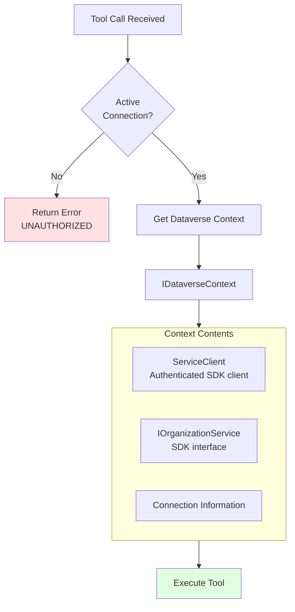

**Important:** All tool executions use the currently active connection. Ensure a connection is active before using tools.

## Tool Naming Convention

### Kebab-Case Format

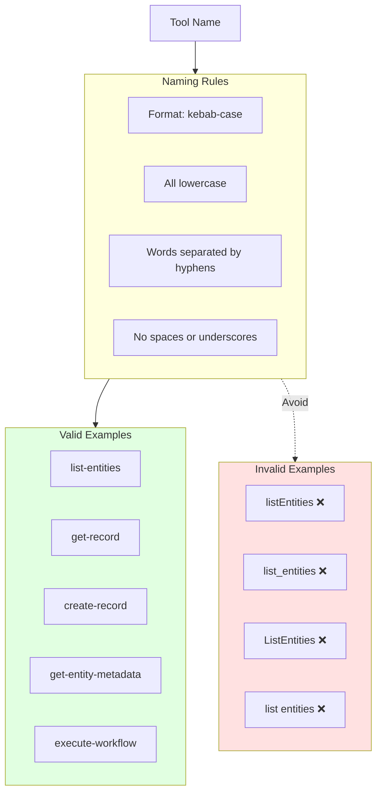

## Common Tools

### Built-in Tool Categories

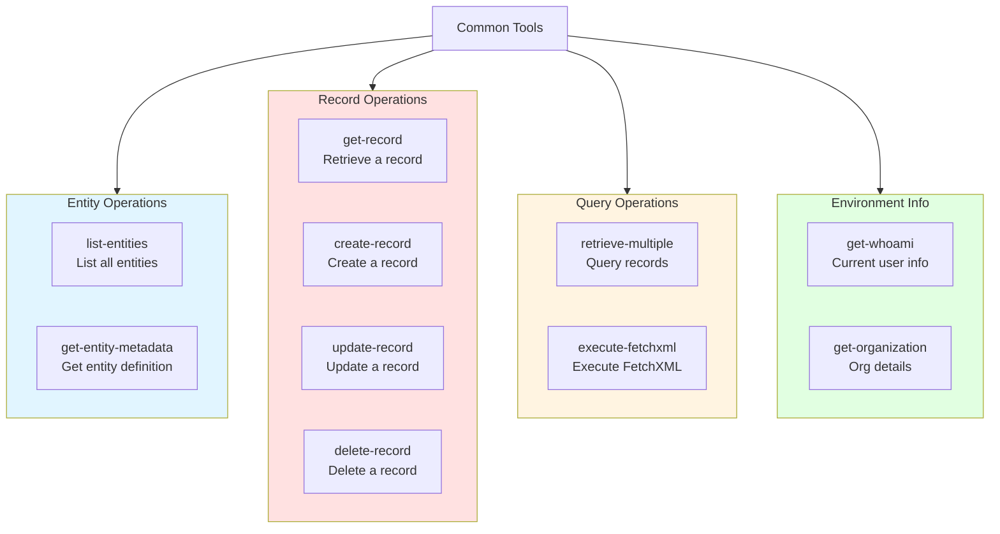

### Tool Usage Patterns

**Pattern 1: Information Retrieval**
```
User Intent → Copilot selects tool → Tool queries Dataverse → Returns data
```

**Pattern 2: Data Modification**
```
User Intent → Copilot selects tool → Tool validates → Modifies Dataverse → Confirms
```

**Pattern 3: Multi-Step Operations**
```
Query entities → Select entity → Get metadata → Create record → Verify
```

## Performance Considerations

### Execution Time

```mermaid
graph LR
    Start[Tool Call] -->|~5ms| Bridge[Bridge Forward]
    Bridge -->|~5ms| Core[Core Processing]
    Core -->|~10ms| Validation[Validation]
    Validation -->|Variable| SDK[Dataverse SDK Call]
    SDK -->|~100-500ms| DataverseAPI[Dataverse API]
    DataverseAPI -->|~100-500ms| Response[Response]
    Response -->|~10ms| Format[Format Result]
    Format -->|~5ms| Return[Return to Copilot]
    
    style SDK fill:#ffe1e1
    style DataverseAPI fill:#ffe1e1
```

**Typical Timings:**
- Simple queries: 200-500ms
- Complex queries: 500-2000ms
- Create/Update: 300-1000ms
- Large datasets: 1-5 seconds

### Optimization Tips

1. **Use Specific Queries**
   - Request only needed columns
   - Use filters to reduce results
   - Avoid retrieving all records

2. **Batch Operations**
   - Use tools that support batch operations
   - Reduce number of round trips

3. **Cache Results**
   - Copilot may cache responses
   - Reuse data within conversation

## Troubleshooting Tool Usage

### Common Issues

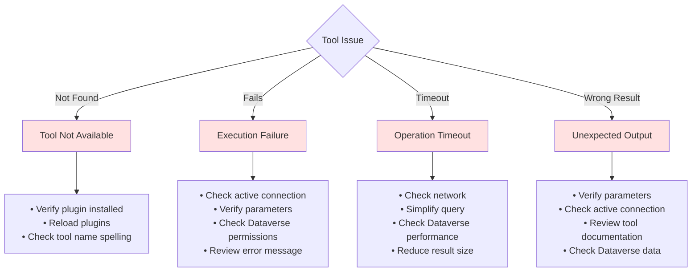

### Debugging Tools

**View Available Tools:**
```
Ask Copilot: @workspace What tools are available for Dataverse?
```

**Check Active Connection:**
```
Sidebar → Connections → Look for ✓ (green checkmark)
```

**View Execution Logs:**
```
Output Panel → Dataverse MCP Toolbox
Filter for tool execution logs
```

## Next Steps

- **[Creating Plugins](14-Creating-Plugins.md)**: Build custom tools
- **[Plugin Architecture](15-Plugin-Architecture.md)**: Understanding plugin structure
- **[Troubleshooting](13-Troubleshooting.md)**: Detailed troubleshooting
