# Troubleshooting

Comprehensive troubleshooting guide for common issues and their solutions.

## Diagnostic Overview

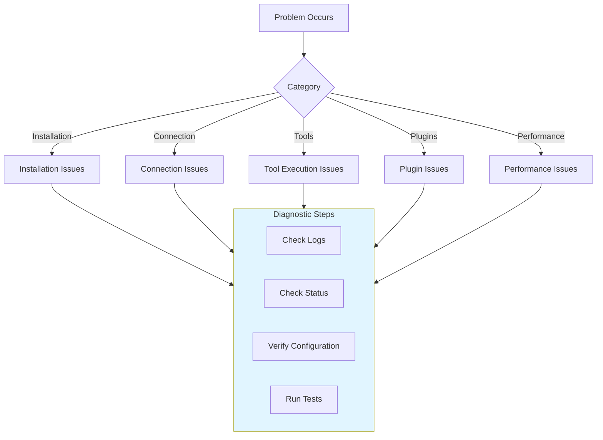

## Finding Logs

### Output Panel

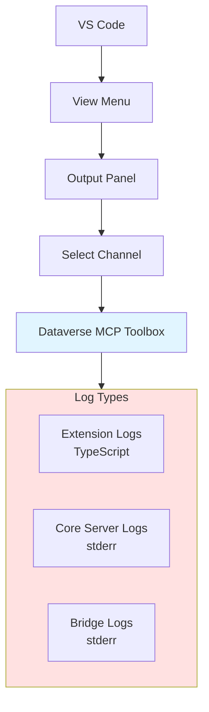

**Access Logs:**
1. `View` → `Output` (or `Ctrl+Shift+U`)
2. Select `Dataverse MCP Toolbox` from dropdown
3. View real-time logs

### Log Levels

| Level | Prefix | Description |
|-------|--------|-------------|
| **ERROR** | `[ERROR]` | Critical errors requiring attention |
| **WARNING** | `[WARN]` | Warnings about potential issues |
| **INFO** | `[INFO]` | General information |
| **DEBUG** | `[DEBUG]` | Detailed debugging information |

## Installation Issues

### Extension Won't Activate

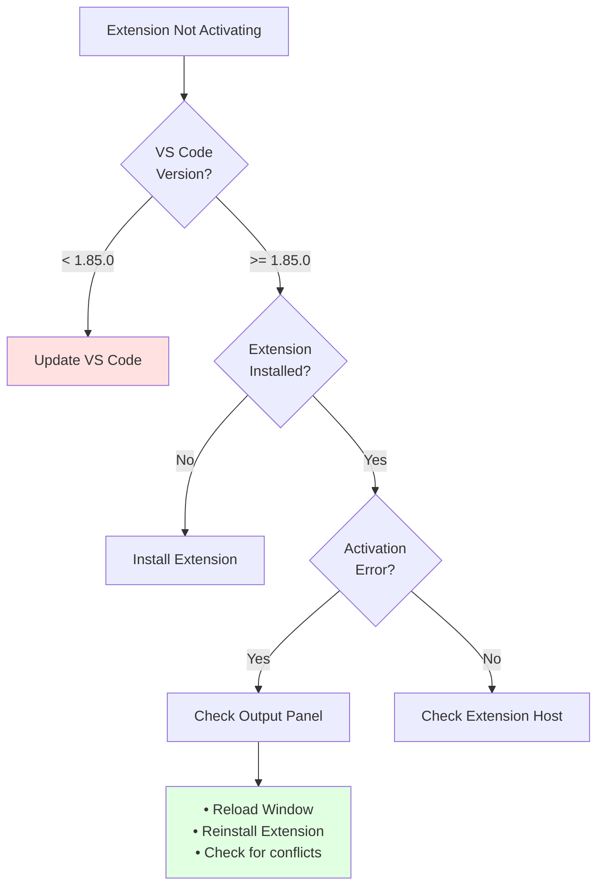

### Binary Download Fails

**Symptoms:**
- "Downloading runtime..." hangs
- "Failed to download server binaries"
- Extension activates but Core Server won't start

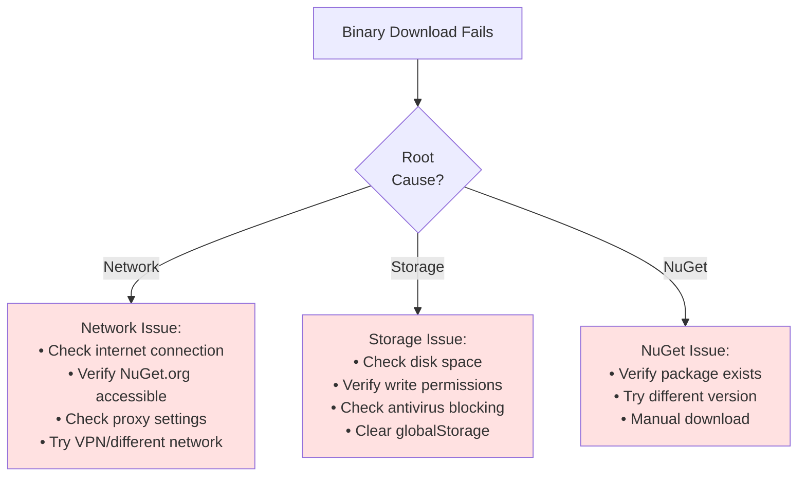

**Solutions:**

1. **Check Network**
   ```
   # Test NuGet connectivity
   curl https://api.nuget.org/v3/index.json
   ```

2. **Clear Cache and Retry**
   ```
   Command Palette → Dataverse: Clear Server Cache
   Reload Window
   ```

3. **Manual Installation**
   - Download Runtime package from NuGet.org
   - Extract to `globalStorageUri/server/`
   - Set execute permissions (Unix)

### Core Server Won't Start

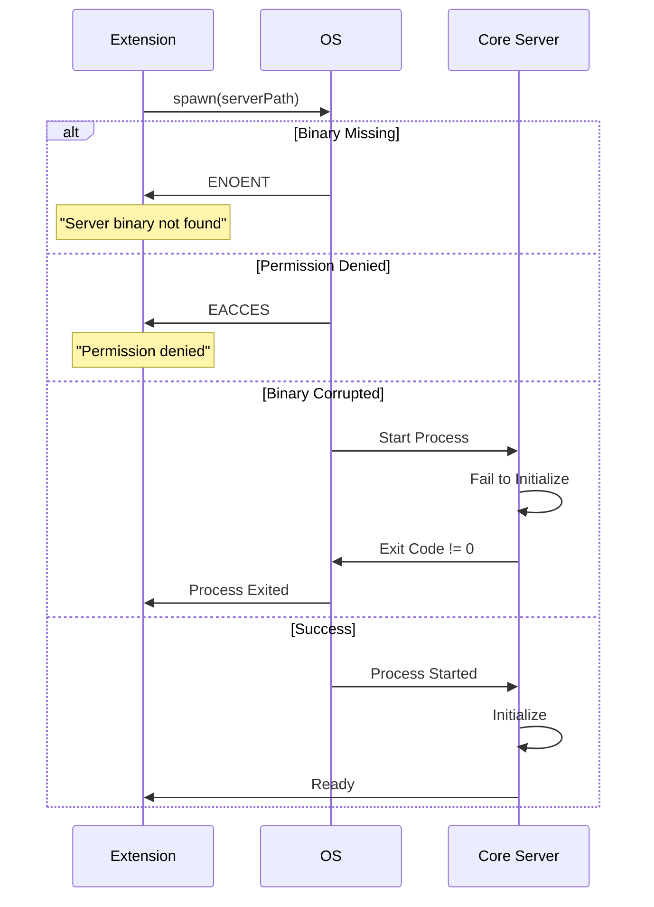

**Diagnostic Steps:**

1. **Verify Binary Exists**
   ```
   ls -la ~/Library/Application\ Support/Code/User/globalStorage/.../server/
   ```

2. **Check Permissions (Unix)**
   ```bash
   # Make executable
   chmod +x DataverseMCPToolBox
   chmod +x DataverseMCPToolBox.Bridge
   ```

3. **Check Core Server Logs**
   - Output panel → Dataverse MCP Toolbox
   - Look for `[Core]` prefix logs

4. **Try Manual Execution**
   ```bash
   # Test if binary runs
   ./DataverseMCPToolBox --help
   ```

## Connection Issues

### Authentication Failures

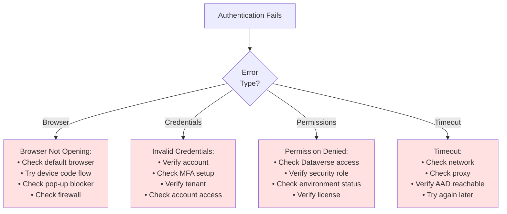

**Common Solutions:**

1. **Browser Authentication Issues**
   ```
   # Set default browser
   # macOS
   open -a "Google Chrome" --args --new-window
   
   # Try device code flow as fallback
   # Automatically attempted if browser fails
   ```

2. **Clear MSAL Cache**
   ```
   Delete connection and recreate
   Extension clears cached tokens
   ```

3. **Test URL Manually**
   ```
   # Open in browser
   https://yourorg.crm.dynamics.com
   
   # Verify you can access environment
   ```

### Connection Timeout

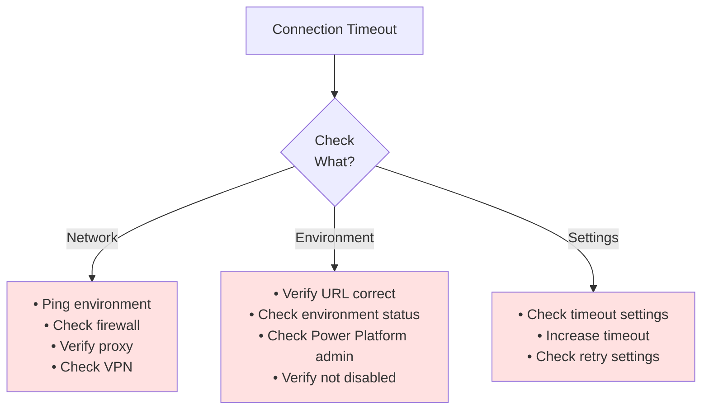

### Token Refresh Failures

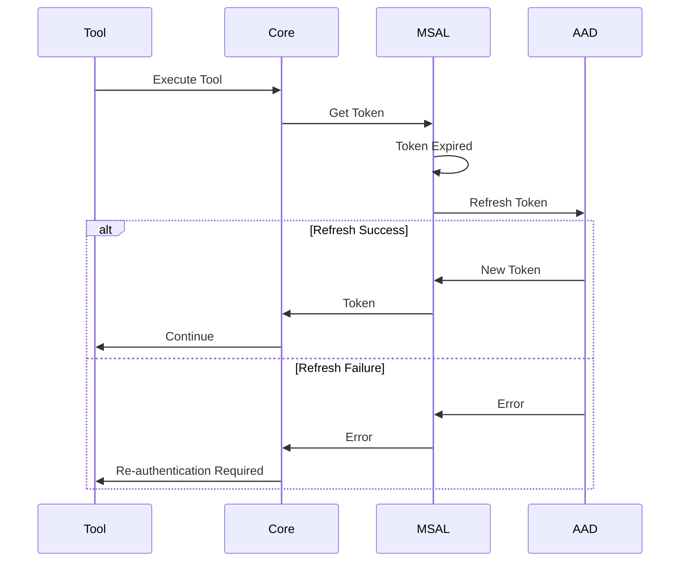

**Solution:**
- Delete connection
- Recreate connection
- Re-authenticate

## Tool Execution Issues

### Tool Not Found

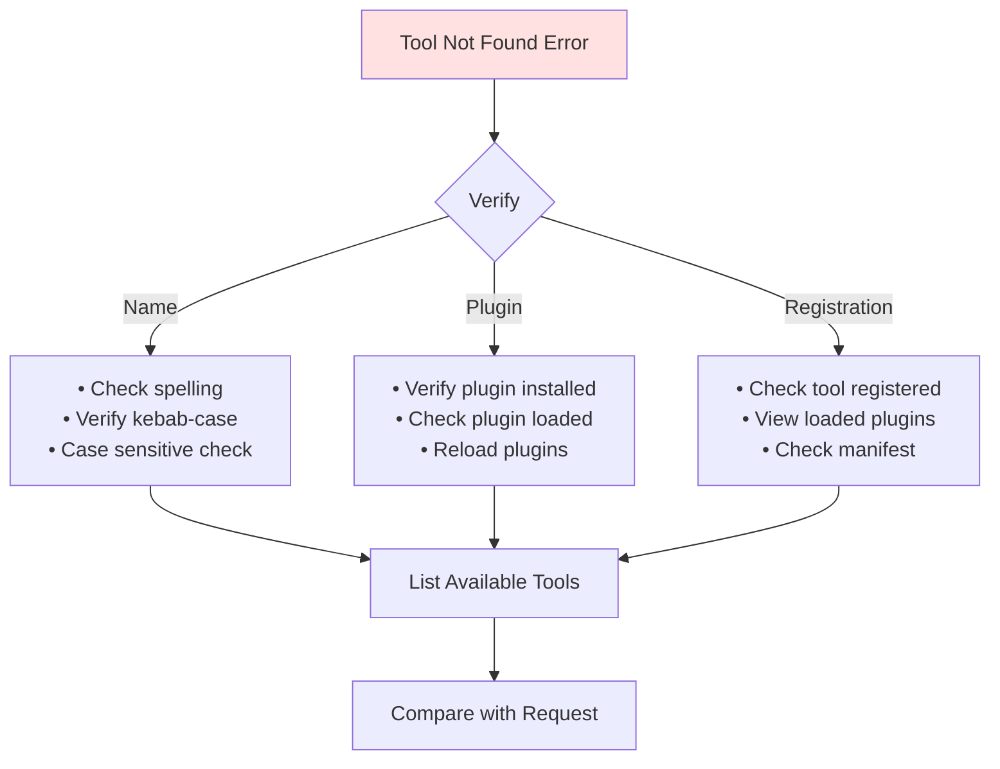

**Diagnostic Commands:**
```
Command Palette → Dataverse: List Loaded Plugins
Ask Copilot: "@workspace What tools are available?"
```

### Tool Execution Fails

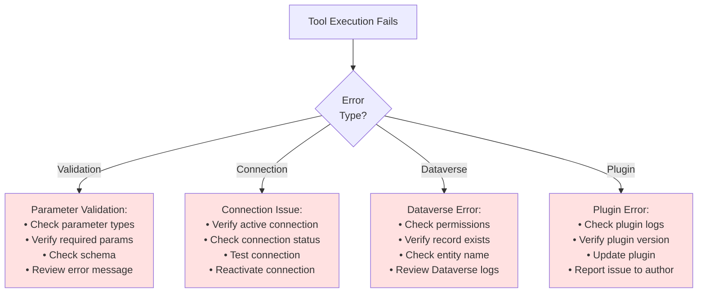

### No Active Connection Error

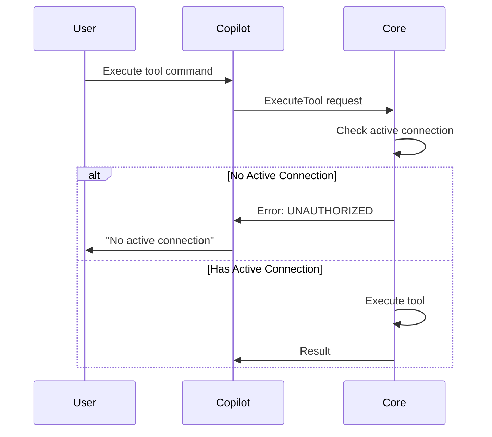

**Solution:**
1. Open Dataverse MCP sidebar
2. Activate a connection (click on it)
3. Verify green checkmark appears
4. Retry tool execution

## Plugin Issues

### Plugin Won't Load

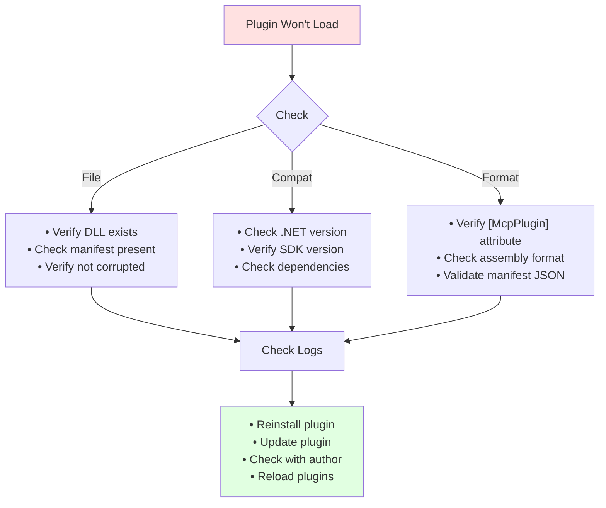

### Tools Not Appearing

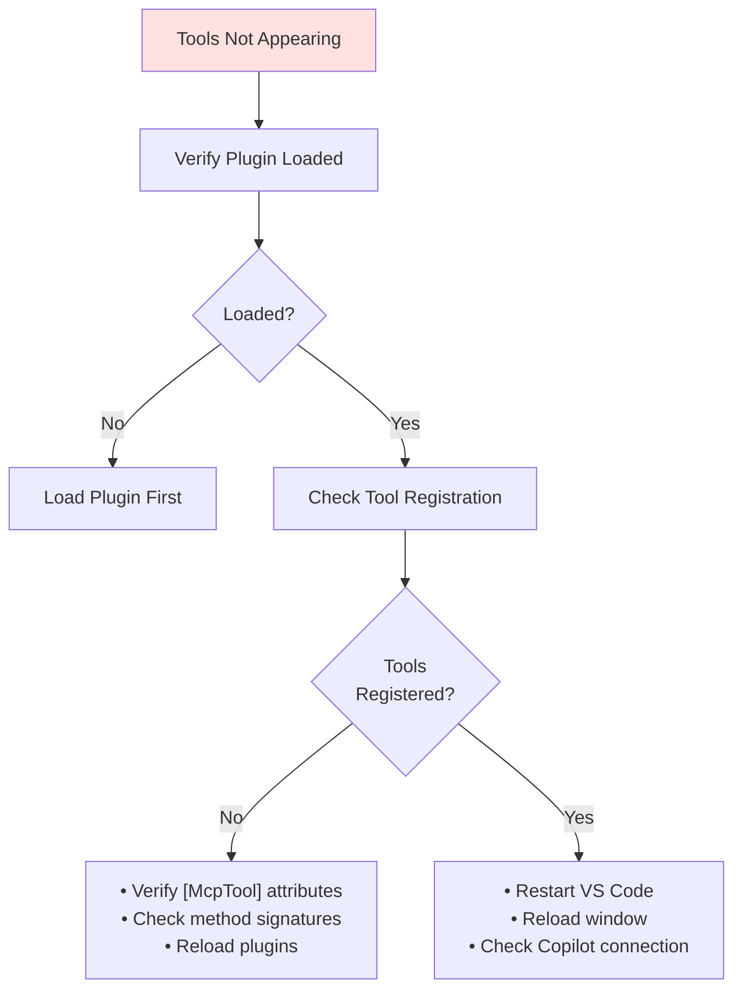

## Performance Issues

### Slow Tool Execution

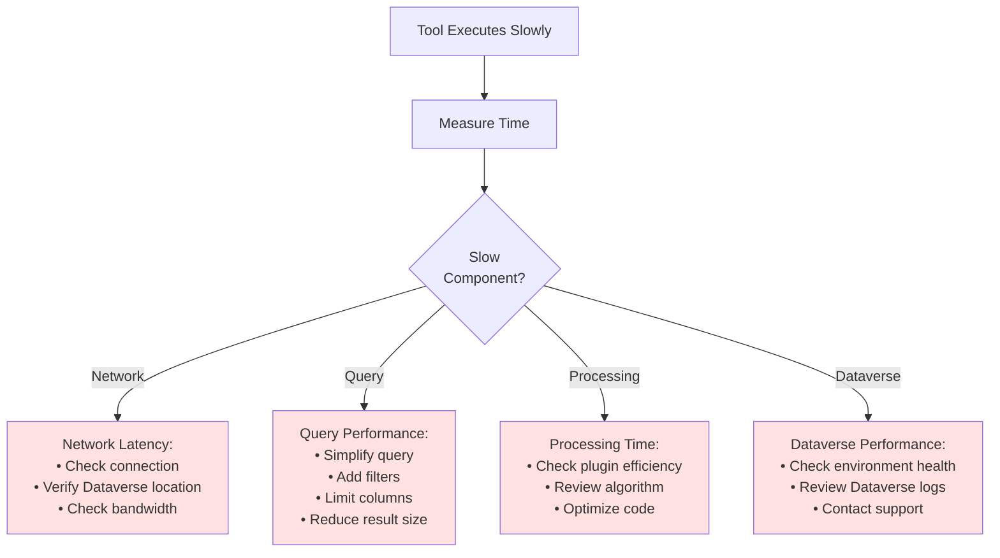

### High Memory Usage

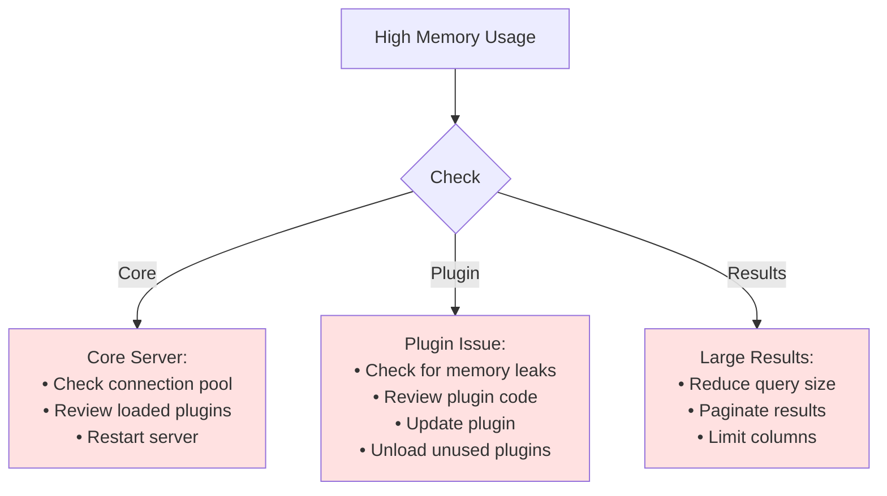

## Common Error Messages

### Error Reference

| Error Code | Meaning | Solution |
|------------|---------|----------|
| `VALIDATION_ERROR` | Invalid parameters | Check parameter types and values |
| `NOT_FOUND` | Resource not found | Verify entity/record exists |
| `DATAVERSE_ERROR` | Dataverse SDK error | Check permissions, review details |
| `UNAUTHORIZED` | No active connection | Activate a connection |
| `PLUGIN_ERROR` | Plugin execution error | Check plugin logs, update plugin |
| `TIMEOUT` | Operation timeout | Check network, simplify query |
| `AUTHENTICATION_ERROR` | Auth failed | Re-authenticate, check credentials |

## Diagnostic Commands

### Extension Commands

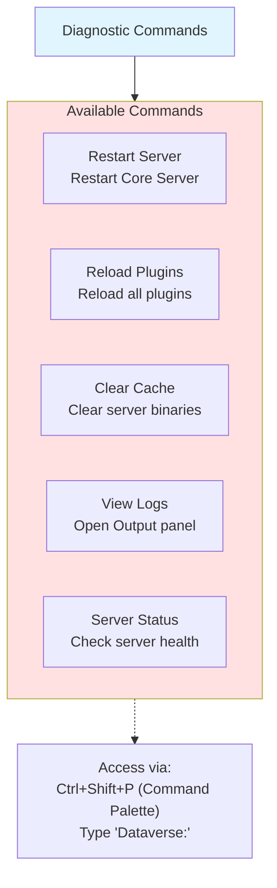

**Quick Commands:**
```
Ctrl+Shift+P → Dataverse: Restart Server
Ctrl+Shift+P → Dataverse: Reload Plugins
Ctrl+Shift+P → Dataverse: View Logs
Ctrl+Shift+P → Dataverse: Check Server Status
```

## Getting Help

### Support Resources

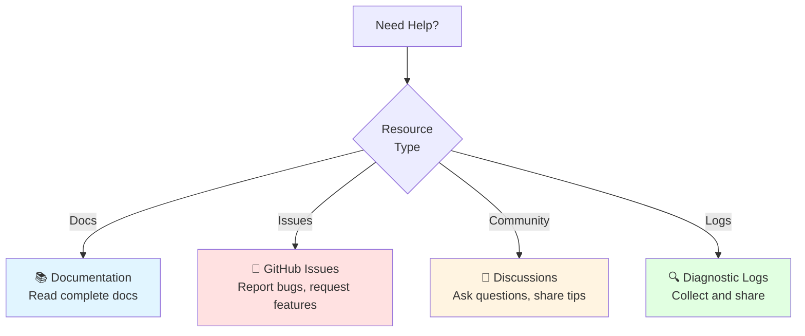

### Reporting Issues

**Information to Include:**

1. **Environment**
   - OS and version
   - VS Code version
   - Extension version
   - Runtime version

2. **Reproduction Steps**
   - Step-by-step instructions
   - Expected behavior
   - Actual behavior

3. **Logs**
   - Output panel logs
   - Error messages
   - Screenshots

4. **Configuration**
   - Update channel
   - Installed plugins
   - Connection details (no tokens!)

**Template:**
```markdown
## Environment
- OS: macOS 14.0
- VS Code: 1.85.0
- Extension: 1.2.3
- Runtime: 1.2.3

## Issue Description
[Describe the issue]

## Reproduction Steps
1. [Step 1]
2. [Step 2]
3. [Step 3]

## Expected Behavior
[What should happen]

## Actual Behavior
[What actually happens]

## Logs
```
[Paste relevant logs]
```

## Screenshots
[Attach screenshots if applicable]
```

## Next Steps

- **[Configuration Reference](16-Configuration-Reference.md)**: Detailed configuration options
- **[Build and Deployment](17-Build-And-Deployment.md)**: Advanced deployment topics
- **[Security](18-Security.md)**: Security considerations
