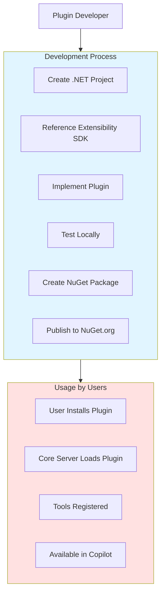
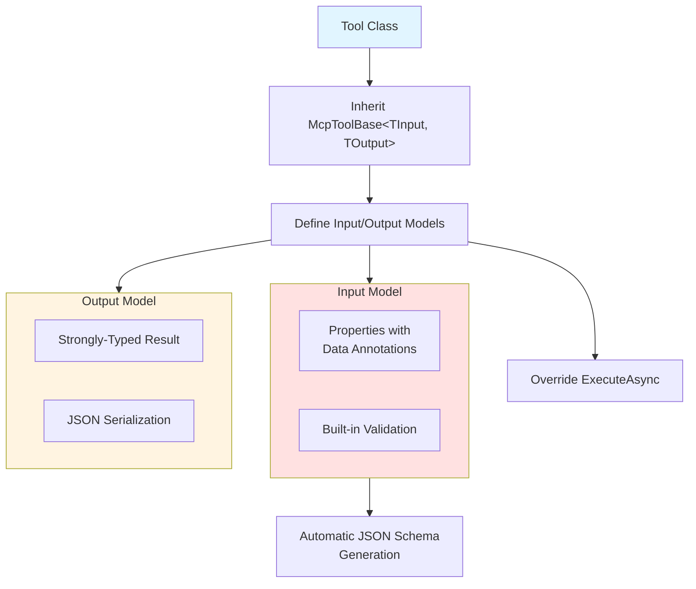
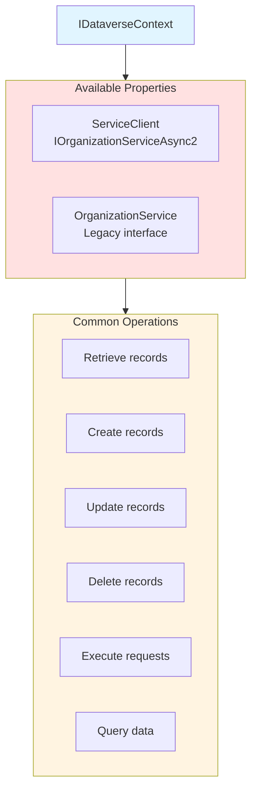
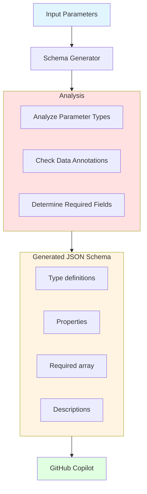
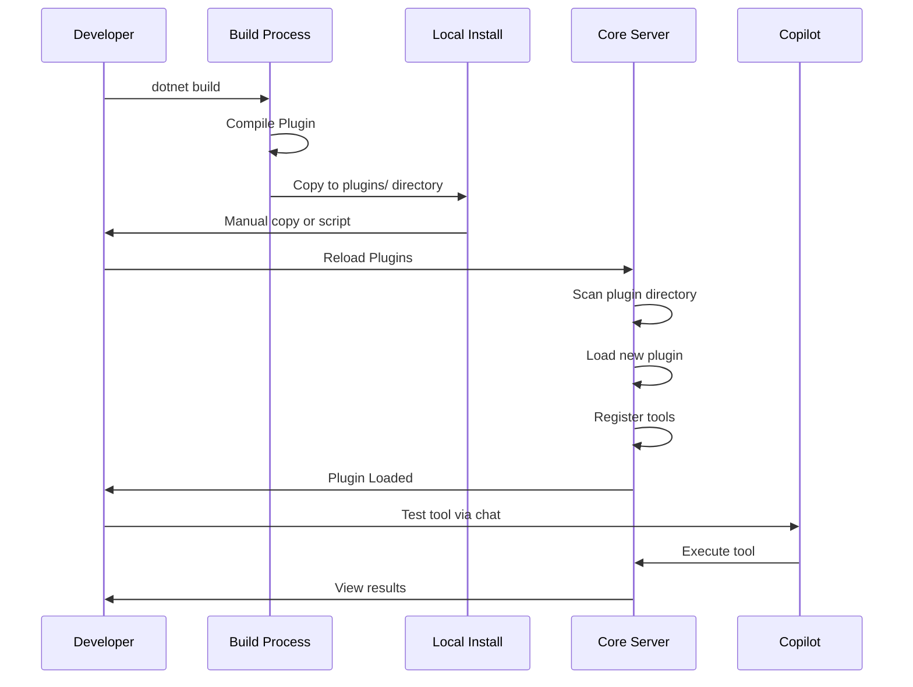

# Creating Plugins

Complete guide to building custom plugins that extend Dataverse MCP Toolbox functionality.

## Plugin Overview

Plugins are NuGet packages that extend the toolbox with custom tools. They are loaded dynamically by the Core Server and automatically expose tools to GitHub Copilot via the MCP protocol.



## Prerequisites

- **.NET SDK**: Version 6.0 or later
- **IDE**: Visual Studio, VS Code, or Rider
- **NuGet Account**: For publishing (optional)
- **Dataverse Access**: For testing

## Quick Start

### 1. Create Project

```bash
# Create new class library
dotnet new classlib -n MyDataversePlugin
cd MyDataversePlugin

# Add Extensibility SDK
dotnet add package DataverseMCPToolBox.Extensibility
```

### 2. Implement Plugin

```csharp
using DataverseMCPToolBox.Extensibility;
using DataverseMCPToolBox.Extensibility.Abstractions;
using DataverseMCPToolBox.Extensibility.Attributes;

[McpPlugin("my-plugin", "1.0.0",
    Author = "Your Name",
    Description = "My custom Dataverse plugin")]
public class MyPlugin : PluginBase
{
    [McpTool("Get current user information")]
    public async Task<object> GetWhoAmI(
        IDataverseContext context,
        CancellationToken cancellationToken)
    {
        var request = new WhoAmIRequest();
        var response = (WhoAmIResponse)await context.ServiceClient
            .ExecuteAsync(request, cancellationToken);
        
        return new {
            userId = response.UserId,
            businessUnitId = response.BusinessUnitId,
            organizationId = response.OrganizationId
        };
    }
}
```

### 3. Build and Test

```bash
# Build the project
dotnet build

# Create NuGet package
dotnet pack -c Release
```

## Plugin Patterns

### Pattern 1: Attribute-Based (Simple)

Use `PluginBase` with `[McpTool]` attributes for automatic tool discovery.

```mermaid
graph TB
    Plugin[Plugin Class]
    
    Plugin --> Base[Inherit PluginBase]
    Base --> Attribute[Add [McpPlugin] Attribute]
    Attribute --> Methods[Add [McpTool] Methods]
    
    subgraph Method["Tool Method"]
        Signature[Method Signature]
        Context[IDataverseContext parameter]
        Cancel[CancellationToken parameter]
        Async[async Task&lt;object&gt; return]
    end
    
    Methods --> Method
    
    Auto[Automatic Discovery<br/>& Registration]
    Method --> Auto
    
    style Plugin fill:#e1f5ff
    style Method fill:#ffe1e1
    style Auto fill:#e1ffe1
```

**Example:**

```csharp
[McpPlugin("simple-plugin", "1.0.0")]
public class SimplePlugin : PluginBase
{
    // Method name → kebab-case: "list-entities"
    [McpTool("List all entities")]
    public async Task<object> ListEntities(
        IDataverseContext context,
        CancellationToken ct)
    {
        // Implementation
    }
    
    // Explicit tool name
    [McpTool("Get record", Name = "get-record")]
    public async Task<object> GetRecord(
        string entityName,
        string recordId,
        IDataverseContext context,
        CancellationToken ct)
    {
        // Implementation
    }
}
```

### Pattern 2: Strongly-Typed (Complex)

Use `McpToolBase<TInput, TOutput>` for type-safe parameters and results.



**Example:**

```csharp
public class GetRecordInput
{
    [Required]
    [JsonProperty("entityName")]
    public string EntityName { get; set; }
    
    [Required]
    [JsonProperty("recordId")]
    public string RecordId { get; set; }
    
    [JsonProperty("columns")]
    public string[]? Columns { get; set; }
}

public class GetRecordOutput
{
    [JsonProperty("id")]
    public Guid Id { get; set; }
    
    [JsonProperty("entityName")]
    public string EntityName { get; set; }
    
    [JsonProperty("attributes")]
    public Dictionary<string, object> Attributes { get; set; }
}

public class GetRecordTool : McpToolBase<GetRecordInput, GetRecordOutput>
{
    public GetRecordTool()
        : base("get-record", "Retrieves a specific record from Dataverse")
    {
    }
    
    protected override async Task<GetRecordOutput> ExecuteAsync(
        GetRecordInput parameters,
        IDataverseContext context,
        CancellationToken cancellationToken)
    {
        var id = Guid.Parse(parameters.RecordId);
        var columns = parameters.Columns != null
            ? new ColumnSet(parameters.Columns)
            : new ColumnSet(true);
        
        var entity = await context.ServiceClient.RetrieveAsync(
            parameters.EntityName,
            id,
            columns,
            cancellationToken);
        
        return new GetRecordOutput
        {
            Id = entity.Id,
            EntityName = entity.LogicalName,
            Attributes = entity.Attributes.ToDictionary(
                kvp => kvp.Key,
                kvp => kvp.Value)
        };
    }
}
```

## Tool Naming

### Kebab-Case Convention

```mermaid
graph TB
    Method[Method Name] --> Convert{Conversion}
    
    Convert -->|Automatic| Auto[ListEntities → list-entities]
    Convert -->|Explicit| Explicit[Name = "get-record"]
    
    subgraph Rules["Naming Rules"]
        Rule1[All lowercase]
        Rule2[Hyphens separate words]
        Rule3[No spaces or underscores]
        Rule4[Descriptive and concise]
    end
    
    Auto --> Rules
    Explicit --> Rules
    
    subgraph Examples["Valid Examples"]
        Ex1[get-whoami]
        Ex2[list-entities]
        Ex3[create-record]
        Ex4[execute-workflow]
    end
    
    Rules --> Examples
    
    style Examples fill:#e1ffe1
    style Rules fill:#ffe1e1
```

**Conversion Examples:**

| Method Name | Tool Name |
|-------------|-----------|
| `GetWhoAmI` | `get-who-am-i` |
| `ListEntities` | `list-entities` |
| `CreateRecord` | `create-record` |
| `ExecuteWorkflow` | `execute-workflow` |

## Accessing Dataverse

### IDataverseContext



**Example Usage:**

```csharp
[McpTool("Create a new account record")]
public async Task<object> CreateAccount(
    string name,
    decimal? revenue,
    IDataverseContext context,
    CancellationToken ct)
{
    var account = new Entity("account")
    {
        ["name"] = name
    };
    
    if (revenue.HasValue)
        account["revenue"] = new Money(revenue.Value);
    
    var id = await context.ServiceClient.CreateAsync(
        account,
        ct);
    
    return new { accountId = id, name = name };
}
```

## JSON Schema Generation

### Automatic Schema



**Data Annotations:**

```csharp
using System.ComponentModel.DataAnnotations;

public class CreateAccountInput
{
    [Required]
    [StringLength(100)]
    [JsonProperty("name")]
    public string Name { get; set; }
    
    [Range(0, double.MaxValue)]
    [JsonProperty("revenue")]
    public decimal? Revenue { get; set; }
    
    [EmailAddress]
    [JsonProperty("email")]
    public string? Email { get; set; }
}
```

**Generated Schema:**

```json
{
  "type": "object",
  "properties": {
    "name": {
      "type": "string",
      "maxLength": 100
    },
    "revenue": {
      "type": "number",
      "minimum": 0
    },
    "email": {
      "type": "string",
      "format": "email"
    }
  },
  "required": ["name"]
}
```

## Error Handling

### ToolExecutionException

```csharp
using DataverseMCPToolBox.Extensibility.Exceptions;

[McpTool("Get entity metadata")]
public async Task<object> GetEntityMetadata(
    string entityName,
    IDataverseContext context,
    CancellationToken ct)
{
    try
    {
        var request = new RetrieveEntityRequest
        {
            LogicalName = entityName,
            EntityFilters = EntityFilters.All
        };
        
        var response = (RetrieveEntityResponse)
            await context.ServiceClient.ExecuteAsync(request, ct);
        
        return new { metadata = response.EntityMetadata };
    }
    catch (FaultException<OrganizationServiceFault> ex)
    {
        throw new ToolExecutionException(
            "DATAVERSE_ERROR",
            $"Failed to retrieve metadata for entity '{entityName}'",
            ex.Message);
    }
}
```

## Testing Plugins

### Local Testing



**Local Install Script:**

```bash
#!/bin/bash
# install-plugin-local.sh

# Build plugin
dotnet build -c Debug

# Copy to VS Code globalStorage
PLUGIN_DIR="$HOME/Library/Application Support/Code/User/globalStorage/YOUR_EXTENSION_ID/plugins/MyPlugin"
mkdir -p "$PLUGIN_DIR"
cp -r bin/Debug/net6.0/* "$PLUGIN_DIR/"

echo "Plugin installed locally. Reload plugins in VS Code."
```

## Packaging for Distribution

### NuGet Package

```xml
<!-- MyPlugin.csproj -->
<Project Sdk="Microsoft.NET.Sdk">
  <PropertyGroup>
    <TargetFramework>net6.0</TargetFramework>
    <PackageId>DataverseMCPToolBox.Plugins.MyPlugin</PackageId>
    <Version>1.0.0</Version>
    <Authors>Your Name</Authors>
    <Description>My custom Dataverse plugin</Description>
    <PackageTags>dataverse-mcp;plugin;dataverse</PackageTags>
    <PackageLicenseExpression>MIT</PackageLicenseExpression>
    <RepositoryUrl>https://github.com/youruser/yourrepo</RepositoryUrl>
  </PropertyGroup>
  
  <ItemGroup>
    <PackageReference Include="DataverseMCPToolBox.Extensibility" Version="0.1.0-alpha" />
  </ItemGroup>
</Project>
```

### Build and Publish

```bash
# Build release
dotnet build -c Release

# Create NuGet package
dotnet pack -c Release -o nupkg

# Publish to NuGet.org
dotnet nuget push nupkg/DataverseMCPToolBox.Plugins.MyPlugin.1.0.0.nupkg \
  --api-key YOUR_API_KEY \
  --source https://api.nuget.org/v3/index.json
```

## Best Practices

### Design Principles

1. **Single Responsibility**: Each tool should do one thing well
2. **Descriptive Names**: Use clear, action-oriented names
3. **Async All the Way**: All operations must be async
4. **Proper Error Handling**: Use ToolExecutionException
5. **Input Validation**: Validate parameters early
6. **Documentation**: Provide clear descriptions

### Performance Tips

1. **Use Column Sets**: Don't retrieve all columns unnecessarily
2. **Batch Operations**: Combine multiple operations when possible
3. **Caching**: Cache metadata that doesn't change
4. **Pagination**: Handle large result sets properly
5. **Cancellation**: Respect CancellationToken

### Security Considerations

1. **Validate Input**: Never trust user input
2. **Sanitize Queries**: Prevent injection attacks
3. **Respect Permissions**: Use Dataverse security
4. **Limit Exposure**: Only expose necessary operations
5. **Error Messages**: Don't leak sensitive information

## Next Steps

- **[Plugin Architecture](15-Plugin-Architecture.md)**: Deep dive into plugin architecture
- **[Configuration Reference](16-Configuration-Reference.md)**: Configuration options
- **Sample Plugins**: Check SampleWhoAmIPlugin/ for examples
