# Plugin Architecture

Deep dive into how plugins are loaded, managed, and executed within the Dataverse MCP Toolbox.

## Plugin System Overview

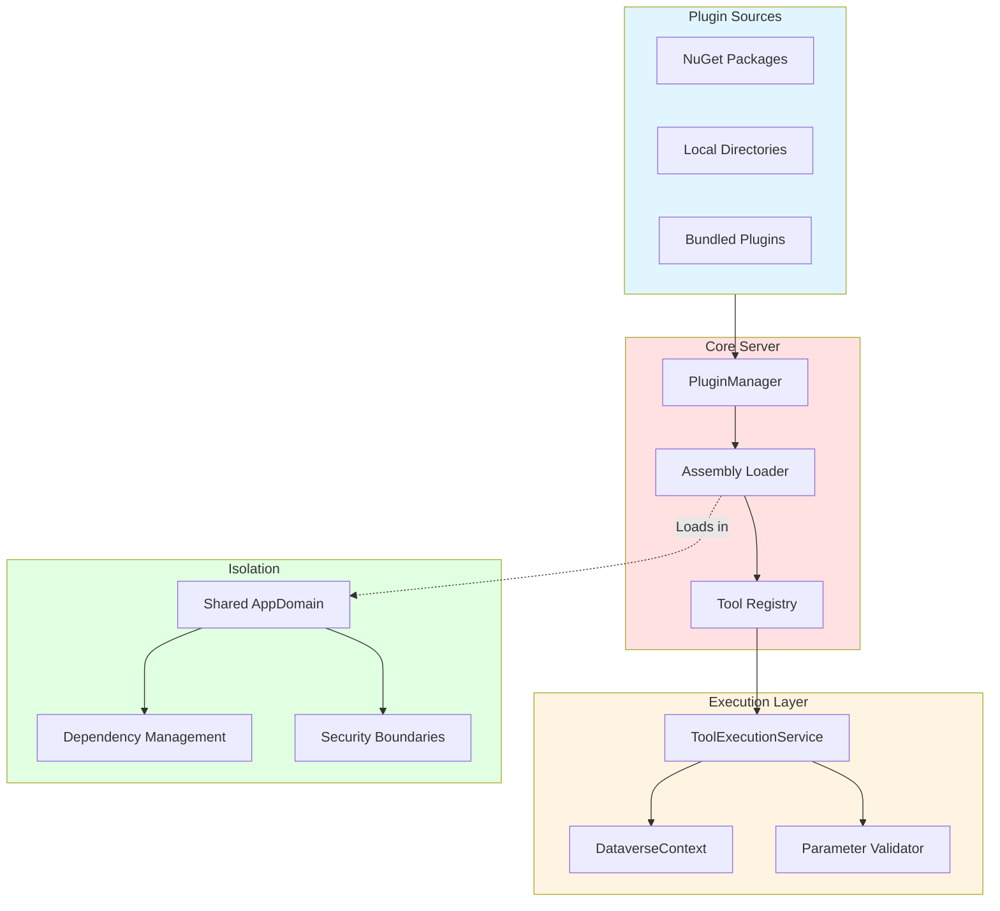

## Plugin Lifecycle

### Discovery and Loading

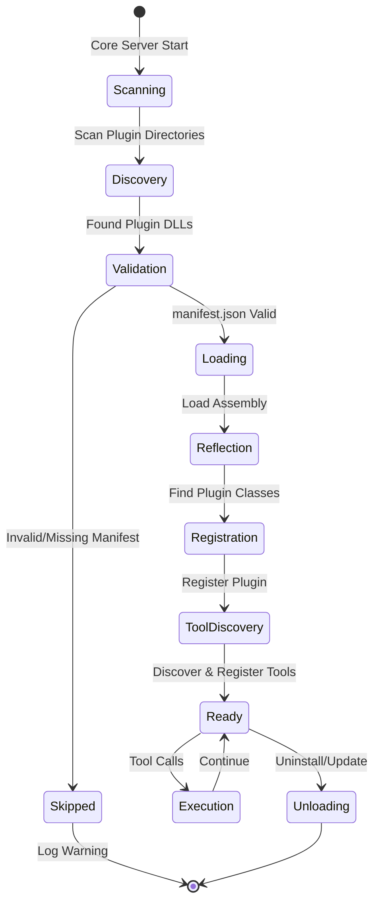

### Startup Sequence

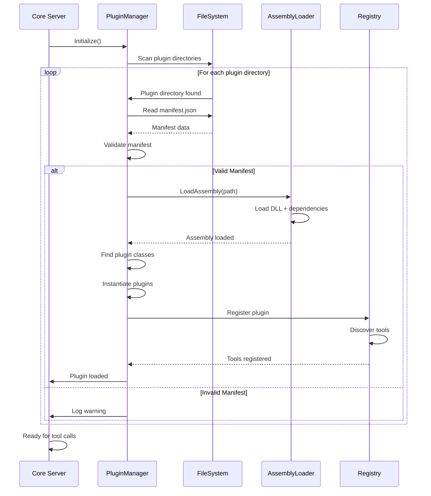

## Plugin Structure

### Directory Layout

```
plugins/
├── WhoAmIPlugin/
│   ├── manifest.json
│   ├── WhoAmIPlugin.dll
│   ├── WhoAmIPlugin.pdb
│   └── [dependencies]
├── CustomPlugin/
│   ├── manifest.json
│   ├── CustomPlugin.dll
│   └── [dependencies]
└── AnotherPlugin/
    ├── manifest.json
    └── AnotherPlugin.dll
```

### Manifest Format

```json
{
  "name": "whoami-plugin",
  "version": "1.0.0",
  "author": "Your Name",
  "description": "Provides WhoAmI functionality",
  "entryPoint": "WhoAmIPlugin.dll",
  "dependencies": [
    {
      "name": "Newtonsoft.Json",
      "version": "13.0.3"
    }
  ],
  "compatibility": {
    "minCoreVersion": "0.1.0",
    "maxCoreVersion": "1.0.0"
  },
  "metadata": {
    "repository": "https://github.com/user/whoami-plugin",
    "license": "MIT",
    "tags": ["whoami", "user", "identity"]
  }
}
```

## Tool Discovery

### Attribute-Based Discovery

```mermaid
graph TB
    Plugin[Plugin Assembly]
    
    Plugin --> Scan[Scan for Classes]
    Scan --> Filter[Filter by Attributes]
    
    subgraph AttributeCheck["Attribute Check"]
        McpPlugin[Has [McpPlugin]?]
        Inherits[Inherits PluginBase?]
    end
    
    Filter --> AttributeCheck
    
    subgraph MethodScan["Method Scan"]
        Methods[Find Public Methods]
        McpTool[Has [McpTool]?]
        Signature[Valid Signature?]
    end
    
    AttributeCheck -->|Yes| MethodScan
    AttributeCheck -->|No| Skip[Skip]
    
    subgraph Registration["Tool Registration"]
        Name[Extract Tool Name]
        Desc[Extract Description]
        Schema[Generate Schema]
        Register[Register in Registry]
    end
    
    MethodScan -->|Valid| Registration
    MethodScan -->|Invalid| Skip
    
    style Plugin fill:#e1f5ff
    style AttributeCheck fill:#ffe1e1
    style MethodScan fill:#fff4e1
    style Registration fill:#e1ffe1
```

### Strongly-Typed Discovery

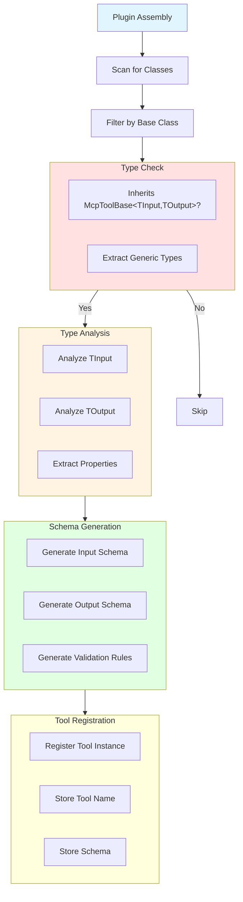

## Tool Registry

### Internal Structure

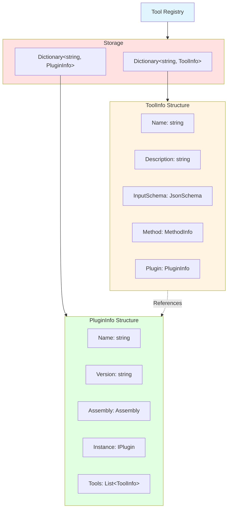

### Tool Lookup

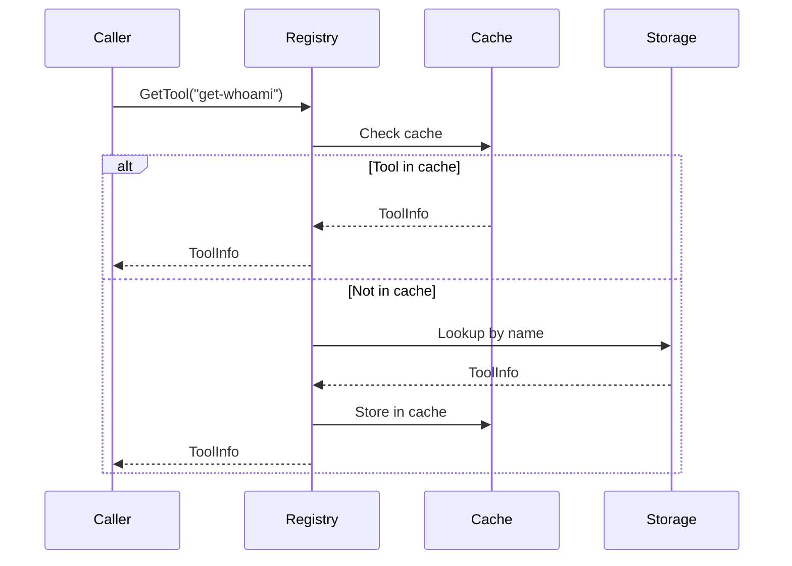

## Schema Generation

### Process Flow

```mermaid
graph TB
    Input[Input Type]
    
    Input --> Analyze[Type Analyzer]
    
    subgraph Analysis["Type Analysis"]
        Props[Extract Properties]
        Types[Determine Types]
        Attrs[Read Data Annotations]
    end
    
    Analyze --> Analysis
    
    subgraph SchemaBuilder["Schema Builder"]
        Root[Create Root Object]
        PropDefs[Define Properties]
        Required[Mark Required]
        Constraints[Add Constraints]
    end
    
    Analysis --> SchemaBuilder
    
    subgraph JsonSchema["JSON Schema Output"]
        Type[type: object]
        Properties[properties: {...}]
        Req[required: [...]]
        Defs[definitions: {...}]
    end
    
    SchemaBuilder --> JsonSchema
    
    Copilot[Sent to Copilot]
    JsonSchema --> Copilot
    
    style Input fill:#e1f5ff
    style Analysis fill:#ffe1e1
    style SchemaBuilder fill:#fff4e1
    style JsonSchema fill:#e1ffe1
```

### Type Mapping

| C# Type | JSON Schema Type | Additional |
|---------|-----------------|------------|
| `string` | `"string"` | |
| `int`, `long` | `"integer"` | |
| `float`, `double`, `decimal` | `"number"` | |
| `bool` | `"boolean"` | |
| `DateTime` | `"string"` | `format: "date-time"` |
| `Guid` | `"string"` | `format: "uuid"` |
| `T[]`, `List<T>` | `"array"` | `items: {...}` |
| `Dictionary<string, T>` | `"object"` | `additionalProperties: {...}` |
| Custom class | `"object"` | Nested schema |
| `T?` (nullable) | Same as T | Not in `required` |

### Data Annotation Mapping

| Attribute | JSON Schema |
|-----------|-------------|
| `[Required]` | Adds to `required` array |
| `[StringLength(max)]` | `maxLength: max` |
| `[Range(min, max)]` | `minimum: min`, `maximum: max` |
| `[EmailAddress]` | `format: "email"` |
| `[Url]` | `format: "uri"` |
| `[RegularExpression(pattern)]` | `pattern: "pattern"` |
| `[MinLength(n)]` | `minLength: n` |
| `[MaxLength(n)]` | `maxLength: n` |

## Tool Execution

### Execution Pipeline

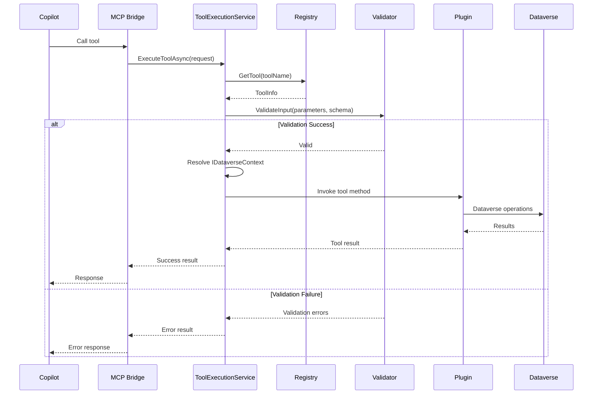

### Context Injection

```mermaid
graph TB
    Execution[Tool Execution]
    
    Execution --> Check[Check Method Signature]
    
    subgraph Parameters["Parameter Analysis"]
        UserParams[User Parameters]
        SystemParams[System Parameters]
    end
    
    Check --> Parameters
    
    subgraph Resolution["Parameter Resolution"]
        Match[Match by Name/Type]
        Inject[Inject IDataverseContext]
        InjectCT[Inject CancellationToken]
    end
    
    Parameters --> Resolution
    
    subgraph Invocation["Method Invocation"]
        Build[Build Argument Array]
        Invoke[MethodInfo.Invoke()]
        Await[Await Task Result]
    end
    
    Resolution --> Invocation
    
    Result[Return Result]
    Invocation --> Result
    
    style Execution fill:#e1f5ff
    style Parameters fill:#ffe1e1
    style Resolution fill:#fff4e1
    style Invocation fill:#e1ffe1
```

## Dependency Management

### Assembly Loading

```mermaid
graph TB
    Plugin[Plugin DLL]
    
    Plugin --> Load[Assembly.LoadFrom()]
    
    subgraph Resolution["Dependency Resolution"]
        Search[Search Plugin Directory]
        Check[Check GAC]
        CheckRuntime[Check Runtime Directory]
    end
    
    Load --> Resolution
    
    subgraph Conflicts["Conflict Handling"]
        Version[Version Check]
        Resolve[Resolve to Best Match]
        Load2[Load Assembly]
    end
    
    Resolution --> Conflicts
    
    subgraph Shared["Shared Dependencies"]
        SDK[Extensibility SDK]
        Dataverse[Dataverse SDK]
        System[System Libraries]
    end
    
    Conflicts --> Shared
    
    Ready[Plugin Ready]
    Shared --> Ready
    
    style Plugin fill:#e1f5ff
    style Resolution fill:#ffe1e1
    style Conflicts fill:#fff4e1
    style Shared fill:#e1ffe1
```

### Version Compatibility

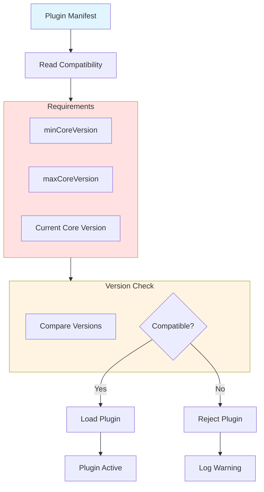

## Isolation and Security

### Plugin Isolation

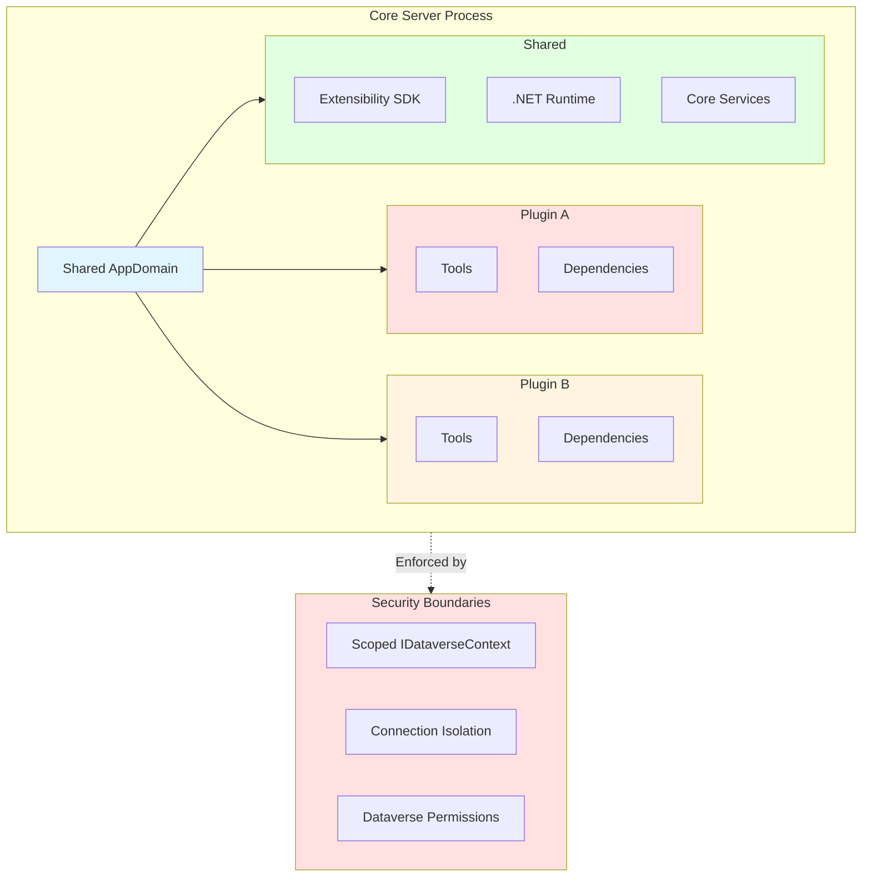

### Security Model

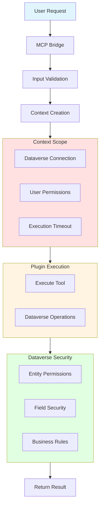

## Plugin Updates

### Update Flow

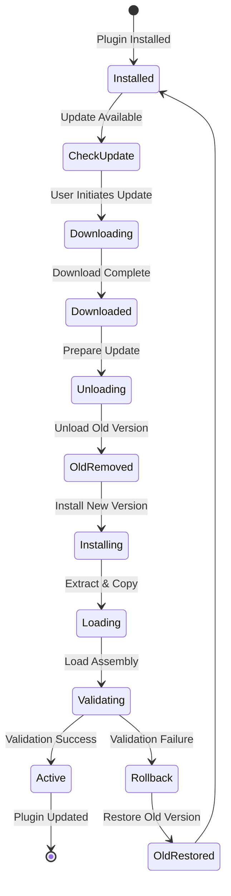

### Hot Reload Considerations

- **Current Limitation**: Hot reload not supported
- **Workaround**: Restart Core Server to load updated plugins
- **Future Enhancement**: AppDomain unloading for hot reload

## Performance Optimization

### Caching Strategy

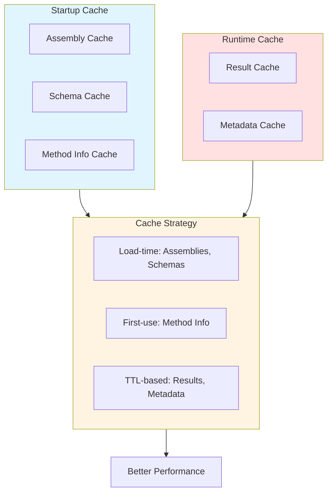

### Lazy Loading

- **Plugin Discovery**: At startup
- **Assembly Loading**: On first tool call (if not pre-loaded)
- **Schema Generation**: Cached after first generation
- **Context Creation**: Per tool execution

## Debugging Plugins

### Debug Workflow

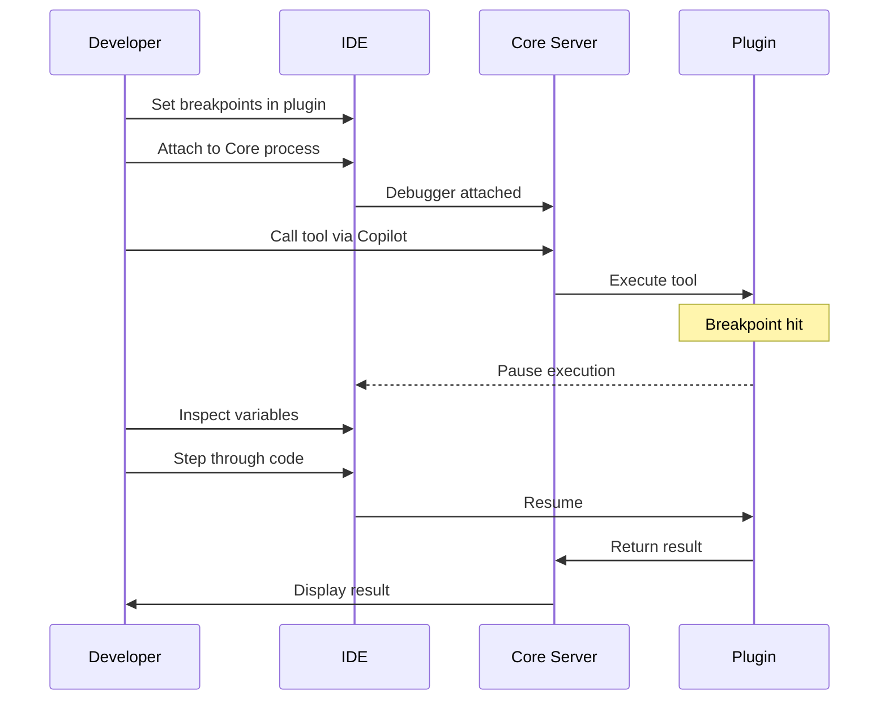

### Debug Configuration

**Visual Studio / VS Code:**

```json
{
  "name": "Attach to Core Server",
  "type": "coreclr",
  "request": "attach",
  "processName": "DataverseMCPToolBox"
}
```

**Logging in Plugins:**

```csharp
[McpTool("Debug tool")]
public async Task<object> DebugTool(
    IDataverseContext context,
    CancellationToken ct)
{
    // Logs visible in Core Server stderr
    Console.Error.WriteLine($"[Plugin] Executing debug tool");
    
    // Your logic
    var result = await DoSomethingAsync();
    
    Console.Error.WriteLine($"[Plugin] Result: {result}");
    return result;
}
```

## Best Practices

### Plugin Design

1. **Stateless**: Plugins should be stateless (no instance variables)
2. **Async**: All operations must be async
3. **Dependencies**: Minimize external dependencies
4. **Compatibility**: Test with multiple Core versions
5. **Documentation**: Document each tool clearly

### Performance

1. **Lazy Loading**: Only load assemblies when needed
2. **Connection Reuse**: Don't create new connections
3. **Caching**: Cache expensive operations
4. **Timeouts**: Implement reasonable timeouts
5. **Cleanup**: Dispose resources properly

### Error Handling

1. **Specific Exceptions**: Use ToolExecutionException
2. **Error Codes**: Use meaningful error codes
3. **User Messages**: Provide helpful error messages
4. **Logging**: Log errors to stderr
5. **Graceful Degradation**: Handle failures gracefully

## Next Steps

- **[Creating Plugins](14-Creating-Plugins.md)**: Step-by-step plugin development guide
- **[Configuration Reference](16-Configuration-Reference.md)**: Plugin configuration options
- **Sample Code**: Explore SampleWhoAmIPlugin/ for complete example
