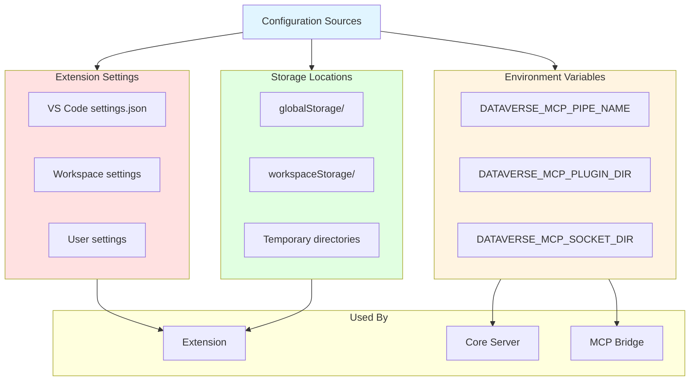
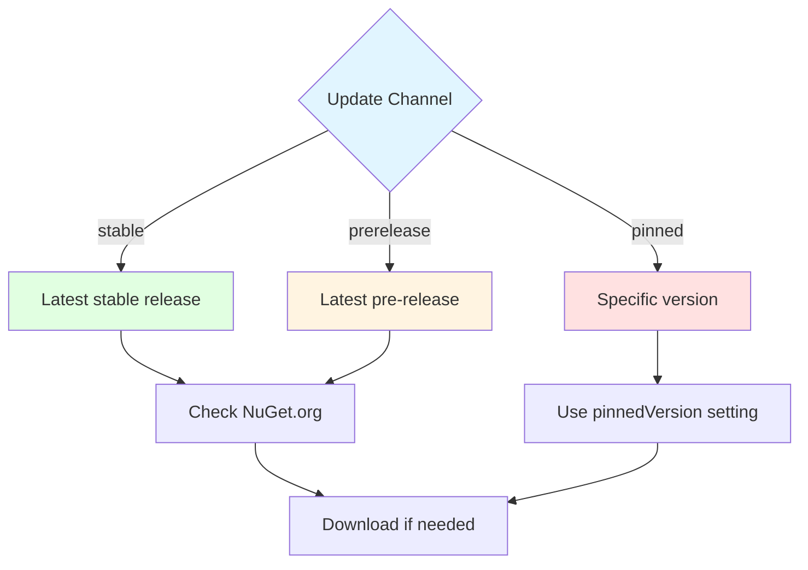

# Configuration Reference

Complete reference for all configuration options, environment variables, and settings.

## Configuration Overview



## VS Code Settings

### Extension Settings

#### dataversemcptoolbox.updateChannel

**Description**: Controls which version of Core Server binaries to use.

**Type**: `string`

**Default**: `"stable"`

**Options**:
- `"stable"`: Production-ready releases only
- `"prerelease"`: Include pre-release versions
- `"pinned"`: Use specific pinned version

**Example**:

```json
{
  "dataversemcptoolbox.updateChannel": "stable"
}
```

**Behavior**:



---

#### dataversemcptoolbox.pinnedVersion

**Description**: Specific version to use when updateChannel is "pinned".

**Type**: `string`

**Default**: `null`

**Format**: Semantic version (e.g., `"0.1.0-alpha"`, `"1.0.0"`)

**Example**:

```json
{
  "dataversemcptoolbox.updateChannel": "pinned",
  "dataversemcptoolbox.pinnedVersion": "0.1.0-alpha"
}
```

**Validation**:
- Must be valid semantic version
- Version must exist on NuGet.org
- Ignored if updateChannel is not "pinned"

---

#### dataversemcptoolbox.autoRestart

**Description**: Automatically restart Core Server on crash or update.

**Type**: `boolean`

**Default**: `true`

**Example**:

```json
{
  "dataversemcptoolbox.autoRestart": true
}
```

**Behavior**:
- `true`: Extension automatically restarts server on failure
- `false`: User must manually restart via command

---

#### dataversemcptoolbox.logLevel

**Description**: Logging verbosity level.

**Type**: `string`

**Default**: `"info"`

**Options**:
- `"error"`: Only errors
- `"warn"`: Errors and warnings
- `"info"`: Errors, warnings, and info
- `"debug"`: All messages including debug
- `"trace"`: Extremely verbose (development only)

**Example**:

```json
{
  "dataversemcptoolbox.logLevel": "info"
}
```

**Log Levels**:


---

#### dataversemcptoolbox.serverStartupTimeout

**Description**: Maximum time (ms) to wait for server startup.

**Type**: `number`

**Default**: `30000` (30 seconds)

**Example**:

```json
{
  "dataversemcptoolbox.serverStartupTimeout": 30000
}
```

**Behavior**:
- Extension waits this long for server to become ready
- If timeout exceeded, shows error notification
- Increase for slower systems or debugging

---

#### dataversemcptoolbox.pluginAutoUpdate

**Description**: Automatically check for plugin updates.

**Type**: `boolean`

**Default**: `true`

**Example**:

```json
{
  "dataversemcptoolbox.pluginAutoUpdate": true
}
```

---

#### dataversemcptoolbox.telemetry

**Description**: Enable anonymous telemetry.

**Type**: `boolean`

**Default**: `true`

**Example**:

```json
{
  "dataversemcptoolbox.telemetry": false
}
```

**Collected Data** (when enabled):
- Extension version
- Platform information
- Error events (no personal data)
- Usage statistics

## Environment Variables

### DATAVERSE_MCP_PIPE_NAME

**Description**: Named pipe identifier for Core Server communication.

**Set By**: Extension (auto-generated)

**Format**: `DataverseMCP-{instanceId}` (Windows) or socket path (Unix)

**Purpose**: Enables Extension and MCP Bridge to connect to Core Server.

**Platform-Specific**:

| Platform | Format | Example |
|----------|--------|---------|
| Windows | Named Pipe | `\\.\pipe\DataverseMCP-12345` |
| macOS/Linux | Socket Path | `/tmp/dvmcptb-sockets/DataverseMCP-12345` |

**Example (Windows)**:

```
DATAVERSE_MCP_PIPE_NAME=\\.\pipe\DataverseMCP-abc123
```

**Example (Unix)**:

```bash
export DATAVERSE_MCP_PIPE_NAME=/tmp/dvmcptb-sockets/DataverseMCP-abc123
```

---

### DATAVERSE_MCP_PLUGIN_DIR

**Description**: Directory containing installed plugins.

**Set By**: Extension

**Format**: Absolute path

**Example**:

```bash
# macOS
export DATAVERSE_MCP_PLUGIN_DIR="/Users/username/Library/Application Support/Code/User/globalStorage/dataversemcptoolbox/plugins"

# Windows
set DATAVERSE_MCP_PLUGIN_DIR=C:\Users\Username\AppData\Roaming\Code\User\globalStorage\dataversemcptoolbox\plugins

# Linux
export DATAVERSE_MCP_PLUGIN_DIR=/home/username/.config/Code/User/globalStorage/dataversemcptoolbox/plugins
```

**Purpose**: Core Server scans this directory at startup to load plugins.

---

### DATAVERSE_MCP_SOCKET_DIR

**Description**: Directory for Unix domain sockets (Unix only).

**Set By**: Extension

**Platform**: macOS, Linux

**Default**: `/tmp/dvmcptb-sockets`

**Example**:

```bash
export DATAVERSE_MCP_SOCKET_DIR=/tmp/dvmcptb-sockets
```

**Purpose**: Centralized location for socket files to avoid path length limits.

## Storage Locations

### Global Storage

**Purpose**: Extension-wide data (not workspace-specific).

**Location by Platform**:

| Platform | Path |
|----------|------|
| **macOS** | `~/Library/Application Support/Code/User/globalStorage/dataversemcptoolbox/` |
| **Windows** | `%APPDATA%\Code\User\globalStorage\dataversemcptoolbox\` |
| **Linux** | `~/.config/Code/User/globalStorage/dataversemcptoolbox/` |

**Directory Structure**:

```
globalStorage/dataversemcptoolbox/
├── server/                    # Core Server binaries
│   ├── 0.1.0-alpha/
│   │   ├── DataverseMCPToolBox
│   │   └── DataverseMCPToolBox.Bridge
│   └── 0.2.0-beta/
│       └── ...
├── plugins/                   # Installed plugins
│   ├── WhoAmIPlugin/
│   └── CustomPlugin/
└── connections.json           # Connection state (deprecated)
```

### Workspace Storage

**Purpose**: Workspace-specific data.

**Location**: `.vscode/` in workspace root

**Not Currently Used**: Reserved for future workspace-specific settings.

### Temporary Files

**Purpose**: Short-lived files (downloads, extracts).

**Location**:

| Platform | Path |
|----------|------|
| **macOS** | `$TMPDIR` |
| **Windows** | `%TEMP%` |
| **Linux** | `/tmp` |

**Cleanup**: Extension cleans up temporary files after use.

## Core Server Configuration

### Command-Line Arguments

Core Server is spawned by Extension with these arguments:

```bash
DataverseMCPToolBox \
  --pipe-name "DataverseMCP-abc123" \
  --plugin-dir "/path/to/plugins" \
  --log-level "info"
```

**Arguments**:

| Argument | Description | Required |
|----------|-------------|----------|
| `--pipe-name` | Named pipe/socket identifier | Yes |
| `--plugin-dir` | Plugin directory path | Yes |
| `--log-level` | Logging level | No |
| `--no-plugin-load` | Skip plugin loading | No |

### Environment Variables (Core)

Core Server reads these from environment:

```bash
# Primary pipe name
DATAVERSE_MCP_PIPE_NAME=DataverseMCP-abc123

# Plugin directory
DATAVERSE_MCP_PLUGIN_DIR=/path/to/plugins

# Socket directory (Unix)
DATAVERSE_MCP_SOCKET_DIR=/tmp/dvmcptb-sockets
```

## MCP Bridge Configuration

### Spawned by Copilot

MCP Bridge is spawned by GitHub Copilot with these settings:

**Environment Variables**:

```bash
# Core Server pipe name (required)
DATAVERSE_MCP_PIPE_NAME=DataverseMCP-abc123

# Optional: Socket directory
DATAVERSE_MCP_SOCKET_DIR=/tmp/dvmcptb-sockets
```

**STDIO Communication**:
- **stdin**: Receives MCP protocol messages from Copilot
- **stdout**: Sends MCP protocol responses to Copilot
- **stderr**: Logs (not visible to Copilot)

## Connection Configuration

### Connection Storage

**Location**: In-memory (Core Server process)

**Persistence**: Lost on server restart

**Structure**:

```json
{
  "connectionId": "conn-abc123",
  "name": "My Environment",
  "url": "https://org.crm.dynamics.com",
  "authMethod": "OAuth",
  "createdAt": "2024-01-15T10:30:00Z",
  "lastUsed": "2024-01-15T11:45:00Z"
}
```

### OAuth Configuration

**Handled By**: Dataverse SDK (MSAL library)

**Token Cache**: In-memory (per connection)

**Configuration**:

```csharp
// Automatic via Dataverse SDK
var serviceClient = new ServiceClient(
    instanceUrl: connectionUrl,
    useUniqueInstance: true,
    // Interactive OAuth flow
    requireNewInstance: false
);
```

## Plugin Configuration

### Plugin Manifest

**File**: `manifest.json` in plugin directory

**Schema**:

```json
{
  "$schema": "https://dataverse-mcp-toolbox.io/schemas/plugin-manifest.schema.json",
  "name": "plugin-name",
  "version": "1.0.0",
  "author": "Author Name",
  "description": "Plugin description",
  "entryPoint": "PluginName.dll",
  "dependencies": [
    {
      "name": "Newtonsoft.Json",
      "version": "13.0.3"
    }
  ],
  "compatibility": {
    "minCoreVersion": "0.1.0",
    "maxCoreVersion": "1.0.0"
  },
  "settings": {
    "customSetting": "value"
  }
}
```

### Plugin Settings

Custom plugin settings can be accessed via plugin manifest:

```csharp
public class MyPlugin : PluginBase
{
    public override void Initialize(PluginContext context)
    {
        var setting = context.Manifest.Settings["customSetting"];
        // Use setting
    }
}
```

## Logging Configuration

### Extension Logging

**Location**: VS Code Output panel

**Channel**: "Dataverse MCP Toolbox"

**Format**:

```
[2024-01-15 10:30:15.123] [INFO] Server started successfully
[2024-01-15 10:30:16.456] [DEBUG] Connected to Core Server
[2024-01-15 10:30:17.789] [ERROR] Connection failed: Invalid URL
```

### Core Server Logging

**Output**: stderr

**Format**:

```
[Core] [INFO] 2024-01-15 10:30:15 - Server starting...
[Core] [DEBUG] 2024-01-15 10:30:16 - Loading plugins from /path/to/plugins
[Core] [ERROR] 2024-01-15 10:30:17 - Plugin load failed: Invalid manifest
```

### MCP Bridge Logging

**Output**: stderr (not visible to Copilot)

**Format**:

```
[Bridge] [INFO] 2024-01-15 10:30:15 - Connected to Core Server
[Bridge] [DEBUG] 2024-01-15 10:30:16 - Translating MCP request
[Bridge] [ERROR] 2024-01-15 10:30:17 - Core Server connection lost
```

## Security Configuration

### Token Storage

**Location**: In-memory only

**Encryption**: Handled by MSAL library

**Lifetime**: Until server restart

### Secrets Management

**Client ID/Secret**: Managed by Dataverse SDK

**OAuth Flow**: Interactive or device code (no stored secrets)

**Permissions**: Defined in Azure AD app registration

## Performance Tuning

### Server Startup

```json
{
  // Increase for slower systems
  "dataversemcptoolbox.serverStartupTimeout": 60000
}
```

### Plugin Loading

```bash
# Core Server argument
DataverseMCPToolBox --no-plugin-load  # Skip plugin loading for debugging
```

### Connection Pooling

**Automatic**: Dataverse SDK handles connection pooling internally.

**Reuse**: Connections cached in Core Server per connection ID.

## Troubleshooting Configuration

### View Current Configuration

**Extension Settings**:
```
CMD/CTRL + , → Search "dataversemcptoolbox"
```

**Environment Variables**:

```bash
# Unix
env | grep DATAVERSE_MCP

# Windows PowerShell
Get-ChildItem Env:DATAVERSE_MCP_*
```

**Storage Locations**:

```bash
# macOS
ls -la ~/Library/Application\ Support/Code/User/globalStorage/dataversemcptoolbox/

# Windows
dir %APPDATA%\Code\User\globalStorage\dataversemcptoolbox\

# Linux
ls -la ~/.config/Code/User/globalStorage/dataversemcptoolbox/
```

### Reset Configuration

**Clear Extension Storage**:
1. Close VS Code
2. Delete globalStorage directory
3. Restart VS Code
4. Extension will re-download binaries

**Reset Settings**:

```json
{
  // Remove these lines from settings.json
  "dataversemcptoolbox.updateChannel": null,
  "dataversemcptoolbox.pinnedVersion": null,
  "dataversemcptoolbox.logLevel": null
}
```

## Configuration Examples

### Production Setup

```json
{
  "dataversemcptoolbox.updateChannel": "stable",
  "dataversemcptoolbox.autoRestart": true,
  "dataversemcptoolbox.logLevel": "warn",
  "dataversemcptoolbox.telemetry": true
}
```

### Development Setup

```json
{
  "dataversemcptoolbox.updateChannel": "prerelease",
  "dataversemcptoolbox.autoRestart": false,
  "dataversemcptoolbox.logLevel": "debug",
  "dataversemcptoolbox.telemetry": false,
  "dataversemcptoolbox.serverStartupTimeout": 60000
}
```

### Pinned Version Setup

```json
{
  "dataversemcptoolbox.updateChannel": "pinned",
  "dataversemcptoolbox.pinnedVersion": "0.1.0-alpha",
  "dataversemcptoolbox.autoRestart": true,
  "dataversemcptoolbox.logLevel": "info"
}
```

## Next Steps

- **[Troubleshooting](13-Troubleshooting.md)**: Configuration-related issues
- **[Build and Deployment](17-Build-And-Deployment.md)**: Configuration for developers
- **[Security](18-Security.md)**: Security-related configuration
