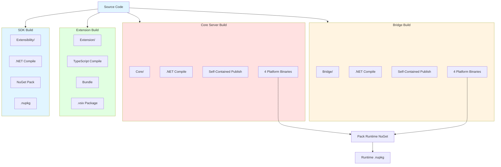
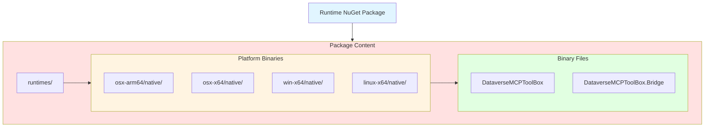
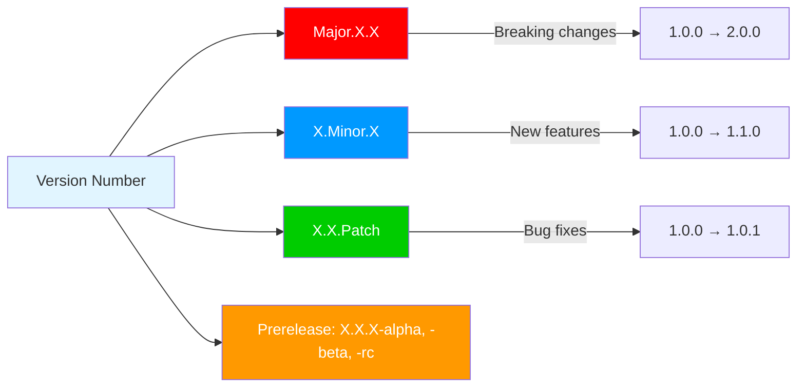

# Build and Deployment

Complete guide to building, packaging, and deploying Dataverse MCP Toolbox components.

## Build Overview



## Prerequisites

### Development Tools

| Tool | Version | Purpose |
|------|---------|---------|
| **.NET SDK** | 8.0+ | Build Core and Bridge |
| **Node.js** | 18+ | Build Extension |
| **npm** | 9+ | Extension dependencies |
| **vsce** | latest | Package Extension |
| **Git** | 2.0+ | Version control |

### Platform Requirements

**Build Platforms**:
- **macOS**: Can build all platforms
- **Windows**: Can build all platforms
- **Linux**: Can build all platforms

**Target Platforms**:
- macOS arm64 (Apple Silicon)
- macOS x64 (Intel)
- Windows x64
- Linux x64

## Building Core Server

### Manual Build

```bash
# Navigate to Core directory
cd Core

# Restore dependencies
dotnet restore

# Build for current platform (Debug)
dotnet build -c Debug

# Build for all platforms (Release)
dotnet publish -c Release -r osx-arm64 --self-contained -o publish/osx-arm64
dotnet publish -c Release -r osx-x64 --self-contained -o publish/osx-x64
dotnet publish -c Release -r win-x64 --self-contained -o publish/win-x64
dotnet publish -c Release -r linux-x64 --self-contained -o publish/linux-x64
```

### Automated Build Script

**Unix (macOS/Linux)**:

```bash
# From project root
./scripts/build-all.sh

# Or from Core directory
cd Core
./scripts/build-publish.sh
```

**Windows**:

```powershell
# From project root
.\scripts\build-all.ps1

# Or from Core directory
cd Core
.\scripts\build-publish.ps1
```

### Build Output

```
Core/publish/
├── osx-arm64/
│   ├── DataverseMCPToolBox
│   ├── *.dll
│   └── *.json
├── osx-x64/
│   ├── DataverseMCPToolBox
│   └── ...
├── win-x64/
│   ├── DataverseMCPToolBox.exe
│   └── ...
└── linux-x64/
    ├── DataverseMCPToolBox
    └── ...
```

### Build Configuration

**Project File** (`DataverseMCPToolBox.csproj`):

```xml
<Project Sdk="Microsoft.NET.Sdk">
  <PropertyGroup>
    <OutputType>Exe</OutputType>
    <TargetFramework>net8.0</TargetFramework>
    <RuntimeIdentifiers>osx-arm64;osx-x64;win-x64;linux-x64</RuntimeIdentifiers>
    <SelfContained>true</SelfContained>
    <PublishSingleFile>true</PublishSingleFile>
    <PublishTrimmed>false</PublishTrimmed>
    <IncludeNativeLibrariesForSelfExtract>true</IncludeNativeLibrariesForSelfExtract>
  </PropertyGroup>
</Project>
```

## Building MCP Bridge

### Manual Build

```bash
# Navigate to Bridge directory
cd Bridge

# Restore dependencies
dotnet restore

# Build for all platforms
dotnet publish -c Release -r osx-arm64 --self-contained -o publish/osx-arm64
dotnet publish -c Release -r osx-x64 --self-contained -o publish/osx-x64
dotnet publish -c Release -r win-x64 --self-contained -o publish/win-x64
dotnet publish -c Release -r linux-x64 --self-contained -o publish/linux-x64
```

### Automated Build

```bash
# Included in build-all.sh/ps1
./scripts/build-all.sh
```

### Build Output

```
Bridge/publish/
├── osx-arm64/
│   ├── DataverseMCPToolBox.Bridge
│   └── ...
├── osx-x64/
├── win-x64/
│   ├── DataverseMCPToolBox.Bridge.exe
│   └── ...
└── linux-x64/
```

## Building Extension

### Install Dependencies

```bash
cd Extension
npm install
```

### Compile TypeScript

```bash
# Development build
npm run compile

# Watch mode (auto-recompile)
npm run watch

# Production build
npm run compile-production
```

### Package VSIX

```bash
# Install vsce (first time only)
npm install -g vsce

# Create .vsix package
vsce package

# Output: dataversemcptoolbox-0.1.0.vsix
```

### Build Output

```
Extension/
├── out/                  # Compiled JavaScript
│   ├── extension.js
│   └── ...
└── dataversemcptoolbox-*.vsix  # Packaged extension
```

## Building Extensibility SDK

### Manual Build

```bash
cd Extensibility

# Restore dependencies
dotnet restore

# Build
dotnet build -c Release

# Create NuGet package
dotnet pack -c Release -o nupkg
```

### Package Script

**Unix**:

```bash
cd Extensibility
./scripts/pack-nuget.sh
```

**Windows**:

```powershell
cd Extensibility
.\scripts\pack-nuget.ps1
```

### Build Output

```
Extensibility/nupkg/
└── DataverseMCPToolBox.Extensibility.0.1.0-alpha.nupkg
```

## Creating Runtime NuGet Package

### Package Structure



### Manual Packaging

```bash
# Build Core and Bridge first
./scripts/build-all.sh

# Navigate to Core directory
cd Core

# Create NuGet package
./scripts/pack-nuget.sh  # or .ps1 on Windows
```

### Package Script (pack-nuget.sh)

```bash
#!/bin/bash
set -e

echo "Creating Runtime NuGet package..."

# Version from .csproj
VERSION=$(grep '<Version>' DataverseMCPToolBox.csproj | sed 's/.*<Version>\(.*\)<\/Version>/\1/')

# Create package structure
rm -rf nupkg-staging
mkdir -p nupkg-staging/runtimes/{osx-arm64,osx-x64,win-x64,linux-x64}/native

# Copy Core binaries
cp publish/osx-arm64/DataverseMCPToolBox nupkg-staging/runtimes/osx-arm64/native/
cp publish/osx-x64/DataverseMCPToolBox nupkg-staging/runtimes/osx-x64/native/
cp publish/win-x64/DataverseMCPToolBox.exe nupkg-staging/runtimes/win-x64/native/
cp publish/linux-x64/DataverseMCPToolBox nupkg-staging/runtimes/linux-x64/native/

# Copy Bridge binaries
cp ../Bridge/publish/osx-arm64/DataverseMCPToolBox.Bridge nupkg-staging/runtimes/osx-arm64/native/
cp ../Bridge/publish/osx-x64/DataverseMCPToolBox.Bridge nupkg-staging/runtimes/osx-x64/native/
cp ../Bridge/publish/win-x64/DataverseMCPToolBox.Bridge.exe nupkg-staging/runtimes/win-x64/native/
cp ../Bridge/publish/linux-x64/DataverseMCPToolBox.Bridge nupkg-staging/runtimes/linux-x64/native/

# Create .nuspec
cat > nupkg-staging/DataverseMCPToolBox.Runtime.nuspec <<EOF
<?xml version="1.0" encoding="utf-8"?>
<package xmlns="http://schemas.microsoft.com/packaging/2013/05/nuspec.xsd">
  <metadata>
    <id>DataverseMCPToolBox.Runtime</id>
    <version>$VERSION</version>
    <authors>Your Name</authors>
    <description>Runtime binaries for Dataverse MCP Toolbox</description>
    <projectUrl>https://github.com/youruser/dataverse-mcp-toolbox</projectUrl>
    <license type="expression">MIT</license>
    <tags>dataverse mcp copilot</tags>
  </metadata>
</package>
EOF

# Pack
cd nupkg-staging
nuget pack DataverseMCPToolBox.Runtime.nuspec -OutputDirectory ../nupkg

echo "✅ Package created: nupkg/DataverseMCPToolBox.Runtime.$VERSION.nupkg"
```

### Package Output

```
Core/nupkg/
└── DataverseMCPToolBox.Runtime.0.1.0-alpha.nupkg
```

## Publishing to NuGet.org

### Prerequisites

1. **NuGet Account**: Create at [nuget.org](https://www.nuget.org/)
2. **API Key**: Generate from account settings

### Publish Runtime Package

```bash
cd Core

# Publish to NuGet.org
dotnet nuget push nupkg/DataverseMCPToolBox.Runtime.0.1.0-alpha.nupkg \
  --api-key YOUR_API_KEY \
  --source https://api.nuget.org/v3/index.json
```

### Publish Extensibility SDK

```bash
cd Extensibility

# Publish to NuGet.org
dotnet nuget push nupkg/DataverseMCPToolBox.Extensibility.0.1.0-alpha.nupkg \
  --api-key YOUR_API_KEY \
  --source https://api.nuget.org/v3/index.json
```

### Publishing Checklist

- [ ] Version updated in .csproj files
- [ ] CHANGELOG updated
- [ ] Tests passing
- [ ] Built on all platforms
- [ ] NuGet packages created
- [ ] Packages tested locally
- [ ] Git tag created (`v0.1.0-alpha`)
- [ ] Published to NuGet.org

## Publishing Extension to Marketplace

### Prerequisites

1. **VS Code Marketplace Account**: Create publisher at [marketplace.visualstudio.com](https://marketplace.visualstudio.com/manage)
2. **Personal Access Token (PAT)**: Generate from Azure DevOps

### Publish Extension

```bash
cd Extension

# Login (first time only)
vsce login YOUR_PUBLISHER_NAME

# Package and publish
vsce publish

# Or publish specific version
vsce publish 0.1.0
```

### Pre-Publish Checklist

- [ ] Version updated in package.json
- [ ] README updated
- [ ] CHANGELOG updated
- [ ] Extension tested locally
- [ ] Screenshots updated
- [ ] Runtime NuGet package published
- [ ] Extension references correct NuGet version

### Update Package.json

```json
{
  "name": "dataversemcptoolbox",
  "version": "0.1.0",
  "publisher": "YOUR_PUBLISHER_NAME",
  "runtimeDependencies": {
    "nugetPackage": "DataverseMCPToolBox.Runtime",
    "version": "0.1.0-alpha"
  }
}
```

## Version Management

### Semantic Versioning



### Version Synchronization

**Keep in sync**:
1. **Core/DataverseMCPToolBox.csproj**: `<Version>0.1.0-alpha</Version>`
2. **Bridge/DataverseMCPToolBox.Bridge.csproj**: `<Version>0.1.0-alpha</Version>`
3. **Extensibility/DataverseMCPToolBox.Extensibility.csproj**: `<Version>0.1.0-alpha</Version>`
4. **Extension/package.json**: `"version": "0.1.0"`

### Bumping Versions

```bash
# Update all .csproj files
sed -i '' 's/<Version>0.1.0-alpha<\/Version>/<Version>0.2.0-alpha<\/Version>/g' **/*.csproj

# Update package.json
cd Extension
npm version minor  # 0.1.0 → 0.2.0
```

## CI/CD Pipeline

### GitHub Actions Workflow

**Build Workflow** (`.github/workflows/build.yml`):

```yaml
name: Build

on:
  push:
    branches: [main, develop]
  pull_request:
    branches: [main]

jobs:
  build-dotnet:
    runs-on: ${{ matrix.os }}
    strategy:
      matrix:
        os: [ubuntu-latest, windows-latest, macos-latest]
    
    steps:
      - uses: actions/checkout@v3
      
      - name: Setup .NET
        uses: actions/setup-dotnet@v3
        with:
          dotnet-version: '8.0.x'
      
      - name: Build Core
        run: |
          cd Core
          dotnet restore
          dotnet build -c Release
      
      - name: Build Bridge
        run: |
          cd Bridge
          dotnet restore
          dotnet build -c Release
  
  build-extension:
    runs-on: ubuntu-latest
    
    steps:
      - uses: actions/checkout@v3
      
      - name: Setup Node.js
        uses: actions/setup-node@v3
        with:
          node-version: '18'
      
      - name: Build Extension
        run: |
          cd Extension
          npm install
          npm run compile
```

**Release Workflow** (`.github/workflows/release.yml`):

```yaml
name: Release

on:
  push:
    tags:
      - 'v*'

jobs:
  release:
    runs-on: ubuntu-latest
    
    steps:
      - uses: actions/checkout@v3
      
      - name: Build all platforms
        run: ./scripts/build-all.sh
      
      - name: Pack Runtime NuGet
        run: |
          cd Core
          ./scripts/pack-nuget.sh
      
      - name: Pack Extensibility NuGet
        run: |
          cd Extensibility
          dotnet pack -c Release -o nupkg
      
      - name: Publish to NuGet
        run: |
          dotnet nuget push Core/nupkg/*.nupkg --api-key ${{ secrets.NUGET_API_KEY }} --source https://api.nuget.org/v3/index.json
          dotnet nuget push Extensibility/nupkg/*.nupkg --api-key ${{ secrets.NUGET_API_KEY }} --source https://api.nuget.org/v3/index.json
      
      - name: Build Extension
        run: |
          cd Extension
          npm install
          npm run compile-production
          npx vsce package
      
      - name: Publish Extension
        run: |
          cd Extension
          npx vsce publish --pat ${{ secrets.VSCE_PAT }}
```

## Local Testing

### Install Local Extension

**Method 1: Install VSIX**:

```bash
# Build VSIX
cd Extension
vsce package

# Install in VS Code
code --install-extension dataversemcptoolbox-0.1.0.vsix
```

**Method 2: Debug Mode**:

1. Open Extension folder in VS Code
2. Press F5 to launch Extension Development Host
3. Test in new VS Code window

### Test Local Binaries

```bash
# Copy binaries to extension for testing
./scripts/install-local.sh  # or .ps1 on Windows
```

**Script** (`scripts/install-local.sh`):

```bash
#!/bin/bash
set -e

echo "Building and installing locally for testing..."

# Build all platforms
./scripts/build-all.sh

# Copy to Extension server directory
mkdir -p Extension/server/binaries
cp -r Core/publish/* Extension/server/binaries/
cp -r Bridge/publish/* Extension/server/binaries/

echo "✅ Local binaries installed"
echo "Press F5 in VS Code to test"
```

## Deployment Checklist

### Pre-Release

- [ ] All tests passing
- [ ] Documentation updated
- [ ] CHANGELOG updated
- [ ] Version numbers synchronized
- [ ] Built on all platforms
- [ ] Local testing completed

### Release

- [ ] Create Git tag (`git tag v0.1.0-alpha`)
- [ ] Push tag (`git push origin v0.1.0-alpha`)
- [ ] Build Runtime NuGet package
- [ ] Build Extensibility NuGet package
- [ ] Publish NuGet packages
- [ ] Build Extension VSIX
- [ ] Publish Extension to Marketplace
- [ ] Create GitHub Release with notes

### Post-Release

- [ ] Verify NuGet packages downloadable
- [ ] Verify Extension installable from Marketplace
- [ ] Update documentation site
- [ ] Announce release
- [ ] Monitor for issues

## Next Steps

- **[Configuration Reference](16-Configuration-Reference.md)**: Build configuration options
- **[Security](18-Security.md)**: Security considerations for deployment
- **[Troubleshooting](13-Troubleshooting.md)**: Build and deployment issues
