# Security

Comprehensive security considerations and best practices for Dataverse MCP Toolbox.

## Security Overview

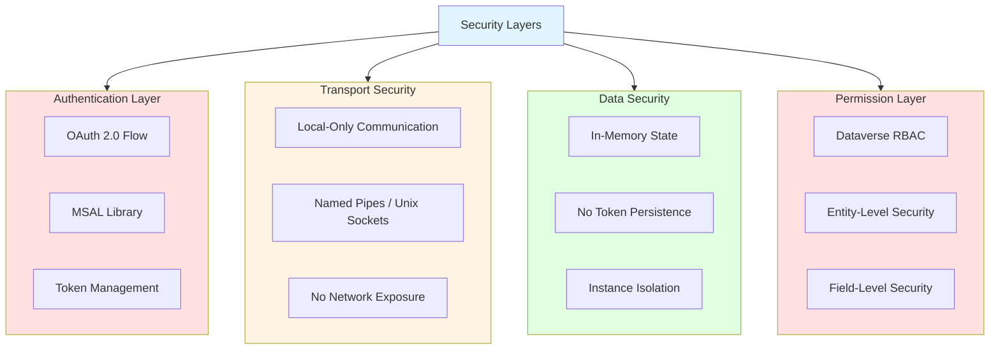

## Authentication Security

### OAuth 2.0 Flow

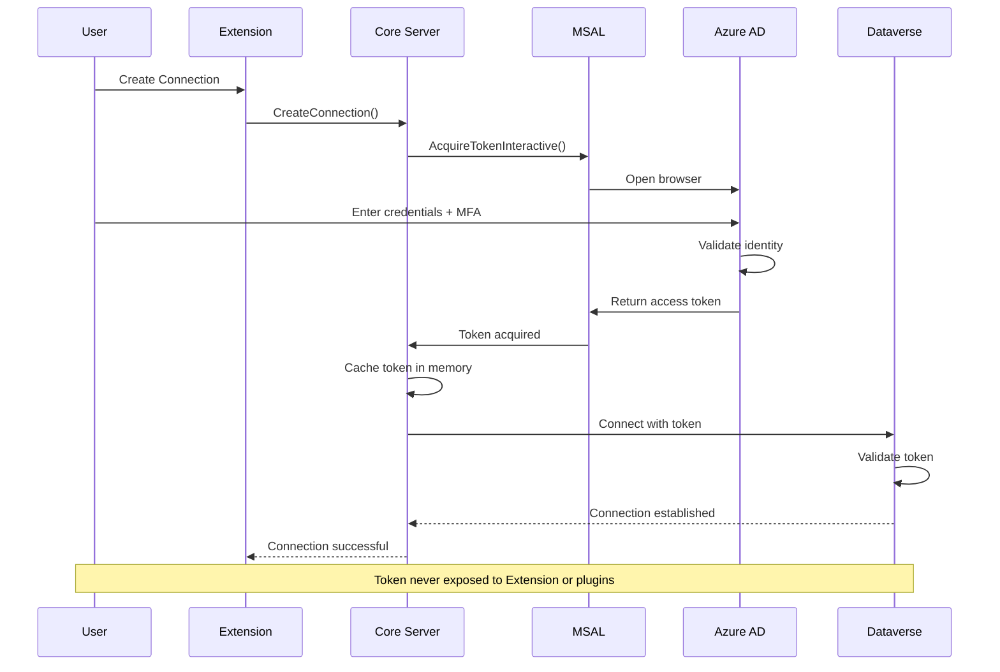

### Token Management

**Security Principles**:

1. **In-Memory Only**: Tokens never written to disk
2. **Scoped Lifetime**: Tokens valid only for server lifetime
3. **Automatic Refresh**: MSAL handles token refresh
4. **Least Privilege**: Request minimal required scopes

**Token Flow**:

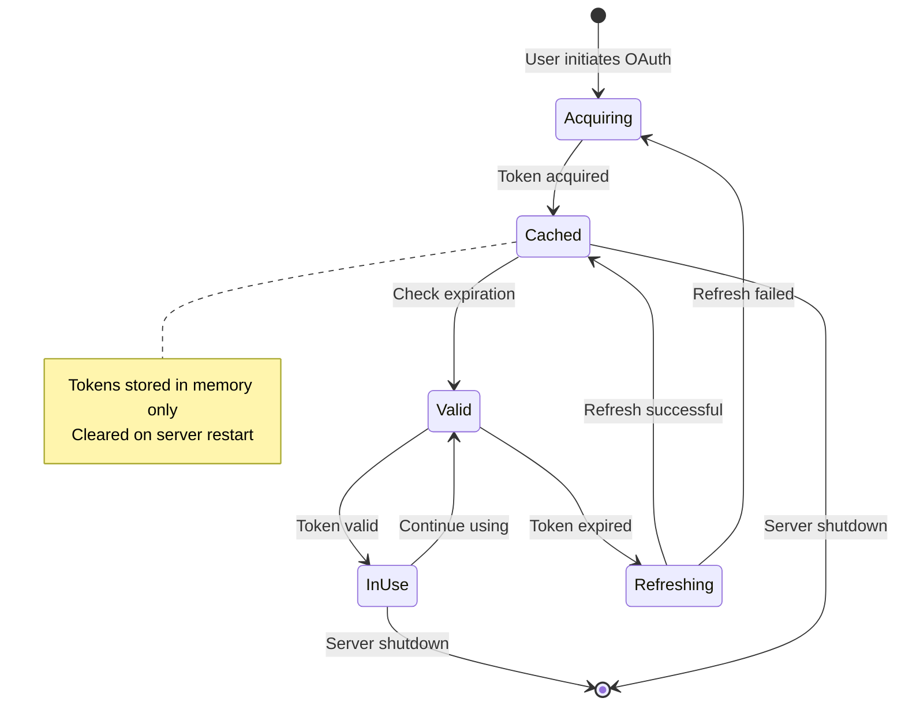

### Credential Storage

**What is stored**:
- Connection metadata (URL, name)
- Connection ID (UUID)

**What is NOT stored**:
- Passwords
- Access tokens
- Refresh tokens
- Client secrets

**Storage Location**:
- In-memory dictionary (Core Server)
- Lost on server restart

### MFA Support

**Multi-Factor Authentication** is fully supported and enforced by Azure AD:

1. User initiates OAuth flow
2. Browser redirects to Azure AD login
3. Azure AD enforces organization's MFA policy
4. User completes MFA challenge (SMS, app, etc.)
5. Access token issued after successful MFA

**Conditional Access**: Organization's Conditional Access policies are respected (location, device compliance, etc.)

## Transport Security

### Local-Only Communication

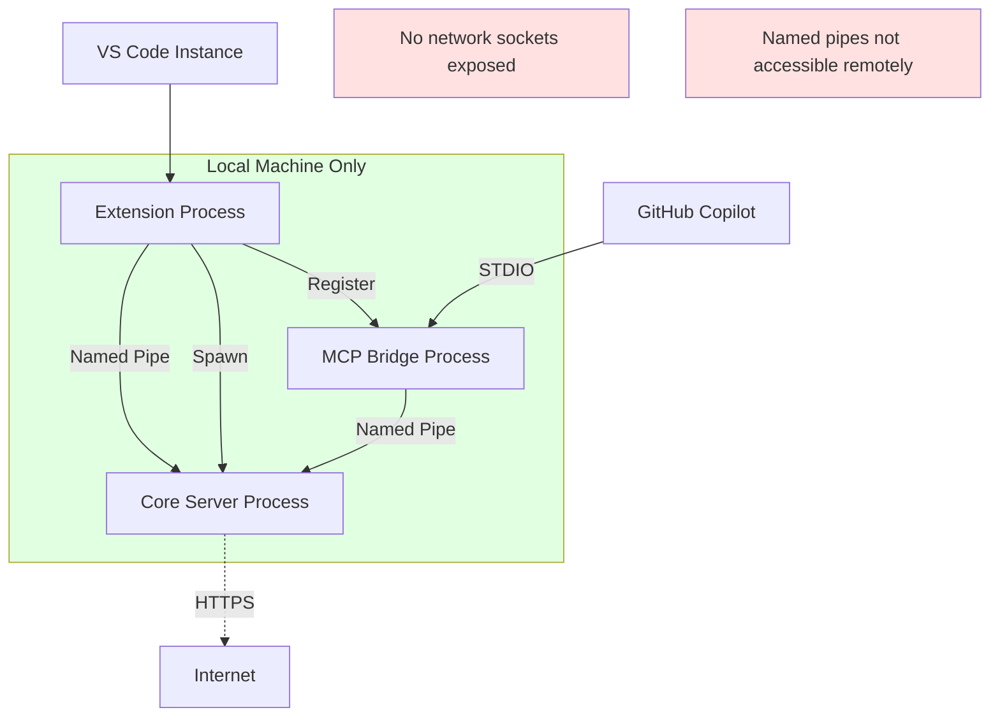

**Security Features**:

1. **No Network Exposure**: Core Server listens on Named Pipes/Unix Sockets only
2. **Process Isolation**: Each VS Code instance has isolated Core Server
3. **Named Pipe Security**: Not accessible from network or other users
4. **STDIO Isolation**: Bridge↔Copilot uses local STDIO (no network)

### Named Pipe Security (Windows)

**Default Permissions**:
- Owner: Current user
- Access: Current user only
- No remote access
- No cross-user access

**Pipe Naming**:
```
\\.\pipe\DataverseMCP-{guid}
```

**Security Descriptor**:
```csharp
var pipeSecurity = new PipeSecurity();
pipeSecurity.AddAccessRule(new PipeAccessRule(
    WindowsIdentity.GetCurrent().User,
    PipeAccessRights.FullControl,
    AccessControlType.Allow));
```

### Unix Socket Security (macOS/Linux)

**File Permissions**:
```bash
# Socket file permissions: 0700 (owner only)
chmod 700 /tmp/dvmcptb-sockets/DataverseMCP-{guid}
```

**Socket Isolation**:
- Socket directory: `/tmp/dvmcptb-sockets/`
- Owner: Current user
- Permissions: `drwx------` (0700)
- Not accessible by other users

## Data Security

### In-Memory State

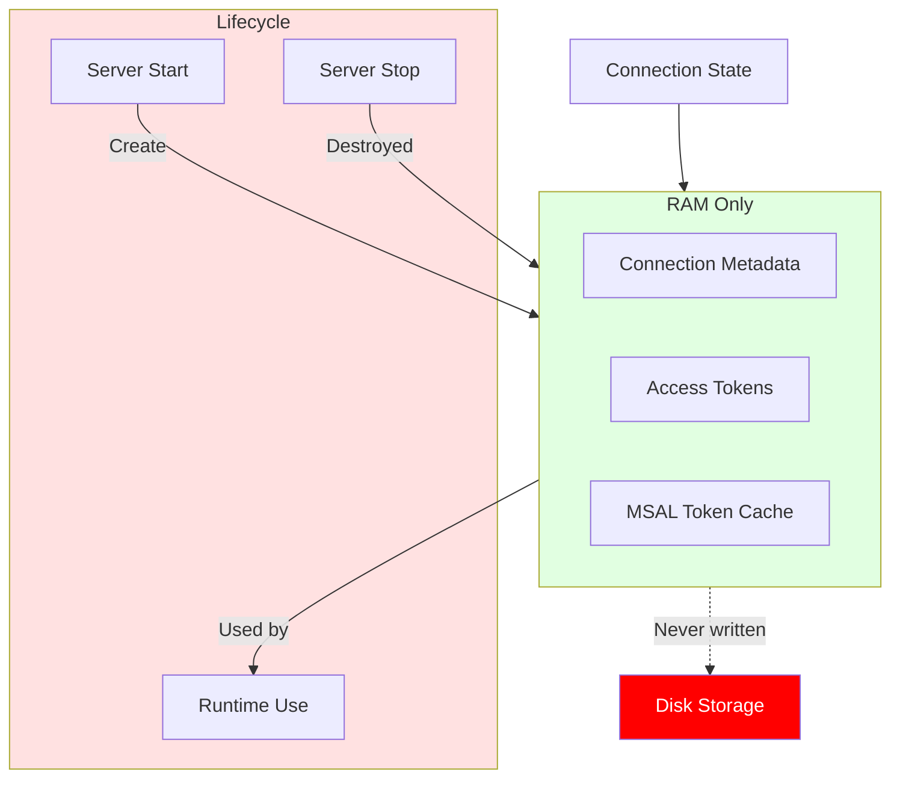

**Security Benefits**:

1. **No Persistence**: Sensitive data cleared on restart
2. **No File Leakage**: No tokens in temp files or logs
3. **Process Isolation**: Memory not accessible to other processes
4. **Clean Shutdown**: Memory cleared when server stops

### Logging Security

**Secure Logging Practices**:

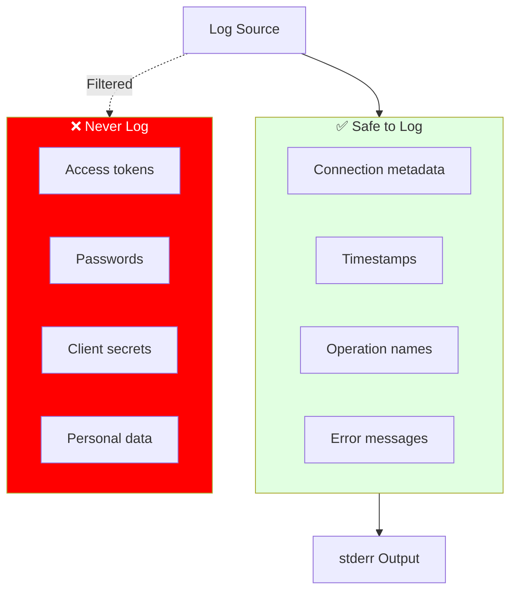

**Redaction Example**:

```csharp
// ❌ BAD - Logs sensitive data
Console.Error.WriteLine($"Token: {accessToken}");

// ✅ GOOD - Logs safely
Console.Error.WriteLine($"Token acquired for connection {connectionId}");
```

### Secret Scanning

**GitHub Secret Scanning** enabled for:
- Access tokens
- Client secrets
- API keys
- Connection strings

**Prevention**:
- Pre-commit hooks (git-secrets)
- Code review for hardcoded secrets
- Environment variables for local secrets

## Permission Layer

### Dataverse RBAC

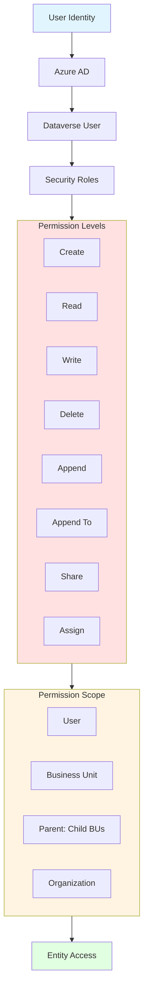

**Plugin Execution Context**:

- Tools execute with **user's permissions**
- No privilege escalation
- Dataverse security enforced at API level
- Audit logs track all operations

### Entity-Level Security

**Enforced by Dataverse**:

1. **CRUD Permissions**: Based on user's security roles
2. **Ownership**: User can only access owned records (depends on scope)
3. **Sharing**: Records shared explicitly with user
4. **Teams**: Records owned by user's teams

**Plugin Behavior**:

```csharp
[McpTool("Create account")]
public async Task<object> CreateAccount(
    string name,
    IDataverseContext context,
    CancellationToken ct)
{
    // User must have CREATE permission on account entity
    // If not, Dataverse returns SecurityException
    
    var account = new Entity("account") { ["name"] = name };
    var id = await context.ServiceClient.CreateAsync(account, ct);
    return new { accountId = id };
}
```

### Field-Level Security

**Secured Fields**:

- Defined in Dataverse entity metadata
- Enforced at field level
- User needs explicit field permissions
- Field-level security profiles assigned to users

**Tool Execution**:

```csharp
[McpTool("Get contact")]
public async Task<object> GetContact(
    Guid contactId,
    IDataverseContext context,
    CancellationToken ct)
{
    var contact = await context.ServiceClient.RetrieveAsync(
        "contact", contactId, new ColumnSet(true), ct);
    
    // Secured fields not included if user lacks permission
    // No error thrown, field simply omitted
    
    return contact.Attributes;
}
```

## Plugin Security

### Plugin Isolation

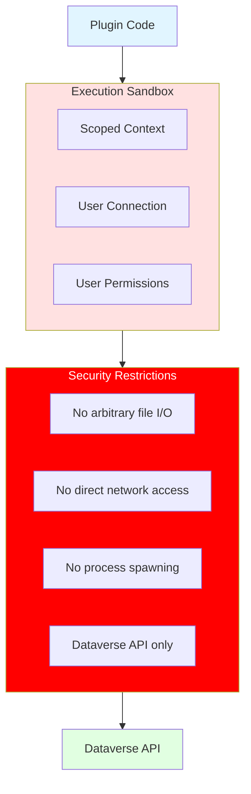

**Restrictions**:

1. **Context Scoped**: Plugin receives scoped IDataverseContext
2. **User Connection**: Uses connection of current user
3. **No File Access**: Cannot access user files directly
4. **No Network**: Cannot make arbitrary HTTP calls (only Dataverse)
5. **No Privilege Escalation**: Runs with user's Dataverse permissions

### Plugin Code Review

**Security Checklist**:

- [ ] No hardcoded credentials
- [ ] No arbitrary file I/O
- [ ] No process spawning
- [ ] Input validation implemented
- [ ] Error messages don't leak secrets
- [ ] Dependencies from trusted sources
- [ ] No SQL injection vulnerabilities
- [ ] Proper exception handling

**Example - Secure Plugin**:

```csharp
[McpPlugin("secure-plugin", "1.0.0")]
public class SecurePlugin : PluginBase
{
    [McpTool("Get entity record")]
    public async Task<object> GetRecord(
        string entityName,
        string recordId,
        IDataverseContext context,
        CancellationToken ct)
    {
        // ✅ Input validation
        if (string.IsNullOrWhiteSpace(entityName))
            throw new ToolExecutionException("INVALID_INPUT", "Entity name required");
        
        if (!Guid.TryParse(recordId, out var id))
            throw new ToolExecutionException("INVALID_INPUT", "Invalid record ID");
        
        try
        {
            // ✅ Use provided context (scoped to user)
            var entity = await context.ServiceClient.RetrieveAsync(
                entityName, id, new ColumnSet(true), ct);
            
            // ✅ Return data only (no sensitive metadata)
            return new {
                id = entity.Id,
                entityName = entity.LogicalName,
                attributes = entity.Attributes
            };
        }
        catch (FaultException<OrganizationServiceFault> ex)
        {
            // ✅ Don't leak internal details
            throw new ToolExecutionException(
                "DATAVERSE_ERROR",
                "Failed to retrieve record",
                ex.Message);
        }
    }
}
```

### Dependency Security

**Trusted Sources**:

- NuGet.org packages only
- Verify package signatures
- Use well-known, maintained libraries
- Review dependencies for vulnerabilities

**Vulnerability Scanning**:

```bash
# Scan dependencies for known vulnerabilities
dotnet list package --vulnerable --include-transitive
```

## Threat Model

### Threat Scenarios

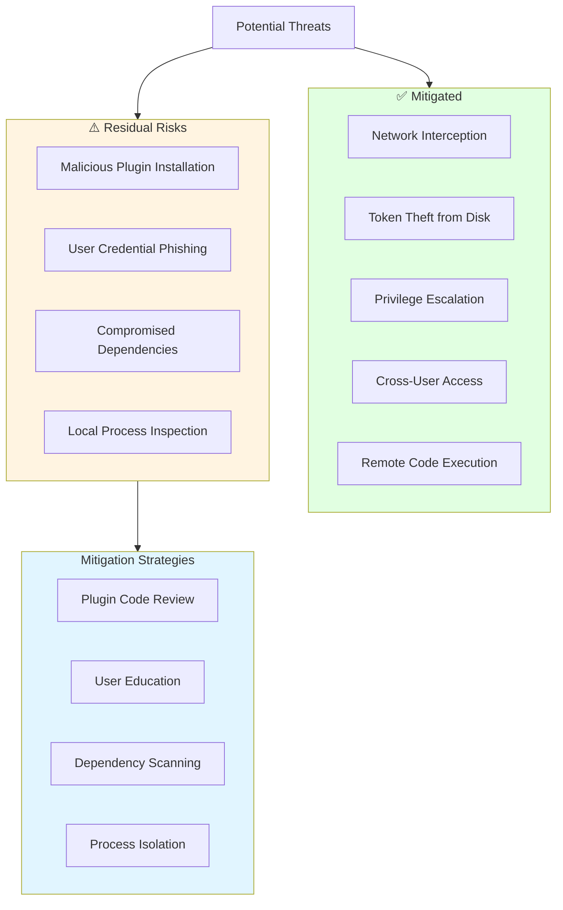

### Attack Surface Analysis

| Component | Attack Surface | Mitigation |
|-----------|----------------|------------|
| **Core Server** | Local process memory | Process isolation, no remote access |
| **MCP Bridge** | STDIO communication | Local-only, no network exposure |
| **Extension** | VS Code Extension API | Sandboxed extension host |
| **Plugins** | Custom code execution | Scoped context, code review |
| **Named Pipes** | Local IPC | User-only permissions |
| **OAuth Flow** | Browser redirect | MSAL handles security |

## Compliance Considerations

### Data Residency

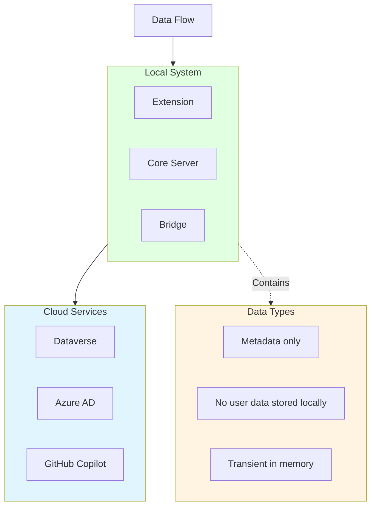

**Compliance Features**:

- **No PII Storage**: Personal data not stored locally
- **Transient Processing**: Data processed in memory only
- **Cloud Compliance**: Dataverse handles compliance (GDPR, HIPAA, etc.)
- **Audit Logs**: All operations logged in Dataverse

### GDPR Compliance

**Data Subject Rights**:

1. **Right to Access**: Dataverse audit logs available
2. **Right to Erasure**: No local data to erase (memory-only)
3. **Right to Portability**: Export from Dataverse
4. **Right to Rectification**: Update in Dataverse

**Data Minimization**: Only connection metadata stored (URL, name, ID)

### SOC 2 / ISO 27001

**Security Controls**:

- Access control (OAuth, RBAC)
- Encryption in transit (HTTPS to Dataverse)
- Logging and monitoring (stderr logs)
- Least privilege (user permissions)
- Secure development lifecycle

## Security Best Practices

### For End Users

1. **Strong Authentication**: Use MFA on Azure AD account
2. **Least Privilege**: Request minimal Dataverse permissions
3. **Plugin Trust**: Only install plugins from trusted sources
4. **Regular Updates**: Keep Extension updated to latest version
5. **Secure Workstation**: Use full-disk encryption, screen lock

### For Plugin Developers

1. **Input Validation**: Validate all user inputs
2. **No Hardcoded Secrets**: Use configuration or environment variables
3. **Proper Error Handling**: Don't leak sensitive info in errors
4. **Dependency Security**: Scan dependencies for vulnerabilities
5. **Code Review**: Have security-focused code reviews
6. **Least Privilege**: Request minimal required Dataverse permissions

### For Administrators

1. **Conditional Access**: Configure Azure AD Conditional Access policies
2. **Security Roles**: Assign least-privilege security roles
3. **Field Security**: Enable field-level security for sensitive data
4. **Audit Logs**: Monitor Dataverse audit logs regularly
5. **Plugin Approval**: Review and approve plugins before distribution

## Incident Response

### Security Incident Procedure

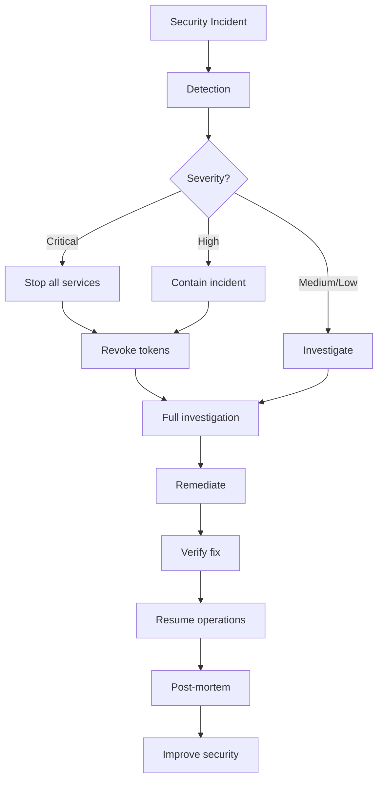

### Reporting Security Issues

**Contact**:
- Email: security@yourproject.com
- GitHub: Private vulnerability reporting
- Response time: 24-48 hours

**What to Include**:
- Description of vulnerability
- Steps to reproduce
- Potential impact
- Suggested mitigation (if any)

**Responsible Disclosure**: 90-day disclosure window after fix is released.

## Security Monitoring

### Audit Logging

**Dataverse Audit Logs**:
- All tool executions logged
- User identity tracked
- Timestamps recorded
- Operation results logged

**Extension Logs**:
- Connection events
- Plugin installations
- Server lifecycle events
- Error events

**Monitoring Queries**:

```sql
-- Failed authentication attempts (Azure AD)
SigninLogs
| where Status.errorCode != 0
| project TimeGenerated, UserPrincipalName, Status

-- Dataverse operations (Audit Log)
-- View in Power Platform admin center
```

### Anomaly Detection

**Indicators of Compromise**:

1. Unexpected plugin installations
2. Unusual Dataverse API patterns
3. Failed authentication attempts
4. Privilege escalation attempts
5. Mass data exports

## Next Steps

- **[Configuration Reference](16-Configuration-Reference.md)**: Security-related configuration
- **[Troubleshooting](13-Troubleshooting.md)**: Security error messages
- **[Plugin Architecture](15-Plugin-Architecture.md)**: Plugin security model
