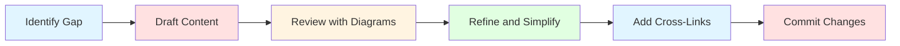

# Dataverse MCP Toolbox Documentation

Complete documentation for the Dataverse MCP Toolbox project - a sidecar architecture toolbox that bridges Microsoft Dataverse operations with AI assistants like GitHub Copilot using the Model Context Protocol.

## Documentation Structure

This documentation is organized into five main sections, progressing from getting started to advanced topics:

### 📚 Getting Started

Essential guides for new users to understand and begin using the toolbox.

| Document | Description |
|----------|-------------|
| **[01-Overview](01-Overview.md)** | Project introduction, capabilities, architecture overview, and technology stack |
| **[02-Quick-Start](02-Quick-Start.md)** | Installation guide, creating first connection, and basic tool usage |
| **[03-Core-Concepts](03-Core-Concepts.md)** | Fundamental concepts: sidecar pattern, MCP protocol, components, state management |

### 🏗️ Architecture

Deep technical dive into system architecture and component design.

| Document | Description |
|----------|-------------|
| **[04-Architecture](04-Architecture.md)** | System architecture, design principles, component communication flows |
| **[05-Core-Server](05-Core-Server.md)** | Core Server internals: services, RPC layer, lifecycle management |
| **[06-MCP-Bridge](06-MCP-Bridge.md)** | MCP Bridge protocol adapter, translation logic, STDIO communication |
| **[07-VS-Code-Extension](07-VS-Code-Extension.md)** | Extension architecture: services, UI components, binary management |
| **[08-Communication](08-Communication.md)** | JSON-RPC protocol specification, message formats, error handling |
| **[09-Server-Lifecycle](09-Server-Lifecycle.md)** | Binary download, version management, update channels, first-run flow |

### 🔧 Working with the System

Practical guides for using connections, plugins, and tools.

| Document | Description |
|----------|-------------|
| **[10-Managing-Connections](10-Managing-Connections.md)** | Connection lifecycle, OAuth authentication, state management |
| **[11-Managing-Plugins](11-Managing-Plugins.md)** | Plugin installation, updates, uninstallation workflows |
| **[12-Using-Tools](12-Using-Tools.md)** | Tool discovery, execution, Copilot integration, examples |
| **[13-Troubleshooting](13-Troubleshooting.md)** | Comprehensive troubleshooting guide, diagnostics, error reference |

### 🔌 Extending the System

Guides for developers extending the toolbox with custom plugins.

| Document | Description |
|----------|-------------|
| **[14-Creating-Plugins](14-Creating-Plugins.md)** | Complete guide to building custom plugins, patterns, best practices |
| **[15-Plugin-Architecture](15-Plugin-Architecture.md)** | Deep dive into plugin system: loading, discovery, execution, isolation |

### 📖 Reference & Operations

Configuration reference, build instructions, and security considerations.

| Document | Description |
|----------|-------------|
| **[16-Configuration-Reference](16-Configuration-Reference.md)** | Complete reference for all settings, environment variables, storage locations |
| **[17-Build-And-Deployment](17-Build-And-Deployment.md)** | Building, packaging, publishing Runtime, SDK, and Extension |
| **[18-Security](18-Security.md)** | Security model, authentication, permissions, threat model, best practices |

## Quick Navigation

### By Role

**🎯 End Users**:
1. Start with [Overview](01-Overview.md) to understand the project
2. Follow [Quick Start](02-Quick-Start.md) to install and create connections
3. Learn [Using Tools](12-Using-Tools.md) to work with GitHub Copilot
4. Reference [Troubleshooting](13-Troubleshooting.md) when issues arise

**💻 Plugin Developers**:
1. Read [Core Concepts](03-Core-Concepts.md) to understand architecture
2. Study [Plugin Architecture](15-Plugin-Architecture.md) for technical details
3. Follow [Creating Plugins](14-Creating-Plugins.md) step-by-step guide
4. Reference [Configuration](16-Configuration-Reference.md) for settings

**🔧 System Administrators**:
1. Review [Architecture](04-Architecture.md) for system design
2. Understand [Security](18-Security.md) model and best practices
3. Check [Configuration Reference](16-Configuration-Reference.md) for deployment settings
4. Use [Troubleshooting](13-Troubleshooting.md) for diagnostics

**🏗️ Core Contributors**:
1. Study full [Architecture](04-Architecture.md) section (docs 04-09)
2. Learn [Build and Deployment](17-Build-And-Deployment.md) process
3. Review [Communication](08-Communication.md) protocol details
4. Understand [Security](18-Security.md) requirements

### By Topic

**🔐 Authentication & Security**:
- [Managing Connections](10-Managing-Connections.md) - OAuth flow
- [Security](18-Security.md) - Complete security model

**🧩 Plugins**:
- [Managing Plugins](11-Managing-Plugins.md) - Installation and updates
- [Creating Plugins](14-Creating-Plugins.md) - Development guide
- [Plugin Architecture](15-Plugin-Architecture.md) - Technical deep-dive

**⚙️ Configuration**:
- [Configuration Reference](16-Configuration-Reference.md) - All settings
- [Server Lifecycle](09-Server-Lifecycle.md) - Binary management

**🏗️ Development**:
- [Build and Deployment](17-Build-And-Deployment.md) - Build process
- [Communication](08-Communication.md) - Protocol specification
- [Core Server](05-Core-Server.md) - Server internals

**❓ Help & Support**:
- [Troubleshooting](13-Troubleshooting.md) - Common issues
- [Quick Start](02-Quick-Start.md) - Getting started
- [Using Tools](12-Using-Tools.md) - Tool execution

## Documentation Features

### 📊 Extensive Diagrams

Every document includes **Mermaid diagrams** to visualize:
- System architecture and component interactions
- Process flows and state machines
- Sequence diagrams for communication
- Flowcharts for decision logic

### 🎯 Practical Examples

Focused on **high-level concepts** with minimal code:
- Generic examples for understanding patterns
- Configuration samples
- Command-line snippets
- No large code blocks (per user requirements)

### 🔗 Cross-References

Documents are **interconnected** with:
- "Next Steps" links to related topics
- Topic-based navigation
- Role-based reading paths
- Consistent internal linking

## Getting Help

### Common Questions

**"Where do I start?"**
→ [Quick Start Guide](02-Quick-Start.md)

**"How do I create a plugin?"**
→ [Creating Plugins](14-Creating-Plugins.md)

**"Something isn't working"**
→ [Troubleshooting Guide](13-Troubleshooting.md)

**"How does authentication work?"**
→ [Managing Connections](10-Managing-Connections.md) and [Security](18-Security.md)

**"What are the configuration options?"**
→ [Configuration Reference](16-Configuration-Reference.md)

### Additional Resources

- **Project Repository**: See root [README.md](../README.md)
- **Project Context**: See [PROJECT_CONTEXT.md](../PROJECT_CONTEXT.md)
- **Copilot Instructions**: See [.github/copilot-instructions.md](../.github/copilot-instructions.md)
- **Sample Plugin**: Explore [SampleWhoAmIPlugin/](../SampleWhoAmIPlugin/)

## Contributing to Documentation

### Documentation Standards

1. **Diagrams First**: Use Mermaid diagrams extensively
2. **Minimal Code**: Only generic, high-level examples
3. **Clear Structure**: Use consistent headings and sections
4. **Cross-Links**: Link to related documents
5. **User-Focused**: Write for the target audience

### Updating Documentation

When updating docs:

1. **Maintain consistency**: Follow existing patterns
2. **Update cross-references**: Keep links accurate
3. **Add diagrams**: Visualize new concepts
4. **Test examples**: Verify any code snippets work
5. **Update this README**: Reflect structural changes

### Documentation Workflow

## Documentation Version

**Version**: 0.1.0-alpha  
**Last Updated**: January 2024  
**Status**: Complete (18 documents)

## Quick Reference Card

### Most Important Documents

| Need | Document | Time to Read |
|------|----------|-------------|
| Get started quickly | [Quick Start](02-Quick-Start.md) | 10 min |
| Understand architecture | [Architecture](04-Architecture.md) | 20 min |
| Create a plugin | [Creating Plugins](14-Creating-Plugins.md) | 30 min |
| Fix an issue | [Troubleshooting](13-Troubleshooting.md) | 15 min |
| Configure settings | [Configuration](16-Configuration-Reference.md) | 20 min |

---

**Ready to get started?** → [Begin with the Overview](01-Overview.md)

**Need help?** → [Check Troubleshooting](13-Troubleshooting.md)

**Want to contribute?** → [Build and Deployment](17-Build-And-Deployment.md)
